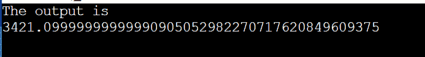

# Java 中的 BigDecimal toString()

> 原文：<https://www.tutorialandexample.com/bigdecimal-tostring-in-java>

BigDecimal 是一个 Java 类，是 java.math 包和 java.base 模块的一部分。它实现了 ComparableBigDecimal >接口并扩展了 Number 类。BigDecimal 类具有加、减、乘、除、舍入、比较、散列和改变格式的操作。数学。Java。如果 BigDecimal 需要指数，则调用此函数的当前 BigDecimal 将使用以下语法转换为字符串。函数 toString()方法。

出于多种原因，该类提供了多种方法。BigDecimal 类中常用的函数 toString()将在本节()中介绍。还应该编写一个 Java 应用程序来将 BigDecimal 转换为 String。

BigDecimal 类具有加、减、乘、除、舍入、比较、散列和改变格式的操作。BigDecimal 可以使用函数 toString()函数进行规范化表示。BigDecimal 类为用户提供了对舍入行为的完全控制。

## BigDecimal toString()方法

所提供的 BigDecimal 的规范表示由 BigDecimal 类的函数 toString()提供。它覆盖了 Object 类的函数 toString()。如果需要一个指数，它会返回这个 BigDecimal 在科学记数法中的文本表示。

**语法**

 **```
public String toString()
```

该过程不接受任何参数。它返回一个字符串形式的 BigDecimal 表示。

## Program1 for BigDecimal toString()方法

BigDecimal1.java

```
// importing required packages
import java . math . BigDecimal ;   
//  Declaring public class with name BegDecimal1
public class BigDecimal1
{  
// Main section of the program where execurion of the program begins 
public static void main ( String args [ ] )   
{  
// Creating and initializing variable for BigDecimal
BigDecimal big_decimal = new BigDecimal ( 500.3224 ) ;  
// Creating string variable 
// Converting bigdecimal it into sstring
String string1 = big_decimal . toString ( ) ;  
// Printing the string which is converted from bigdecimal
System . out . println ( string1 ) ;  
}  
} 
```

**输出**

 **

在前面的程序中，我们传递了一个双精度值作为参数。我们可以看到，我们没有得到作为参数提供给函数对象()的数字。原因是 double 类型不能代表实际金额，即 500.3224。结果，值 500.3224 被转换为最接近的双精度值，即 500.324000000000160071067512035369873046875，这是使用函数 toString()方法的缺点之一。

## Program1 for BigDecimal toString()方法

BigDecimal2.java

```
// importing required packages
import java . math . BigDecimal ;   
//  Declaring public class with name BegDecimal2
public class BigDecimal2
{  
// Main section of the program where execurion of the program begins 
public static void main ( String args [ ] )   
{  
// Creating and initializing variable for BigDecimal
BigDecimal big_decimal = new BigDecimal ( 3421.1 ) ;  
// Creating string variable 
// Converting bigdecimal it into sstring
String string1 = big_decimal . toString ( ) ;  
// Printing the string which is converted from bigdecimal
System . out . println ( string1 ) ;  
}  
} 
```

**输出**



## 在 Java 中将 BigDecimal 转换为字符串

有两种方法可以解决上述问题:

*   作为字符串发送的值
*   应用函数 valueOf()方法

### 作为字符串发送的值

如前所述，如果将一个 double 值传递给 function 对象()，将返回一个接近所需数字的巨大数字。为了获得精确的数字，我们必须以字符串的形式提供参数。

## Program2 for BigDecimal toString()方法

BigDecimal2.java

```
// importing the required packages
import java . math . BigDecimal ; 
// declaring the public main class  
public class BigDecimal2
{  
// Main section of the program where execution of the program starts
public static void main ( String args [ ] )   
{  
BigDecimal big_decimal  =  new BigDecimal ( " 500.3224 " ) ;  
String string1 = big_decimal . toString ( ) ;  
System . out . println ( string1 ) ;  
}  
}
```

**输出**

**  

### 应用函数 valueOf()方法

基于 double 的规范表示形式，该过程创建一个 BigDecimal。使用此方法可以将 BigDecimal 转换为 String。它在内部使用函数 toString()方法。因此，使用函数 toString()函数进行转换会很方便。

## Program3 for BigDecimal toString()方法

BigDecimal3.java

```
// Importing required packages for the program
import java.math.BigDecimal;   
public classBigDecimal3
{  
public static void main(String args[])   
{  
BigDecimal big_decimal = BigDecimal . valueOf ( 500.3224 ) ;  
System . out . println ( big_decimal . toString ( ) ) ; 
}  
} 
```

**输出**

******