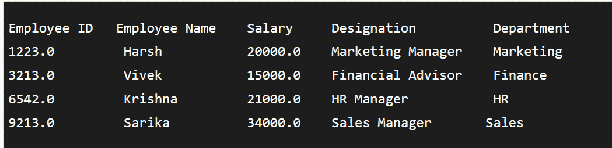

# 用 Java 阅读 XLSX 文件

> 原文：<https://www.tutorialandexample.com/read-the-xlsx-file-in-java>

Excel 文件包含单元格；在 Java 中读取 excel 文件不同于读取 word 文件。JDK 没有可以读写 Word 或 Excel 文档的直接 API。我们必须依赖第三方库 Apache POI。t 有许多特性，被广泛使用，并得到了社区的大力支持。

## Apache 然后

一个叫做 Apache POI 的 Java API 可以读写. xls 和. xlsx 两种格式的微软文档。包括类和接口。

对于读取 excel 文件，Apache POI 库提供了两种实现:

*   HSSF(糟糕的电子表格格式)的实现指定了与 Excel 2003 或更早版本兼容的 API。
*   XSSF (XML 电子表格格式)的实现:表示 API 与 Excel 2007 或更高版本兼容。

## Apache POI 中用于读取 xlsx 文件的类和接口

### 班级

*   XSSFWorkbook 是一个象征 XLSX 文件的类。
*   XLSX 文件的工作表由称为 XSSFSheet 的类表示。
*   XSSFRow 类代表 XLSX 文件工作表中的一行。
*   XSSFCell 类表示 XLSX 文件的一行中的一个单元格。

### 连接

*   **工作簿**
    它作为一个 Excel 工作簿的代表。工作簿是 book 和 XSSFWorkbook 已经实现的接口。此界面或工作表代表 Excel 中的工作表。工作簿的主要组件工作表代表一个单元格网格。工作表接口扩展了 Iterable。

*   **行**
    它是一个单独的界面，描绘了一个电子表格行。Row 接口扩展了 Iterable。存在 HSSFRow 和 XSSFRow 具体类。

*   **细胞**
    它充当一个接口。实现单元接口的是 HSSFCell 和 XSSFCell。

    用 Java 读取 xlsx 文件的程序

ReadXLSX.java

```
// importing all necessary packages
import Java. io. File ;
import java. io . FileInputStream ;
import java . io . IOException ;
import org . apache . poi . hssf . usermodel . HSSFSheet ;
import org . apache . poi . hssf . usermodel . HSSFWorkbook ;
import org . apache . poi . ss . usermodel . Cell ;
import org . apache . poi . ss . usermodel . FormulaEvaluator ;
import org . apache . poi . ss . usermodel . Row ;
// Creating the main class with name ReadXLSX
public class ReadXLSX {
// Main section where execution starts
public static void main ( String [ ] args )
{
// using try block to prevent the stoppage of execution due to errors
try {
// creating object for the class FileInputStream to take the input from user i .e; xlsx file
FileInputStream f1 = new FileInputStream ( new File ( " example.xlsx " ) ) ;
// creating instance for workbook
XSSFWorkbook workbook1 = new XSSFWorkbook ( f1 ) ;
// creating instance for the class XSSFSheet
XSSFSheet st = workbook1 . getSheetAt ( 0 ) ;
// Using Iterator to iterate through the excel sheet
Iterator < Row > r = st . iterator ( ) ;
// Iterating over each row od the excel sheet
while ( r . hasNext ( ) ) {
// creating variable with name row for Row keyword to iterate through the sheet
Row row = r . next ( ) ;
Iterator < Cell > c = row . cellIterator ( ) ;
// Itearator to iterate each column
while ( c . hasNext ( ) ) {
Cell cell = c . next ( ) ;
// using the switch case 
switch ( cell . getCellType ( ) ) 
{
case Cell . CELL_TYPE_NUMERIC :
System . out . print ( cell . getNumericCellValue ( ) + "t" ) ;
break ;
// if the cell contains string value
case Cell . CELL_TYPE_STRING :
System . out . print ( cell . getStringCellValue ( ) + ) ;
break ;
}
}
System . out . println ( " " ) ;
}
// open excel file should be closed
f1 . close ( ) ;
}
// if Exception is raised, it is caught here 
// Exception is the main class which contains all the predefined exceptions in it
catch ( Exception e ) {
e . printStackTrace ( ) ;
}
}
}
```

**输出**

