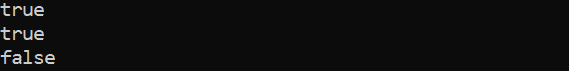
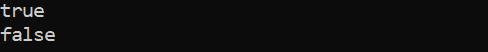
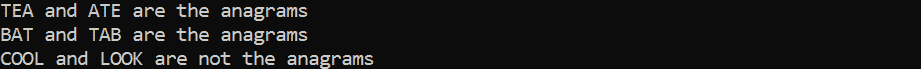

# Java 中的变位词是什么？

> 原文：<https://www.tutorialandexample.com/what-is-anagram-in-java>

本节将解释什么是 Java 中的变位词，并演示如何确定一个文本是否是变位词。在 Java 面试中，变位 Java 程序问题是经常被问到的。

## 变位词

通过颠倒另一个短语或单词的字母而创造的短语或单词被称为变位词，或者变位词是根据该术语的字典定义通过重新排列字母而创造的单词或短语。

如果重新排列或混合两个字符串中的字母产生一个有意义的词，那么相应的字符串被称为变位词。换句话说，如果两个字符串以不同的顺序包含相同的字符，我们可以说它们是变位词。记住一个字母只需要用一次。

让我们看看一些与变位词有关的例子。

## 变位词的例子

有许多单词的变位词，其中一些包括:

天文学家

灌木=灌木丛

商店渣滓=顾客

指示=字典

宿舍=肮脏的房间

编辑=重做

十一加二=十二加一

## 如何测试两个字符串是否是字谜？

*   从头开始读取或创建字符串 sr1 和 sr2。
*   计算两根弦的长度。
*   比较字符串长度。
    1.  如果长度不同，打印字符串就不是变位词。
    2.  如果没有，采取下一步行动。
        *   字符串应该被改变成类似于字符数组的东西。
        *   使用 sort()方法对两个数组进行排序。
        *   使用 equals()方法比较排序后的字符串。equals()方法返回一个用于存储值的 Bool 变量。
    3.  在 if 语句中，传递变量。如果测试返回 true，以下字符串是变位词。没有一个变位词是别的。

让我们在 Java 程序中包含以下活动。

## Java 字谜程序

有许多方法可以找到一个变位字符串，但是在这一部分，我们将集中讨论下面列出的三种方法。

### 通过使用 for 循环

让程序文件名为 AnagramDemo.java

```
public class AnagramDemo  
{  
//function checks if the strings are anagram or not      
public static boolean theAnagram(String sr7, String sr9)   
{  
//comparing of the length      
if (sr7.length() != sr9.length())   
{  
// if the strings' lengths are not equal, returns incorrect.
return false;  
}  
// string to character array conversion
char[] characs = sr1.toCharArray();  
// loop cycles across the array.
for (char s : characs)   
{  
//finds the index      
int index = sr9.indexOf(s);  
if (index != -1)   
{  
//the substring() method returns a new string that is a substring of this string  
Sr9 = sr9.substring(0, index) + sr9.substring(index + 1, sr9.length());  
}   
else   
{  
return false;  
}  
}  
return sr9.isEmpty();  
}  
//It is the driver code  
public static void main(String args[])   
{    
//we are calling the function      
System.out.println(theAnagram("SHRUB", "BRUSH"));    
System.out.println(theAnagram("EAT", "TEA"));    
System.out.println(theAnagram("KAMAL", "MALAK"));   
}    
} 
```

**输出:**



### 通过使用 StringBuilder 类

让程序文件名为 AnagramDemo2.java

```
public class AnagramDemo3  
{  
// determines whether the strings are anagrams or not.
public static boolean theAnagram(String sr7, String sr9)   
{  
// string to character array conversion
char[] charac = sr7.toCharArray();  
StringBuilder sa = new StringBuilder(sr9);  
// iterates through the character array in a loop.
for (char cr : charac)   
{  
// locates the char's index
int index = sa.indexOf("" + cr);  
if (index != -1)   
{  
// at the specified index, remove the character
sa.deleteCharAt(index);  
}   
else   
{  
return false;  
}  
}  
//It finds the length  
return sa.length() == 0 ? true : false;  
}  
//It is the driver code  
public static void main(String args[])   
{    
//It is calling the function      
System.out.println(isAnagram("TON", "NOT"));    
System.out.println(isAnagram("CAM", "MIC"));   
}    
} 
```

**输出:**

  

### 通过使用数组类

下面的程序使用 equals()方法和 String.sort()函数来确定这两个文本是否是变位词。

让程序文件名为 AnagramDemo3.java

```
import java.util.Arrays;    
public class AnagramDemo3
{    
// function that determines whether or not the strings are anagrams
static void isAnagram(String sr7, String sr9)   
{    
// eliminates the white spaces in string 7
String sr7 = sr7.replaceAll("\\sr", "");    
//removes white spaces from string 2  
String sr9 = sr9.replaceAll("\\sr", "");    
boolean condition = true;    
// determines whether the lengths of the two strings are equal
if (sr7.length() != sr9.length())   
{    
// If the length of the strings differs, condition is false.
condition = false;    
}   
// executes if the string lengths are equal
else   
{    
// the string 7 is changed to lower case before being changed into a character array.
// arraySr7 saves the final string.
char[] arraySr7 = sr7.toLowerCase().toCharArray();    
// lowercases the number 9 in the string before turning it into a character array.
//fi arraySr9 contains the final string.
char[] arraySr9 = sr9.toLowerCase().toCharArray();    
// arraySr7's character set is sorted.
Arrays.sort(arraySr7);    
// arraySr9's character set is sorted.
Arrays.sort(arraySr9);    
//it will compar the strings  
status = Arrays.equals(arraySr7, arraySr9);    
}    
if (condition)   
{    
// if status is true, prints
System.out.println(sr7 + " and " + sr9 + " are the anagrams");    
}   
else   
{    
//prints if status returns false      
System.out.println(sr7 + " and " + sr9 + " are not the anagrams");    
}    
}    
//It is the driver code  
public static void main(String args[])   
{    
//we are calling function      
theAnagram("TEA", "ATE");    
theAnagram("BAT", "TAB");    
theAnagram("COOL", "LOOK");   
}    
} 
```

**输出:**

