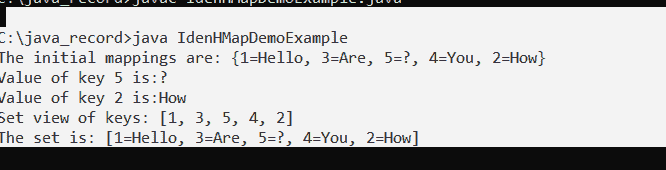

# Java 中的 IdentityHashMap

> 原文：<https://www.tutorialandexample.com/identityhashmap-in-java>

IdentityHashMap 类类似于 HashMap 类，是一个抽象映射实现。但是，在比较键时，它使用引用相等性，而不是对象相等性(或值)。

Identity HashMap 是一个非通用的映射实现。虽然这个类实现了 Map 接口，但它通过使用 equals()函数比较对象，故意违反了 Map 的通用契约。

它是特别为少数需要引用相等语义的场合设计的。当用户希望在参考的帮助下比较两个事物时，使用它。

要使用 IdentityHashMap 类，我们必须导入 java.util 包。

### IdentityHashMap 的特性:

*   它使用引用相等，而不是 equals()方法。它使用了==运算符。
*   因为 IdentityHashMap 以前没有同步，所以必须在外部同步。
*   在迭代过程中尝试修改时，迭代器会引发 ConcurrentModificationException。
*   它确保简单操作(如 get 和 put)的恒定时间性能，假设系统。
*   identityHashCode (Object)适当地分布桶中的元素。IdentityHashMap 使用 System 方法，而不是 hashCode()方法。方法 identityHashCode()()这是一个重要的区别，因为可变对象现在可以用作映射中的键，当映射存储在 IdentityHashMap 中时，预计映射的哈希代码会发生变化。

**语法:**

```
public class IdentityHashMap <K,V>  extends AbstractMap <K,V> implements Map<K,V>, Serializable, Cloneable  
```

V-一个对象的值

 **k 键

 **### IdentityHashMap 的构造函数:

IdentityHashMap 实例可以通过两种方式创建:

*   IdentityHashMap **< K** ，V**>**object _ ihm = new identity hashmap**<K**，V**>**()；
*   Map **< K** ，V**>**object _ hm = new identity hashmap**<K**，V**>**()；

**IdentityHashMap():**

它生成一个新的空身份哈希映射，预期最大大小为 21。

**语法:**

```
IdentityHashMap <K, V> object = new IdentityHashMap<K, V>( );  
```

**identity hashmap(int expected maxsize):**

它生成一个具有指定最大大小的新的空标识哈希映射。

**语法:**

```
IdentityHashMap <K, V> object= new IdentityHashMap(int ExpectedMaxSize);  
```

**IdentityHashMap (Map m):**

它使用先前映射中指定的键值对生成新的身份哈希映射。

**语法:**

```
IdentityHashMap <K, V> object= new IdentityHashMap(Map m);  
```


| 方法 | 描述 |
| void 清除(): | 它清除映射，删除所有映射。 |
| Set entrySet(): | 它返回映射的键值映射的集合视图。 |
| 对象 put(对象键，对象值): | 它将提供的值与身份哈希映射中的给定键相关联。 |
| 对象移除(对象键): | 它从映射中删除所提供键的所有映射(如果存在)。 |
| Set keySet(): | 它返回哈希表中键的基于身份的集合视图。 |
| void putAll(地图 t): | 当前映射从给定映射(在参数中)接收所有映射。这些映射将覆盖映射中提供的任何键的任何现有映射。 |
| 对象克隆(): | 它返回所提供的标识哈希映射的浅层副本。另一方面，键和值不会被复制。 |
| int size(): | 返回标识哈希映射的键值映射计数。 |
| 布尔包含值(对象键): | 它检查提供的对象引用是否是标识哈希映射中的值。 |
| 布尔包含键(对象键): | 它检查所提供的对象是否是标识哈希映射中的一个键。 |
| 布尔等于(对象 o): | 它将提供的项目与地图进行比较，以确定是否相等。 |
| 布尔 isEmpty(): | 如果提供的标识哈希映射没有映射，则返回 true。 |
| 对象获取(对象键): | 它返回标识哈希映射中对应于所提供的键的值。如果映射中没有该键的映射，则返回 null。 |
| 集合值(): | 它返回集合视图的地图值。 |
| int hashCode(): | 它返回给定映射的散列码值。 |


**IdenHMapDemo.java:**

```
// importing the pacakages and classes 
import java.util.Map;  
import java.util.HashMap;  
import java.util.IdentityHashMap;  
import java.util.*;  
public class IdenHMapDemo {  
   public static void main(String args[]) {  
      // instance- IdenHMapDemo   
      Map<String, String> idenHashmap = new IdentityHashMap<>();  
      // insert the elements -put method  
      //  key value pairs  
      idenHashmap.put("Priyanka", "101430");  
      idenHashmap.put("Shravani", "23240");  
      idenHashmap.put(new String("Shreya"), "23430");  
      idenHashmap.put("Anup", "45020");  
      idenHashmap.put("Nirnaya", "67705");  
      Set iSet = idenHashmap.entrySet();  
      Iterator i = iSet.iterator();  

      while(i.hasNext()) {  
         Map.Entry m= (Map.Entry)i.next();  
         System.out.print(m.getKey() + ": ");  
         System.out.println(m.getValue());  
      }  
      System.out.println();  
      // idenHashmap.size() comparing  objects through reference   
      // and printing the size of IdentityHashMap  
      System.out.println(" IdentityHashMap is: " + idenHashmap.size());  
   }  
} 
```

**输出:**

  

## IdentityHashMap 上的操作

**添加元素:**

为了向 IdentityHashMap 添加条目，我们利用 put()和 putAll()方法。put()方法将键和值添加到映射中。当给定当前密钥时，以前的值将被新值替换。PutAll()将所有键值映射从一个映射移动到另一个映射。

**idenhmapdemexample . Java:**

```
import java.util.*;  
public class IdenHMapDemoExample {  
    public static void main (String [] args)  
    {  

        Map<Integer, String> obj_ihm = new IdentityHashMap<Integer, String> ();  
        obj_ihm.put (1, "Hello");  
        obj_ihm.put (2, "??!");  
        obj_ihm.put (3, "welcome");  
        obj_ihm.put (4, "tutorials");  
        obj_ihm.put (5, "welcome");  
        // display IdentityHashMap  
        System.out.println (" mappings initially are: " + obj_ihm);  
        //  existing key with new value  
        //  past value stored in prev_value  
        String prev_value  = (String)obj_ihm.put (1, "Heyyy");  

        System.out.println ("\nReturned value is: "+ prev_value);  
        // displaying  new map  
        System.out.println ( "\nIdentityHashMap after assigning new value for the existing key:\n " + obj_ihm);  
        //  new Identityhashmap and  putAll ()  method
        Map<Integer, String> newHMap  = new IdentityHashMap<Integer, String> ();  
        newHMap.putAll (obj_ihm);  
        // Display final IdentityHashMap  
        System.out.println ("\n new IdentityHashMap : "+ newHMap);  
    }  
} 
```

**输出:**


**移除元素:**

remove()方法用于从映射中删除映射(键值对)。

**IdenHMapDemoExample.java**

```
import java.util.*;  
public class IdenHMapDemoExample {  
    public static void main ( String [] args)  
    {  
        Map<Integer, String> obj_ihm = new IdentityHashMap<Integer, String> ();  
        //  key - value pairs  

        obj_ihm.put (1, "Hello");  
        obj_ihm.put (2, "How");  
        obj_ihm.put (3, "Are");  
        obj_ihm.put (4, "You");  
        obj_ihm.put (5, "?");  
        //  IdentityHashMap  on output screen
        System.out.println ("mappings initially are: " + obj_ihm);  
        // removing  
        String return_value = (String)obj_ihm.remove (3);   
        // Displaying  new IdentityHashMap on the output screen   
        System.out.println ("\n IdentityHashMap is: " + obj_ihm);  
    }  
} 
```

**输出:**

  

**访问元素:**

**idenhmapdemexample . Java:**

```
import java.util.*;    
public class IdenHMapDemoExample {      
    public static void main (String [] args)  
    {  

        Map<Integer, String> obj_ihm = new IdentityHashMap<Integer, String>();    
        //  key - value pairs  

        obj_ihm.put (1, "Hello");  
        obj_ihm.put (2, "How");  
        obj_ihm.put (3, "Are");  
        obj_ihm.put (4, "You");  
        obj_ihm.put (5, "?");  

        //  IdentityHashMap  on the output screen
        System.out.println ("The  mappings initially are: " + obj_ihm);  
        // accessing  of 5  
        System.out.println ("Value of key 5 is:" + obj_ihm.get (5));  
        // accessing  of 2  
        System.out.println ("Value of key 2 is:"+ obj_ihm.get (2));  

        System.out.println ("Set view of keys: "+ obj_ihm.keySet ());  
        // set view using entrySet ()  
        System.out.println ("The set is: "+ obj_ihm.entrySet ());  
    }  
} 
```

**输出:**

  

**同步身份哈希表:**

当几个线程同时访问身份哈希映射，并且其中至少有一个线程从根本上更新该映射时，该映射必须是外部同步的。(添加或删除一个或多个键值映射是一种结构映射变更。如果我们只是修改与一个实例已经拥有的键相关联的值，这不是结构性修改。)

这可以通过对包括地图的任何对象进行同步来实现。如果不存在这样的对象，地图应该被包装在集合中。synchronizedMap 方法()这应该在创建时完成，以避免对地图的不同步访问。

**语法:**

```
Map m = Collections.synchronizedMap (new IdentityHashMap(?));  
```****