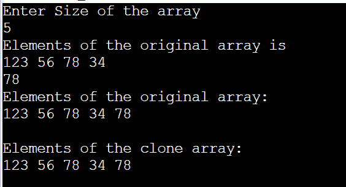
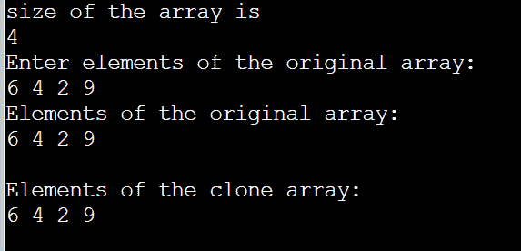
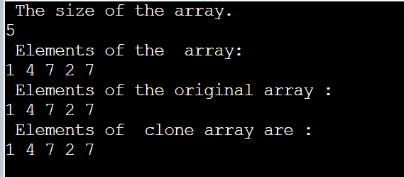
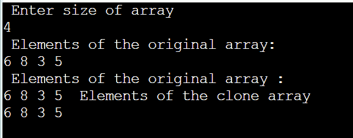
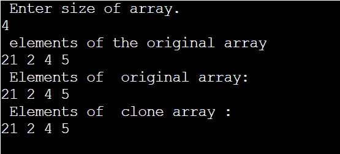

# Java 克隆阵列

> 原文：<https://www.tutorialandexample.com/java-clone-array>

我们经常需要复制一个阵列来备份其原始组件。我们有一些独特的数字和字符串，包括阿姆斯特朗数、回文数和回文字符串。为了测试它们的唯一性，我们必须克隆数组。例如，为了确定一个字符串是否是回文，我们首先将该字符串转换成一个字符数组，并创建一个字符数组的临时副本。char 数组的元素现在被反转，并与包含原始字符串的临时文件进行比较。

## 使用数组元素复制

这是一种简单的数组克隆方法。这种方法包括迭代初始数组并将每一部分放入不同的数组中。

CloneArray1.java

```
// import packages   
import java. Util. Scanner ;  
public class CloneArray1 {  
    // Main method where execution of the program starts
    public static void main ( String [ ] args )  
    {  
         int original [ ] ;  
         int clone [ ] ;  
         int s ;  
         Scanner sc = new Scanner ( System . in) ;  
         System . out. println ( " Enter Size of the array " ) ;  
         s = sc . nextInt ( ) ;  
         original = new int [ s ] ;  
         clone = new int [ s ] ;  
         System . out . println ( " Elements of the original array is " ) ;  
         for ( int i = 0 ; i < s ; i++ )
         {  
             original [i] = sc . nextInt ( ) ;  
         }  
         sc . close ( ) ;  
         for ( int i = 0 ; i < original . length ; i++ )
         {  
             clone [ i ] = original [ i] ;  
         }    
         System . out . println ( " Elements of the original array: " ) ;  
         for (int i = 0 ; i < original . length ; i++ )
         {  
             System . out . print ( original [ i ] + "  " ) ;  
         }  
         System . out . println ( " \n \n Elements of the clone array : " ) ;  
         for (int i = 0; i < clone . length ; i++ ) 
         {  
             System . out . print ( clone [ i ] + " " ) ;  
         }  
    }  
} 
```

**输出**

  

## Java 克隆()方法

在上面的函数中，原始数组被迭代以创建它的副本。Object 类的 clone()函数是另一个可以用来快速复制所提供的数组的选项。

Clone2.java

```
//import packages 
import java . util . Scanner ;  
public class Clone2 {  
    public static void main ( String [ ] args )  
    {  
         int original [ ] ;  
         int clone [ ] ;  
         int s ;  
         Scanner sc = new Scanner ( System . in ) ;  
         System . out . println ( " size of the array is " ) ;  
         s = sc . nextInt ( ) ;  
         original = new int [ s ] ;  
         clone = new int [ s ] ;  
         System . out . println ( " Enter elements of the original array : " ) ;  
         for ( int k = 0 ; k < s ; k++ ) {  
             original [ k ] = sc . nextInt ( ) ;  
         }  
         sc . close ( ) ;  
         clone = original . clone ( ) ;  
         System . out . println ( " Elements of the original array : " ) ;  
         for ( int j = 0 ; j < original . length ; j++ ) {  
             System . out . print ( original [ j ] + " " ) ;  
         }    
         System . out . println ( " \n\n Elements of the clone array: " ) ;  
         for ( int k = 0 ; k < clone . length ; k++ ) {  
             System . out . print ( clone [ k ] + " " ) ;  
         }  
    }  
}
```

**输出**

  

## Java arraycopy()方法

arraycopy()函数可以在 java.lang.*包的 System 类中找到。这种技术将一个数组的特定区域复制到另一个数组中。从源数组中的指定位置开始，将数组复制到目标数组中的指定位置。数组组件的子序列从 src 标识的源数组传输到 dest 指示的目标数组。

### 使用 arraycopy()方法克隆数组的程序

ArrayCopy.java

```
//import  packages 
import java . util . *;  
public class ArrayCopy {  
    // Main section where execution of the program starts 
    public static void main(String[] args)  
    {  
        // declaring array variables
         int original[];  
         int clone[];  
         // size of the array
         int s;  
         // creating object for scanner class
         Scanner sc = new Scanner(System.in);  
         System . out . println ( " size of the array is " ) ;  
         s = sc . nextInt ( ) ;  
         original = new int[s];  
         clone = new int[s];  
         System . out . println ( " the  array elements are " ) ;  
         for ( int k = 0 ; k < s ; k++ )
         {  
             original [ k ] = sc . nextInt ( ) ;  
         }  
         // closing the scanner class
         sc . close ( ) ;  
         System . arraycopy ( original , 0 , clone , 0 , s ) ;  
         System . out . println ( " the original array elements are " ) ;  
         for (int j = 0 ; j < original . length ; j++ )
         {  
             System . out . print ( original [ j ] + " " ) ;  
         }  
         System . out . println ( "\n Elements of  clone array :" ) ;  
         for ( int k = 0 ; k < clone . length ; k++ ) 
         {  
             System . out . print ( clone [ k ] + " " ) ;  
         }  
    }  
} 
```

**输出**

  

## Java CopyOf()方法

java.util 包中 Arrays 类的 copyOf()函数与 clone()和 arraycopy()方法类似。这里，len 指定将要复制的数组的长度，而 arr 指定原始数组。

### 使用 copyOf()方法克隆数组的程序

CopyOf.java

```
//import packages
import java.util.*;  
public class CopyOf {  
    public static void main(String[] args)  
    {  
         int original[];  
         int clone[];  
         int s;  
         Scanner sc = new Scanner(System.in);  
         System . out . println ( " size of array  the array is" ) ;  
         s = sc . nextInt ( ) ;  
         original = new int [ s ] ;  
         clone = new int [ s ] ;  
         System . out . println ( " the original array elements are " ) ;  
         for ( int k = 0 ; k < s ; k++ ) 
         {  
             original [ k ] = sc . nextInt ( ) ;  
         }  
         sc.close();  
         clone = Arrays . copyOf ( original , s ) ;  
         System . out . println ( " The original array  elements are : " ) ;  
         for ( int j = 0 ; j < original . length ; j++ )
         {  
             System . out . print ( original [ j ] + " " ) ;  
         }  
         System . out . println ( " The cloned array elements are " ) ;  

         for  ( int j = 0 ; j  <  clone . length ; j++ ) {  
             System . out . print (clone [ j ] + " " ) ;  
         }  
    }  
} 
```

**输出**

  

## Java copyOfRange()方法

Arrays 类有 copyOfRange()函数来克隆一个数组，类似于 copyOf()方法。使用 copyOfRange()函数将指定范围内的原始数组元素复制到新数组中。这里定义了元素的开始和结束索引。

### 使用 copyOfRange()方法克隆数组的程序

CopyOfRange.java

```
//import packages  
import java.util.Scanner;  
import java.util.Arrays;  
public class CopyOfRange {  
    public static void main(String[] args)  
    {  
         int original [ ] ;  
         int clone [ ] ;  
         int s ;  
         Scanner sc = new Scanner(System.in);  
         System . out . println ( " Enter  array size ." ) ;  
         s = sc.nextInt ( ) ;  
         original = new int [ s ] ;  
         clone = new int [ s ] ;  
         System . out . println ( " The original array elements are " ) ;  
         for ( int j = 0 ; j < s ; j++ ) {  
             original [ j ] = sc . nextInt ( ) ;  
         }  
         clone = Arrays.copyOfRange ( original , 0 , s ) ;  
         System . out . println ( " Elements of  original array: " ) ;  
         for ( int j = 0 ; j < original . length ; j++ )
         {  
             System . out . print (original [ j ] + " " ) ;  
         }  
         System . out . println ( " \n New  cloned array elements are : " ) ;  
         for ( int k = 0 ; k < clone . length ; k++ )
         {  
             System . out . print ( clone [ k ] + " " ) ;  
         }  
    }  
}
```

**输出**

