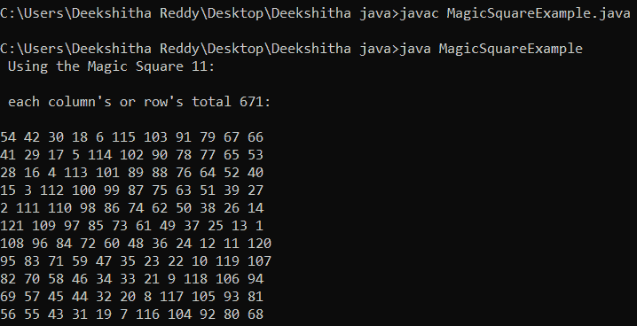

# Java 中的魔方

> 原文：<https://www.tutorialandexample.com/magic-square-in-java>

带有数字的正方形被称为幻方。排列 n 阶幻方中的数字，以确保行、列和对角线中所有数字的总和等于列中所有数字的总和，并且对角线分别与行、列和对角线中所有数字的总和相似。如果用 M 来表示和，那么 M 完全依赖于 M，M 在数学上确实有以下性质。

M = m(m2 + 1) / 2。

因此，

对于 m = 2，

m = 2 x(2^2+ 1)/2 =(2 x(4+1))/2 =(2 x 5)/2 = 10/2 = 5

对于 m = 4，

m = 4x(4^2+ 1)/2 =(4x(8+1))/2 =(4x 9)/2 = 36/2 = 18

对于 m= 9，

m = 9 x(92+1)/2 =(9 x(81+1))/2 =(9 x 82)/2 = 369

对于 m= 3，

m = 3 x(3^2+ 1)/2 =(3 x(9+1))/2 =(3 x 10)/2 = 30/2 = 15

让我们来看几个魔方插图。

对于 m = 15 的值，存在 15 x 15 的幻方，每一行、列和对角线的值为 1695。

```
104 88 72 56 40 24 8 217 201 185 169 153 137 121 120
87 71 55 39 23 7 216 200 184 168 152 136 135 119 103
70 54 38 22 6 215 199 183 167 151 150 134 118 102 86
53 37 21 5 214 198 182 166 165 149 133 117 101 85 69
36 20 4 213 197 181 180 164 148 132 116 100 84 68 52
19 3 212 196 195 179 163 147 131 115 99 83 67 51 35
2 211 210 194 178 162 146 130 114 98 82 66 50 34 18
225 209 193 177 161 145 129 113 97 81 65 49 33 17 1
208 192 176 160 144 128 112 96 80 64 48 32 16 15 224
191 175 159 143 127 111 95 79 63 47 31 30 14 223 207
174 158 142 126 110 94 78 62 46 45 29 13 222 206 190
157 141 125 109 93 77 61 60 44 28 12 221 205 189 173
140 124 108 92 76 75 59 43 27 11 220 204 188 172 156
123 107 91 90 74 58 42 26 10 219 203 187 171 155 139
106 105 89 73 57 41 25 9 218 202 186 170 154 138 122 
```

对于 m = 13 的值，存在一个 13×13 的幻方，每行、每列和每条对角线的值为 1105。

```
77 63 49 35 21 7 162 148 134 120 106 92 91
62 48 34 20 6 161 147 133 119 105 104 90 76
47 33 19 5 160 146 132 118 117 103 89 75 61
32 18 4 159 145 131 130 116 102 88 74 60 46
17 3 158 144 143 129 115 101 87 73 59 45 31
2 157 156 142 128 114 100 86 72 58 44 30 16
169 155 141 127 113 99 85 71 57 43 29 15 1
154 140 126 112 98 84 70 56 42 28 14 13 168
139 125 111 97 83 69 55 41 27 26 12 167 153
124 110 96 82 68 54 40 39 25 11 166 152 138
109 95 81 67 53 52 38 24 10 165 151 137 123
94 80 66 65 51 37 23 9 164 150 136 122 108
79 78 64 50 36 22 8 163 149 135 121 107 93 
```

## 填充正方形的规则

让我们讨论一些在设计魔方填充规则时有用的概念。从 1 到 m2 的每一个数字都出现在魔方上，这是肯定的。数字 1 将被放置在坐标(m / 2，m - 1)处，从该点开始，每一行和每一列将被视为圆形，因此将会环绕。

**规则 1:** 在任意位置，将前面填充的数字的行号减 1，列号减 1，确定后面数字的位置。如果行的计算位置在任何时候改变为-1，我们将把它绕回 m - 1。与此类似，如果估计位置为 m，我们将在 0 附近换行。

**规则 2:** 如果幻方中的计算位置已经有一个数字，则列的计算位置减少 2，行的计算位置增加 1。

**规则 3:** 如果行的计算位置为-1，列的计算位置为 m，则新位置如下:(0，m - 2)。

为了更好的理解，我们来举个例子。

Two hundred and seventy-six

Nine hundred and fifty-one

Four hundred and thirty-eight

上一句中的方阵有 9 个分量，阶数为 3。

第一个数字的位置是(3 / 2，3 - 1) = (1，2)

数字 2 在位置(1 - 1，2 + 1)，等于(0，3)。(0，0) [3 被重写为 0]

数字三位于(0 - 1，0 + 1) = (-1，1) = (3 - 1，1) = (2，1)

[-1 改写为 3 - 1 = 2]

四号在(2 - 1，1 + 1) = (1，2)的位置。然而，数字 1 已经占据了(1，2)的位置，应用规则 2 的结果是(1 + 1，2 - 2) = (2，0)。

5 的位置值是(2 - 1，0 + 1) = (1，1)

六号在(1 - 1，1 + 1) = (0，2)的位置

数字 7 位于位置(0 - 1，2 + 1) = (-1，3) = (0，3 - 2) = (0，1)

[在这种情况下使用规则 3]

数字 8 位于位置(0 - 1，1 + 1) = (-1，2) = (3 - 1，2) = (2，2)

[-1 改写为 3 - 1 = 2]

数字 9 在位置(2 - 1，2 + 1)，等于(1，3)。(1, 0)

[3 被重写为 0]

## 履行

下面的代码是以上面的示例为指导开发的。

MagicSquareExample.java

```
public class MagicSquareExample   
{  
// How to create magic squares of odd sizes
public void makeSquare(int t)  
{  
int ms[][] = new int[t][t];  
// Put 1 in its initial place.  
int row = t / 2;  
int column = t - 1;  
// Put each value in the magic square one at a time. 
for (int n = 1; n <= t * t;)   
{  
if (row == -1 && coloumn == t) // the 3rd prerequisite  
{  
coloumn = t - 2;  
row = 0;  
}  
else   
{  
// if the following number is beyond the range, 
// use the first rule as an assist.
if (column == t)  
{  
coloumn = 0;  
}  
// if the following number is beyond the range, 
// use the first rule as an assist.
if (row < 0)  
{  
row = t - 1;  
}  
}  
// the 2nd prerequisite 
if (ms[row][coloumn] != 0)   
{  
coloumn = coloumn - 2;  
row = row + 1;  
continue;  
}  
else  
{  
// adjusting the value  
ms[row][coloumn] = n;  
n = n + 1;  
}  
// the first prerequisite 
coloumn = coloumn + 1;  
row = row - 1;  
}  
// the magic square as output  
System.out.println(" Using the Magic Square " + t + ": \n");  
System.out.println(" each column's or row's total " + t * (t * t + 1) / 2 + ": \n");  
for (row = 0; row < t; row++)   
{  
for (coloumn = 0; coloumn < t; coloumn++)  
{  
System.out.print(ms[row][coloumn] + " ");  
}  
System.out.println();  
}  
}  
// main method  
public static void main(String[] args)  
{  
// When m = 11, a magic 
// square of order 11 is produced. 
int m = 11;  
// creating an instance for the class MagicSquareExample 
MagicSquareExample o = new MagicSquareExample();  
// using the makeSquare method  
o.makeSquare(m);  
}  
} 
```

**输出:**

  

**时间复杂度:**给定程序的时间复杂度为 O(n2)，表示矩阵形式的列数或行数。

**空间复杂度:**给定程序的空间复杂度为 O(n2)，表示二维数组中的列数或行数。