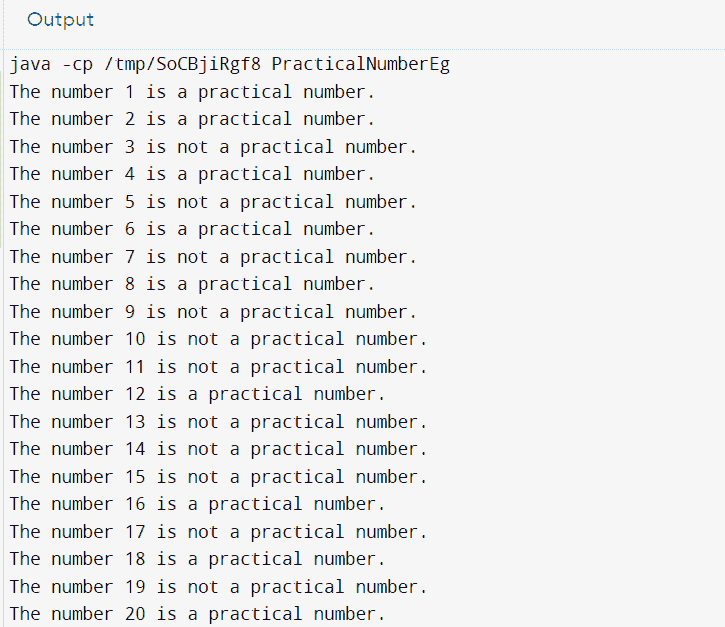

# Java 中的实用数字

> 原文：<https://www.tutorialandexample.com/practical-number-in-java>

在本教程中，我们将了解什么是实际数字。我们将通过 java 编程语言中的例子和实现来理解它。实用数字是最常见的编码面试问题。

任何一个数 A 在 Java 中都称为**实际数如果所有小于 A 的数 B(B<A)都写成 A 的唯一真除数之和**

注意，一个数的真除数不包括该数本身。

**获取实际数字的步骤**

**第一步:** Allocateor 给变量赋值。

**第二步:**求给定数的真约数。

**第三步:**用一个列表来存储这些除数。

**第四步:**逐个取出所有小于给定数(范围- 1 到 n- 1 (n=给定数))的数，并尝试从列表(在第三步中找到)中找到其和等于所取数的子集。

**第五步:**检查从 1 到 n - 1 的每个数是否找到子集。如果找到子集，那么给定的数就是**实用**数；否则，不会。

### 插图

现在让我们看一些例子来更好地理解实际数的概念。

**例 1**

假设 A = 10

那么，A 的真约数是:1，2，5

所有小于 10 的数字都是 B = {1，2，3，4，5，6，7，8，9}

检查 B 中的每个数字是否存在。

1 = 1 (1 是 X 的适当除数)

2 = 2 (2 也是 X 的适当除数)

3 = 1 + 2 (1 和 2 都是 x 的真约数，而且它们是唯一的)

4 = 2 + 2 (2 是 x 的适当除数。然而，2 出现了两次，这不是唯一的)

因此，我们发现至少有一个数字不满足所述条件。所以数字 **10** 并不是一个实用的数字。

**例 2**

假设 A = 15

那么，A 的真约数是:1，3，5

所有小于 15 的数字都是 B = {1，2，3，4，5，6，7，8，9，10，11，12，13，14}

检查每个数字是否都出现在 B 中。

1 = 1 (1 是 A 的真除数)

2 = 2 (2 不是 A 的真除数)

3 = 3 (3 也是 A 的适当除数)

4 = 2+2(A 的既不是唯一的也不是真约数

5 = 5 (5 也是 A 的适当除数)

因此，我们发现所有的数字都不满足实际数字所要求的条件。因此， **15** 不是一个实用的数字。

**例 3**

假设 A = 16

那么，A 的真约数是:1，2，4，8

所有小于 15 的数字都是 B = {1，2，3，4，5，6，7，8，9，10，11，12，13，14，15}

检查每个数字是否都出现在 B 中。

1 = 1 (1 是 A 的真除数)

2 = 2 (2 是 A 的适当除数)

3 = 2+1(两者都是唯一的，并且是 A 的适当除数)

4 = 3+1(两者都是唯一的，并且是 A 的适当除数)

5 = 3+2(两者都是唯一的，并且是 A 的适当除数)

6 = 4+2(两者都是唯一的，并且是 A 的适当除数)

7 = 3+4(两者都是唯一的，并且是 A 的适当除数)

8 = 7+1(两者都是唯一的，并且是 A 的适当除数)

9 = 8+1(两者都是唯一的，并且是 A 的适当除数)

10 = 9+1(两者都是唯一的，并且是 A 的适当除数)

11 = 10+1(两者都是唯一的，并且是 A 的适当除数)

12 = 11+1(两者都是唯一的，并且是 A 的适当除数)

13 = 12+1(两者都是唯一的，并且是 A 的适当除数)

因此，我们发现所有的数都满足实际数所要求的条件。因此， **16** 是一个实用的数字。

**例 4**

假设 A = 6

那么，A 的真约数是:1，2，3

所有小于 15 的数都是 B = {1，2，3，4，5}

检查每个数字是否都出现在 B 中。

1 = 1 (1 是 A 的真除数)

2 = 2 (2 不是 A 的真除数)

3 = 3 (3 也是 A 的适当除数)

4 = 3+1(两者都是唯一的，也是 A 的真约数)

5 = 3+2(两者都是唯一的，也是 A 的真约数)

因此，我们发现所有的数字都不满足实际数字所要求的条件。因此， **6** 是一个实用的数字。

## 履行

现在让我们看一段 JAVA 代码来理解从 1 到 20 的数字的实际性质。

```
// Online Java Compiler
// Import Statement  
import java.util.*;  

public class PracticalNumberEg
{  
// A method returns boolean value true whenever s is equal to the sum of a subset of v  
public booleanisAddSubset(int s, int size, Vector<Integer> v)  
{  
// The value of isSubset[j][i] will give out true, when  
// there is a subset of v[0..i-1] with the sum  
// equal to j   
booleanisSubset[][] = new boolean[size + 1][s + 1];  

// the answer is true whenever we get the sum as 0  
for (int j = 0; j <= size; j++)  
{  
isSubset[j][0] = true;  
}  

// the subset is not empty and the sum is 0\. Hence, the  value  is false
for (int j = 1; j <= s; j++)  
{  
isSubset[0][j] = false;  
}  

// Filling the subset table in a bottom-up manner  
for (int j = 1; j <= size; j++)  
{  
for (int i = 1; i<= s; i++)  
{  
if (i<v.get(j - 1))  
{  
isSubset[j][i] = isSubset[j - 1][i];  
}  
if (i>= v.get(j - 1))  
{  
isSubset[j][i] = isSubset[j - 1][i] || isSubset[j - 1][i - v.get(j - 1)];  
}  
}  
}  
return isSubset[size][s];  
}  

// a method to keep or store all the divisors of no in the vector f  
public void keepDivisors(int no, Vector<Integer> f)  
{  
// A loop to keep track of all divisors that divides 'num'  
for (int j = 1; j <= Math.sqrt(no); j++)  
{  

// if 'j' is the divisor of 'no'  
if (no % j == 0)  
{  

// if divisor and quotient both are the same   
// then either divisor or quotient will be considered  
// for example - 9 / 3 = 3\. In this case, quotient and   
// divisor both are 3\. Hence, only one 3 will be stored in the vector f  
if (j == (no / j))  
f.add(j);  
else  
{  
f.add(j);  
f.add(no / j);  
}  
}  
}  
}  

// A method that returns true whenever a num is a practical number  
public booleanisPracticalNo(int num)  
{  
// a vector for storing all the factors of num
Vector<Integer> factor = new Vector<Integer>();  

// a method that fills the vector factor  
keepDivisors(num, factor);  
int size = factor.size();  

// to checking all numbers from 1 to <num
for (int j = 1; j <num; j++)  
{  
if (!isAddSubset(j, size, factor))  
return false;  
}  
return true;  
}  

// main method  
public static void main(String argvs[])  
{  
// creating an object of the class PracticalNumberExample
PracticalNumberEgpNumObj = new PracticalNumberEg();   

for(int i = 1; i<= 20; i++)  
{  
if(pNumObj.isPracticalNo(i) == true)  
System.out.println("The number " + i + " is a practical number.");  
else  
System.out.println("The number " + i + " is not a practical number.");  
}  
}  
} 
```

**输出:**



**解释:**循环从 1 到 20，根据设计的代码检查数字是否是实际数字。为了检查编号是否为实际编号，名为 **isPracticalNo** 的函数被调用。检查每个数字后，会打印出一条合适的消息。

## 摘要

我们通过深入了解术语“实际数字”开始了本教程。我们进一步了解了获取这些数字应遵循的步骤。我们继续看了一些例子，以便更好地理解这个概念，并做了一些分析。最后，我们考虑了一种实用的方法。我们编写了一个代码来观察 1 到 20 之间的数字的实际性质。这都是些实用的数字。