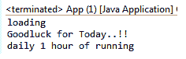
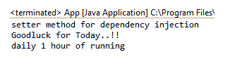

# Spring 依赖注入

> 原文：<https://www.tutorialandexample.com/spring-dependency-injection/>

**春天——依赖注入**

 **控制反转(IoC)的主要特征之一是**依赖注入(DI)** 。这是一个从一个对象向其他对象提供依赖关系的过程。Spring-Core 容器模块负责注入依赖项。依赖注入用于实现控制反转(IoC ),有时它本身也称为控制反转。IoC 的主要动机是保持所有 Java 类相互独立，并提供自动对象创建。在 Spring 中，依赖注入也确保了类之间的松耦合。

### 依赖注入的需求是什么？

让我们通过一个例子来理解这一点。在一个应用程序中，类 A 需要类 B 的对象来调用或操作一个方法，这样，类 A 就依赖于类 B。依赖于另一个类可能看起来没什么问题，但在大规模的应用程序中，这将产生许多问题。因此，我们需要避免这些类型的依赖。

Spring Inversion of Control (IoC)通过依赖注入(DI)解决了这样的问题。这使得代码更容易使用、学习和测试。通过 DI，通过定义接口，类之间的松耦合成为可能。

### 依赖注入的类型

Spring 中有两种类型的依赖注入:

1.  **构造函数依赖注入**–在这个 DI 类型中，依赖是在构造函数的帮助下注入的。要使用构造函数设置依赖关系，我们需要在 **bean-Configuration 文件中的**<Constructor-arg></Constructor-arg>**标签内添加依赖关系引用。**

 ****下面的代码展示了如何在配置文件中添加构造函数依赖:**

 **```
<bean>
<constructor-arg ref = "myfortune"></constructor-arg>
</bean> 
```

在上面的代码中， **myfortune** 是对构造函数注入的引用。

*   **Setter 依赖注入**–在这个 DI 类型中，依赖是在 Setter 方法的帮助下注入的。与构造函数注入相比，Setter 注入类型更容易访问。要使用 setter 设置依赖关系，我们需要将 **<属性></属性>** 标签内的依赖关系引用添加到 **bean-configuration 文件中。**

**下面的代码显示了如何在配置文件中添加 Setter 依赖:**

 **```
<bean>
<property name = "fortuneservice" ref = "myfortune"></property>
</bean> 
```

**构造函数依赖注入的例子**

 **让我们借助一个例子来理解构造函数依赖注入。在这个例子中，**财富**和**蔻驰**是包含未实现方法的接口。 **GoodLuckFortune** 类实现了 Fortune 接口及其未实现的方法。类似地，**Cricket _ 蔻驰**类实现了蔻驰接口及其未实现的方法。

以下是创建构造函数依赖注入示例的步骤:

**Fortune.java**T2】

```
public interface Fortune {
             public String fortuneService();
   } 
```

**GoodLuckFortune.java**T2】

```
public class GoodLuckFortune implements Fortune {
             public String fortuneService() {
                         return "Goodluck for Today..!!";
             }
   } 
```

**Coach.java**T2】

```
public interface Coach {
             public String workout();
             public String getDailyFortune();
  }  
```

**Cricket_Coach.java**

 **```
public class Cricket_Coach implements Coach {
             private Fortune fortuneservice;
                        // setting a Constructor
             public Cricket_Coach(Fortune fortuneservice) {
                         super();
                         this.fortuneservice = fortuneservice;
             } 
             public String workout() {
         return "daily 1 hour of running ";
          }
       public String getDailyFortune() {
         return fortuneservice.fortuneService();
             }
   } 
```

在上面的**Cricket _ 蔻驰**类中，我们创建了一个 **arg-constructor** 用于执行依赖注入。

**application context . XML**

 **```
<?xml version = "1.0" encoding = "UTF-8"?>
 <beans xmlns = "http://www.springframework.org/schema/beans"
         xmlns:xsi = "http://www.w3.org/2001/XMLSchema-instance"
         xmlns:p = "http://www.springframework.org/schema/p"
         xsi:schemaLocation = "http://www.springframework.org/schema/beans   
 http://www.springframework.org/schema/beans/spring-beans-3.0.xsd">
 <!--Define the dependency -->
 <bean id = "myfortune" class = "com.app.SpringDI.GoodLuckFortune"></bean>
 <bean id = "mycoach" class ="com.app.SpringDI.Cricket_Coach">
 <!-- setup the Constructor Injection -->
 <constructor-arg ref = "myfortune"> 
 </constructor-arg> 
 </bean>
 </beans> 
```

上面的 bean 配置文件( **applicationContext** )包含了**<bean></bean>**标签中的 bean 信息。**<bean>**标签用于定义多个 bean。在**bean**标签内，定义了**<bean></bean>**标签用于定义不同的 bean。 **< bean >** 标签用于定义一个 bean 类。

在**<constructor-arg></constructor-arg>**标签内还包含了依赖注入的构造函数引用。

**App.java**T2】

```
import org.springframework.context.ApplicationContext;
 import org.springframework.context.support.ClassPathXmlApplicationContext;
 public class App 
 {
     public static void main( String[] args )
     {
                     ClassPathXmlApplicationContext appcontext = new ClassPathXmlApplicationContext("applicationContext.xml"); 
             System.out.println("loading");
             Coach co = appcontext.getBean("mycoach", Coach.class);
             System.out.println(co.getDailyFortune());
             System.out.println(co.workout());
     }
 } 
```

上面的 **App** 类包含了 **main()** 方法。

**输出**

 **

现在，我们将创建一个 Setter 依赖注入的例子。

**Setter 依赖注入的例子**

 **我们已经在上面讨论了构造函数依赖注入的例子。现在，我们将创建 SDI 示例。它类似于上面的例子。**财富**和**蔻驰**是未实现方法的接口。 **GoodLuckFortune** 和**Cricket _ 蔻驰**是 Bean 类，分别实现了 Fortune 和蔻驰接口。

下面是创建 Setter 依赖注入示例的步骤:

**Fortune.java**T2】

```
public interface Fortune {
             public String fortuneService();
 } 
```

**GoodLuckFortune.java**T2】

```
public class GoodLuckFortune implements Fortune{
             public String fortuneService() {
                         return "Goodluck for Today..!!";  
             }
 } 
```

**Coach.java**T2】

```
public interface Coach {
             public String workout();
             public String getDailyFortune();
 } 
```

**Cricket_Coach.java**

 **```
public class Cricket_Coach implements Coach {
             private Fortune fortuneservice;
              //setter method for dependency injection
             public void setFortuneservice(Fortune fortuneservice) {
                         this.fortuneservice = fortuneservice;
                         System.out.println("setter method for dependency injection");
             } 
             public String workout() {
               return "daily 1 hour of running ";
             }
             public String getDailyFortune() {
             return fortuneservice.fortuneService();
             }
 } 
```

在上面的**Cricket _ 蔻驰**类中，我们使用了 **setter** 方法来执行依赖注入。

**application context . XML**

 **```
<?xml version = "1.0" encoding = "UTF-8"?>
 <beans xmlns = "http://www.springframework.org/schema/beans"
         xmlns:xsi = "http://www.w3.org/2001/XMLSchema-instance"
         xmlns:p = "http://www.springframework.org/schema/p"
         xsi:schemaLocation = "http://www.springframework.org/schema/beans   
 http://www.springframework.org/schema/beans/spring-beans-3.0.xsd">
 <!--Define the dependency  -->
 <bean id = "myfortune" class= "com.app.SpringDI.GoodLuckFortune"></bean>
 <bean id = "mycoach" class ="com.app.SpringDI.Cricket_Coach">
 <!-- setting up the Setter Injection -->
 <property name = "fortuneservice" ref = "myfortune"></property>
 </bean> 
 </beans> 
```

在上面的 xml 文件中，我们在 **<属性></属性>** 标签中定义了依赖引用。

**App.java**T2】

```
import org.springframework.context.ApplicationContext;
 import org.springframework.context.support.AbstractApplicationContext;
 import org.springframework.context.support.ClassPathXmlApplicationContext;
 public class App 
 {
     public static void main( String[] args )
     { 
             ApplicationContext appcontext = new ClassPathXmlApplicationContext("applicationContext.xml");
             Coach co = appcontext.getBean("mycoach", Coach.class);
             System.out.println(co.getDailyFortune());
             System.out.println(co.workout());
     }
 } 
```

**输出**

 **************************