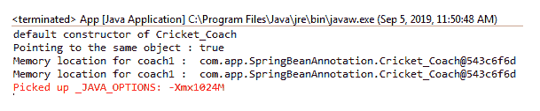
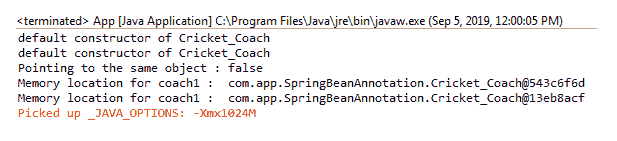

# 带注释的 Spring - Bean 作用域

> 原文：<https://www.tutorialandexample.com/spring-bean-scopes-with-annotations/>

**带注释的弹簧豆示波器**

我们之前已经讨论了使用基于 XML 的配置的 Spring bean 作用域。在基于 XML 的配置中，我们已经在 bean-config 文件(applicationContext)中定义了 bean 及其范围。

这里，我们将使用 **@Scope** 注释来定义 bean 的作用域。 **@Scope** 注释有两种用法:作为带有**@组件**的类型级注释，或者作为带有 **@Bean** 注释的方法级注释。范围定义了实例的生命周期。**org . spring framework . context . annotation**包包含了 **@Scope** 注释。

正如我们所讨论的，Spring 框架中有五个作用域，如下所列:

*   一个
*   原型
*   请求
*   会议
*   全球会议

请求、会话和全局会话是 web 感知应用程序使用的范围。

**下面的代码显示了如何使用单例作用域:**

```
@Component
@Scope("singleton")
public class Cricket_Coach implements Coach {
….
} 
```

**下面的代码显示了如何使用原型作用域:**

```
@Component
@Scope("prototype")
public class Cricket_Coach implements Coach {
….
}
```

**单一 bean 作用域的示例**

现在，我们将创建一个 singleton bean 作用域的示例。在下面的例子中，我们创建了一个接口**蔻驰**，它包含了一个未实现的方法。**Cricket _ 蔻驰**类实现了蔻驰接口及其未实现的方法。

单一作用域是默认作用域。如果我们不使用@Scope 注释来定义单例范围，默认情况下，Spring 会将其视为单例范围。

以下是用于创建单一 bean 范围示例的步骤:

**Coach.java**

```
public interface Coach {
public String training();
} 
```

**Cricket_Coach.java**

```
import org.springframework.context.annotation.Scope;
 import org.springframework.stereotype.Component;
 @Component
 @Scope("singleton")
 public class Cricket_Coach implements Coach {
 public Cricket_Coach() {
 System.out.println( "default constructor of Cricket_Coach" ) ;
}
public String training() { 
return "10 rounds of the ground daily..!!" ;
}
} 
```

在上面的类中，我们已经定义了@Scope 注释，其 singleton 作用域就在@Component 注释的下面。

**applicationContext.xml**

```
http://www.springframework.org/schema/beans/spring-beans-3.0.xsd
[http://www.springframework.org/schema/context](http://www.springframework.org/schema/context)
[http://www.springframework.org/schema/context/spring-context-3.0.xsd">](http://www.springframework.org/schema/context/spring-context-3.0.xsd">)
 <component-scan base-package="com.app.SpringBeanAnnotation"></component-scan>  
```

**App.java**

```
import org.springframework.context.support.ClassPathXmlApplicationContext;
public class App 
{
public static void main( String[] args )
{
ClassPathXmlApplicationContext appcontext = new ClassPathXmlApplicationContext("applicationContext.xml");
// retrieving the beans from the Spring 
Coach coach1 = appcontext.getBean("cricket_Coach" , Coach.class);
Coach coach2 = appcontext.getBean("cricket_Coach", Coach.class);
// check if both the objects are same
boolean result = (coach1 == coach2);
System.out.println("  Check  whether pointing to the same object : " + result);
System.out.println("Memory location for coach1 :  " + coach1);
System.out.println("Memory location for coach1 :  " + coach2);
appcontext.close(); 
}
} 
```

输出

以下输出显示这两个对象位于相同的内存位置。



现在，我们将创建一个原型 bean 作用域的示例。

**原型 bean 作用域的示例**

在下面的例子中，我们将创建一个接口**蔻驰**，它包含一个未实现的方法。**Cricket _ 蔻驰**类实现了**蔻驰**接口及其未实现的方法。

以下是用于创建原型 bean 范围示例的步骤:

**Coach.java**

```
public interface Coach {
public String training();
} 
```

**Cricket_Coach.java**

```
import org.springframework.context.annotation.Scope;
import org.springframework.stereotype.Component;
@Component
@Scope("prototype")
public class Cricket_Coach implements Coach {
public Cricket_Coach() {
System.out.println( "default constructor of Cricket_Coach" ) ;
}
public String training() { 
return "10 rounds of the ground daily..!!" ;
}
} 
```

**applicationContext.xml**

```
http://www.springframework.org/schema/beans/spring-beans-3.0.xsd
[http://www.springframework.org/schema/context](http://www.springframework.org/schema/context)
[http://www.springframework.org/schema/context/spring-context-3.0.xsd">](http://www.springframework.org/schema/context/spring-context-3.0.xsd">)
 <component-scan base-package="com.app.SpringBeanAnnotation"></component-scan>  
```

**App.java**

```
import org.springframework.context.support.ClassPathXmlApplicationContext;
 public class App 
 {
public static void main( String[] args )
{
ClassPathXmlApplicationContext appcontext = new ClassPathXmlApplicationContext("applicationContext.xml");
// retrieves beans from the Spring  
Coach coach1 = appcontext.getBean("cricket_Coach" , Coach.class);
Coach coach2 = appcontext.getBean("cricket_Coach", Coach.class);
// check if both the objects are same or not 
boolean result = (coach1 == coach2);

System.out.println("Check whether pointing to the same object : " + result);
System.out.println("Memory location for coach1 : " + coach1);
System.out.println("Memory location for coach1 : " + coach2);
appcontext.close(); 
}
} 
```

**输出**

以下输出显示这两个对象位于不同的内存位置。

