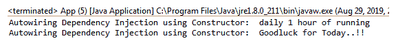

# Spring 自动布线–构造器注入

> 原文：<https://www.tutorialandexample.com/spring-autowiring-constructor-injection/>

**Spring 自动布线–构造器注入**

我们之前讨论过一个使用基于 XML 的配置的构造函数依赖注入(CDI)的例子。在前一个案例中，我们已经在 **bean-config** 文件( **applicationContext.xml** )中定义了构造函数的**引用**。

### 需要通过构造函数注入进行自动连接

如果有多个构造函数或 bean 可用于依赖注入，就会在 **bean-config** 文件中造成很多混乱。为了减少 bean-config 文件中的代码行，我们使用了基于注释的构造函数依赖注入(CDI)。CDI 也称之为自动布线。

为了创建一个使用自动连接的构造函数依赖注入的例子，我们使用了以下注释:

**@Component** -我们在之前的教程中已经讨论过@Component 注释。它用于创建一个作为组件的类。

**@ auto wired**-**@ auto wired 注释用于自动注入依赖关系。**

 ****使用构造函数注入的自动连线示例**

在这个例子中，我们已经创建了一个接口和组件类。**Fortune.java**和**Coach.java**是由未实现的方法组成的接口。GoodLuckFortune.java 和**T4**是两个组件类，分别实现了 Fortune.java**和 Coach.java**、**。**

以下是使用@Autowired 创建 CDI 示例的步骤:

**Fortune.java**

```
public interface Fortune {
public String fortuneService();
} 
```

**GoodLuckFortune.java**

```
import org.springframework.stereotype.Component;
@Component
public class GoodLuckFortune implements Fortune{
public String fortuneService() {
return "Goodluck for Today..!!";
}
} 
```

**Coach.java**

```
public interface Coach {
public String workout();
public String getDailyFortune();
} 
```

**Cricket_Coach.java**

```
import org.springframework.beans.factory.annotation.Autowired;
import org.springframework.stereotype.Component;
@Component
public class Cricket_Coach implements Coach {
private Fortune fortuneservice;
@Autowired
public Cricket_Coach(Fortune fortuneservice) { 
super();
this.fortuneservice = fortuneservice;
}
public String workout() {
return "daily 1 hour of running ";
}
public String getDailyFortune() {
return fortuneservice.fortuneService(); 
}
} 
```

在上面的代码中，我们在进行构造函数依赖注入时，在**构造函数**上方定义了@Autowired 注释。

**applicationContext.xml**

```
beans xmlns = "http://www.springframework.org/schema/beans"
xmlns:xsi = "http://www.w3.org/2001/XMLSchema-instance"
xmlns:context = "http://www.springframework.org/schema/context"
xsi:schemaLocation = "http://www.springframework.org/schema/beans
http://www.springframework.org/schema/beans/spring-beans-3.0.xsd
http://www.springframework.org/schema/context
http://www.springframework.org/schema/context/spring-context-3.0.xsd"> 

```

**App.java**

```
import org.springframework.context.support.ClassPathXmlApplicationContext;
 public class App 
 {
public static void main( String[] args )
{
ClassPathXmlApplicationContext appcontext = new ClassPathXmlApplicationContext("applicationContext.xml");
Coach co = appcontext.getBean("cricket_Coach", Coach.class); 
System.out.println("Autowiring Dependency Injection using Constructor:" + co.workout());
System.out.println("Autowiring Dependency Injection using Constructor: " + co.getDailyFortune());
appcontext.close();
}
} 
```

**输出**

**