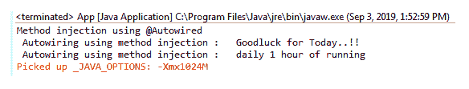

# 弹簧自动布线–现场注射

> 原文：<https://www.tutorialandexample.com/spring-autowiring-field-injection/>

**弹簧自动接线–现场注射**

字段注入用于注入 beans 的字段、变量或属性。它在使用基于 XML 的配置的自动布线中不可用。这是 Spring 基于注释的配置的一个新特性。

与构造函数和设置器注入相比，字段注入更容易使用。在字段注入中，我们不需要编写任何独特的代码，比如定义构造函数或方法。

**使用磁场注入的自动布线示例**

这里，我们将创建一个场注入的示例。在这个例子中，有两个接口，一个是**财富**，另一个是**蔻驰**。 **GoodLuckFortune** 和**Cricket _ 蔻驰**分别是实现 **Fortune** 和**蔻驰**接口的组件类。

以下是使用场注入创建自动布线示例的步骤:

**Fortune.java**

```
public interface Fortune {
public String fortuneService();
 } 
```

**GoodLuckFortune.java**

```
import org.springframework.stereotype.Component;
@Component
public class GoodLuckFortune implements Fortune{
public String fortuneService() {
return "Goodluck for Today..!!" ;
}
} 
```

**Coach.java**

```
public interface Coach {
public String workout();
public String getDailyFortune();
 } 
```

**Cricket_Coach.java**

```
import org.springframework.beans.factory.annotation.Autowired;
import org.springframework.stereotype.Component;
@Component
public class Cricket_Coach implements Coach {
// defining @autowired on the Field
@Autowired
private Fortune fortuneservice;
public String workout() {
return "daily 1 hour of running " ;
} 
public String getDailyFortune() {
return fortuneservice.fortuneService();
}
} 
```

在上面的代码中，我们在**板球 _ 蔻驰**类的字段或参数上方定义了**@自动连线**注释。

**applicationContext.xml**

```
http://www.springframework.org/schema/beans/spring-beans.xsd
[http://www.springframework.org/schema/context](http://www.springframework.org/schema/context) 
[http://www.springframework.org/schema/context/spring-context.xsd">](http://www.springframework.org/schema/context/spring-context.xsd">)
 <component-scan base-package="com.app.SpringDIFieldInjec"></component-scan>  
```

**App.java**

```
import org.springframework.context.support.ClassPathXmlApplicationContext;
 public class App 
 {
public static void main( String[] args )
{
ClassPathXmlApplicationContext appcontext = new ClassPathXmlApplicationContext( "applicationContext.xml" ) ;
Coach co = appcontext.getBean("cricket_Coach", Coach.class) ; 
System.out.println( " Autowiring Dependency Injection using Field Method : " + co.getDailyFortune()) ;
System.out.println( " Autowiring Dependency Injection using Field Method :" + co.workout()) ;
appcontext.close() ;
}
}
```

**输出**

**方法注射**

Spring @Autowired 注释提供了另一种类型的依赖注入，称为**方法注入。**通过方法注入，我们可以通过调用 bean 类的**任何方法**来注入依赖。例如，bean 中有一个方法 **doSomething()** ，我们可以使用@Autowired 注释将它用于方法注入。

例如:

**Cricket_Coach.java**

```
@Component
public class Cricket_Coach implements Coach {
fortuneservice;
@Autowired
public void doSomething(Fortune thefortuneservice) {
fortuneservice = thefortuneservice ;
System.out.println("Method injection using @Autowired");
}
} 
```

**输出**

