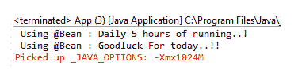

# spring——使用@Bean 的 Bean

> 原文：<https://www.tutorialandexample.com/spring-beans-using-bean/>

**Spring——使用@Bean 的 Bean**

我们之前已经讨论了一个使用基于 XML 的配置的 Spring 配置的例子。在前面的例子中，我们已经在 **bean-configuration** 文件( **applicationContext.xml** )中定义了 bean。为了使代码更容易理解，我们将使用@Bean 注释(基于注释的配置)来配置 Spring 应用程序。

**@ Bean-**@ Bean 是一个方法级别的注释。它告诉 Spring 容器带注释的方法将返回一个 bean。要定义 bean，请用@Bean 注释对方法进行注释。方法名必须与 bean 名相同。它还支持 **< bean >** 标签提供的几个属性，如 **init-method、destroy-method、dependency、**和 **autowiring。**

我们通过一个例子来理解@Bean 注释的概念。

**使用@Bean 注释的 Spring beans 示例**

这里，我们将使用@Bean 注释创建一个 Spring beans 的例子。**Fortune.java**和**Coach.java**是包含未实现方法的两个接口，**GoodLuckFortune.java**和 **Cricket_Coach.java** 是分别实现 **Fortune** 和**蔻驰**接口的 java 类。类**AppConfig.java**是一个基于 Java 的配置类，包含 bean 信息。

以下是使用@Bean 创建 Spring beans 示例的步骤:

*   **创建一个接口**

在这一步，我们将创建一个名为**Fortune.java 的界面。**

**Fortune.java**

```
public interface Fortune {
public String getDailyFortune();
}
```

*   **创建一个 Java 类**

在这一步，我们将创建一个名为**GoodLuckFortune.java**的类，它实现了**财富**接口。

**GoodLuckFortune.java**

```
import org.springframework.stereotype.Component;
@Component
public class GoodLuckFortune implements Fortune{
public String getDailyFortune() {
return "Goodluck For today..!!" ;
}
} 
```

*   **创建另一个接口**

在这一步，我们将创建另一个名为**Coach.java 的界面。**

**Coach.java**

```
public interface Coach {
public String getDailyTraining();
public String getFortuneService();
} 
```

*   **创建另一个 Java 类**

在这一步，我们将创建另一个名为 **Cricket_Coach.java** 的 Java 类，它实现了**蔻驰**接口。

**Cricket_Coach.java**

```
import org.springframework.stereotype.Component;
@Component
public class Cricket_Coach implements Coach {
private Fortune fortuneService;
public Cricket_Coach(Fortune fortuneService) {
this.fortuneService = fortuneService;
}
public String getDailyTraining() { 
return "Daily 5 hours of running..!" ;
}
public String getFortuneService() {
return fortuneService.getDailyFortune() ;
}
} 
```

*   **创建配置类**

在这一步中，我们将创建名为**AppConfig.java 的配置类。**

**AppConfig.java**

```
import org.springframework.context.annotation.Bean;
import org.springframework.context.annotation.ComponentScan;
import org.springframework.context.annotation.Configuration;
@Configuration
@ComponentScan( "com.app.SpringBean_usingBean" )
public class AppConfig {
// defining bean for GoodLuckFortune class 
@Bean
public Fortune goodLuckFortune() {
return new GoodLuckFortune();
}
//defining bean for Cricket_Coach class
@Bean 
public Coach cricket_Coach() {
return new Cricket_Coach(goodLuckFortune());
}
} 
```

在**AppConfig.java**文件中，我们已经声明了 bean 类，一个是 **GoodLuckFortune，**另一个是**Cricket _ 蔻驰。**Bean 名称和方法名称(在其上定义了@Bean)必须与上面代码中定义的相同。

*   **创建主类**

在这一步中，我们将学习名为**App.java 的主要课程。**

**App.java**

```
import org.springframework.context.annotation.AnnotationConfigApplicationContext;
public class App 
{
public static void main( String[] args )
{
AnnotationConfigApplicationContext appcontext = new AnnotationConfigApplicationContext(AppConfig.class);
Coach newCoach = appcontext.getBean("cricket_Coach", Coach.class); 
System.out.println(newCoach.getDailyTraining());
System.out.println(newCoach.getFortuneService());
appcontext.close();
}
} 
```

**输出**

