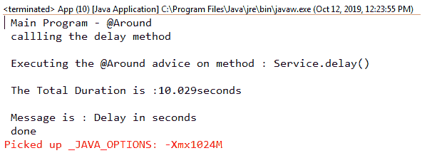
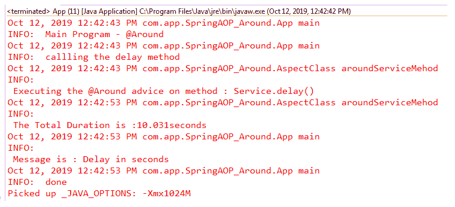

# spring AOP –@ Around Advice

> 原文：<https://www.tutorialandexample.com/spring-aop-around-advice/>

**春季 AOP-@周边建议**

我们已经在之前的教程中讨论了 Spring AOP 的概念和术语。建议是建议的一种。它可以在方法执行之前和之后应用于方法。这是最有力的建议。

让我们借助一个例子来简单理解一下 Around advice。

**@ Around 建议示例**

这里，我们将使用@around 注释创建一个 Around 通知的例子。

以下是创建@Around 建议示例的步骤:

*   **创建一个刀类**

在这一步中，我们将创建一个包含业务逻辑的 DAO 类名**服务**。在这个类中，我们定义了一个名为 **delay()** 的方法，它将在输出中产生 10 秒的延迟。

**Service.java**

```
import java.util.concurrent.TimeUnit;
 import org.springframework.stereotype.Component;
 @Component
 public class Service {
                 public String delay() {
                                 // produce a delay
                                 try {
                                                 TimeUnit.SECONDS.sleep(10);
                                     } catch (InterruptedException e) {
                                       e.printStackTrace();
                                 }
                                 return " Delay in seconds " ;
                 }
  } 
```

*   **创建一个执行组件扫描的类**

在这一步，我们将创建一个名为 **DemoAOP** 的类来执行组件扫描。

**DemoAOP.java**

```
import org.springframework.context.annotation.ComponentScan;
 import org.springframework.context.annotation.Configuration;
 import org.springframework.context.annotation.EnableAspectJAutoProxy;
 @Configuration
 @EnableAspectJAutoProxy
 @ComponentScan( "com.app.SpringAOP_Around" )
 public class DemoAOP {
 } 
```

*   **为特征逻辑创建一个特征类**

在这一步，我们将创建一个名为 **AspectClass，**的类，它包含方面逻辑(通知类型)。

**AspectClass.java**

```
import java.util.List;
 import org.aspectj.lang.ProceedingJoinPoint;
 import org.aspectj.lang.annotation.Around;
 import org.aspectj.lang.annotation.Aspect;
 import org.springframework.stereotype.Component;
 @Aspect
 @Component
 public class AspectClass {
                 @Around(" execution( * com.app.SpringAOP_Around.*.*()) ")
                 public Object aroundServiceMehod(ProceedingJoinPoint pjp) throws Throwable { 
                                 String str = pjp.getSignature().toShortString();
                                 System.out.println(" \n Executing the @Around advice on method : " + str);
                                 // begin the TimeStamp
                                 long start = System.currentTimeMillis();
                                 // execute the method
                                 Object reslt = pjp.proceed();
                                 // end the stopwatch
                                 long end = System.currentTimeMillis(); 
                                 // compute the result
                                 long duration = end - start;
                                 System.out.println(" \n The Total Duration is :" + duration / 1000.0 + "seconds");
                                 return reslt;
                 }
  } 
```

*   **创建主类**

在这一步中，我们将创建名为 **App** 的包含主方法的主类。

**App.java**

```
import java.util.List;
 import org.springframework.context.annotation.AnnotationConfigApplicationContext;
 public class App 
 {
     public static void main( String[] args )
     {
         AnnotationConfigApplicationContext appcontext = new AnnotationConfigApplicationContext( DemoAOP.class );
        Service serve = appcontext.getBean( "service", Service.class );
         System.out.println(" Main Program - @Around"); 
         System.out.println(" callling the delay method");
         String s = serve.delay();
         System.out.println(" \n Message is :" + s);
         System.out.println("done");
         appcontext.close();
          }
  } 
```

**输出**

下面的输出显示@Around 建议被应用于方法 **delay()。**它还显示执行的总持续时间。



### 使用记录器的建议

**Logger–**Logger 是一个界面，用于记录特定应用程序的消息。通过 Logger 接口，我们还可以记录操作。它可以在 **org.apache.log4j** 包中找到。

以下代码片段显示了如何使用记录器:

```
     private static Logger newlogger = Logger.getLogger(App.class.getName()); 
```

在上面的代码片段中， **newlogger** 是 logger 类的一个对象。

让我们借助一个例子来理解 Logger 的概念。

### 使用记录器的建议示例

这里，我们将使用 Logger 创建一个 Around advice 的示例。我们使用前面的例子，只是做了一些修改。

在下面的例子中，我们将把 **System.out.println** 替换为 **newlogger.info.**

修改在以下类中完成:

**AspectClass.java**

```
import java.util.List;
 import java.util.logging.Logger;
 import org.aspectj.lang.ProceedingJoinPoint;
 import org.aspectj.lang.annotation.Around;
 import org.aspectj.lang.annotation.Aspect;
 import org.springframework.stereotype.Component;
 @Aspect
 @Component
 public class AspectClass {
                 private Logger newlogger = Logger.getLogger(getClass().getName());
                 @Around(" execution( * com.app.SpringAOP_Around.*.*()) ")
                 public Object aroundServiceMehod(ProceedingJoinPoint pjp) throws Throwable {
                                 String str = pjp.getSignature().toShortString();
                                 newlogger.info(" \n Executing the @Around advice on method : " + str);
                                 // begin the TimeStamp
                                 long start = System.currentTimeMillis();
                                 // execute the method
                                 Object reslt = pjp.proceed();
                                 // end the stopwatch
                                 long end = System.currentTimeMillis(); 
                                 // compute the result
                                 long duration = end - start;
                                 newlogger.info(" \n The Total Duration is :" + duration / 1000.0 + "seconds");
                                 return reslt;
                 }
  } 
```

**App.java**

```
import java.util.List;
 import java.util.logging.Logger;
 import org.springframework.context.annotation.AnnotationConfigApplicationContext;
 public class App 
 {
      private static Logger newlogger = Logger.getLogger(App.class.getName()); 
      public static void main( String[] args )
     {
         AnnotationConfigApplicationContext appcontext = new AnnotationConfigApplicationContext(DemoAOP.class);
        Service serve = appcontext.getBean( "service", Service.class);
        newlogger.info(" Main Program - @Around");
        newlogger.info(" callling the delay method");
        String s = serve.delay();
        newlogger.info(" \n Message is :" + s);
        newlogger.info(" done ");
         appcontext.close();
        }
  } 
```

**输出**



在前面的例子中，我们使用了带有 around 建议的 Logger。我们还可以将它与任何其他建议类型一起使用。