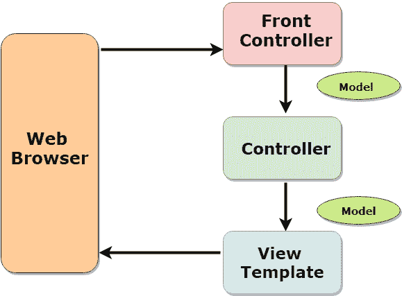
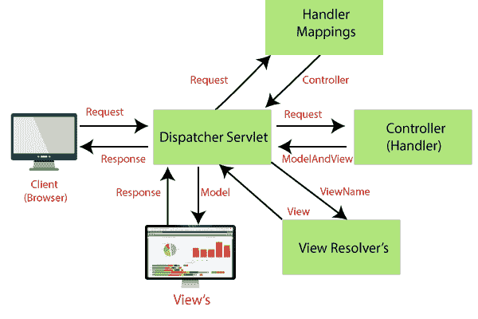
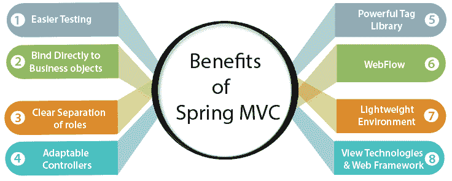

# Spring MVC 教程

> 原文：<https://www.tutorialandexample.com/spring-mvc-tutorial/>

**春季 MVC 教程**

**Spring MVC** 是一个基于 Servlet API 构建的 web **模型-视图-控制器**框架。它用于构建 web 应用程序。MVC 框架围绕名为 **DispatcherServlet** 的中央 servlet 工作。它将请求分派给控制器，并提供用于开发网络应用程序的其他功能。除了提供对象之间的松耦合，MVC 的主要目的是将应用程序的不同方面分成不同的逻辑(输入、业务和 UI 逻辑)。

**模型(M)–**模型包含应用程序的数据或信息。它负责管理应用程序的数据、业务逻辑和业务规则。该模型用于在应用程序中 Spring MVC 的不同部分之间传送数据。

**视图(V)–**视图用于以文本或图形的形式向用户显示信息或数据。在 Spring 中，我们最常用的视图模板是**JSP(Java server Pages)+JSTL(Java 标准标签库)。**JSP 页面用于读取模型数据，然后显示给用户。

**控制器(C)–**控制器是由开发人员创建的代码。它包含应用程序的业务逻辑。此外，它还处理 web 请求，将数据存储到数据库中，并从 web 服务/数据库中检索数据。

**前端控制器—****dispatcher servlet**在 Spring MVC 框架中充当前端控制器。它还负责 Spring MVC 的工作流。

### 调度员服务网

**DispatcherServlet** 是一个中央调度程序，用于处理 HTTP 请求，或者充当基于 Spring 的 web 应用程序的前端控制器。DispatcherServlet 将 web 请求分派给已注册的请求处理程序来处理请求，并提供方便的映射和异常处理功能。

> DispatcherServlet 是一个非常灵活的类，因为它围绕 JavaBeans 配置机制工作。我们可以在 web 应用程序中定义多个 DispatcherServlet。DispatcherServlet 类在**org . spring framework . web . servlet**包中定义。

### Spring Web MVC 的工作流程

步骤 1:dispatcher servlet 接收 web 请求。

**步骤 2:** 在 handlerMappings，DispatcherServlet 的帮助下，找到与给定请求相关联的**控制器**，然后将选择的控制器返回给 DispatcherServlet。

**步骤 3:** 请求被传送到控制器。控制器将通过执行适当的方法来处理请求，并将 ModelAndView(保存模型数据和视图名称)对象返回给 DispatcherServlet。

**步骤 4:**dispatcher servlet 将模型对象发送给视图解析器，以获取与视图相关联的实际视图页面。

**第五步:**在这一步中，视图页面用于显示结果。

### Spring Web MVC 的好处

Spring MVC 框架是一个用于开发 web 应用程序的**健壮、灵活的**和**精心设计的**框架。Spring MVC 模块的好处类似于 Spring 框架的其他模块。

下图展示了 Spring MVC 的好处。

*   更容易测试:大多数 Spring 类都被设计成 JavaBeans，这使得我们能够使用特定类的 setter 方法注入测试数据。它还提供了模拟类来生成 Java HTTP 对象，这使得 web 层的测试更加舒适。

*   **直接绑定到业务对象:** Spring MVC 不需要业务类来扩展任何特殊的类。它使我们能够通过将业务对象与 HTML 表单字段绑定来重用它们。控制器类是唯一需要扩展 Spring 类的类。

*   **角色的清晰分离:** Spring MVC 提供了框架的各个组件所扮演的角色的清晰分离。例如，与其他控制器相比，弹簧控制器具有不同的功能。

*   **适应性强的控制器:** Spring MVC 提供了适应性和灵活性，因为我们可以使用参数注释之一来定义所需数量的控制器方法签名，例如 **@RequestParam、@RequestHeader、@PathVariable** 等。

*   **强大的标签库:** Spring MVC 框架提供了强大的标签库。例如，Spring MVC 使用 JSP 表达式语言(EL)作为< spring:bind >标签的参数。JSP 标记库也称为 Spring 标记库。

*   **Web flow:** Spring MVC 是一个子项目，不与 Spring 核心模块包装在一起。Spring web flow 是 web 开发栈的一部分，包括 Spring MVC。这是一个强大的控制器。当应用程序需要复杂的受控导航时使用它。

*   轻量级环境:和 Spring 一样，Spring MVC 也支持 POJO 应用，这使得 Spring MVC 更加**轻量级**。Spring MVC 的环境设置可以更加简单和便宜，因为我们可以使用轻量级 Servlet 容器来开发和部署我们的应用程序。

*   **视图技术& Web 框架:** Spring 支持多种视图技术，如 **JSP、Apache Velocity、FreeMarker** 等。我们将在教程中使用 JSP 视图技术。Spring 还为 Apache Struts、Apache Tapestry 和 Open Symphony 的 WebWork 提供集成支持。

### Spring MVC

*   [春季 MVC 教程](https://www.tutorialandexample.com/spring-mvc-tutorial/)
*   [Spring MVC 示例](https://www.tutorialandexample.com/spring-mvc-example/)
*   [Spring MVC 示例–读取 HTML 表单数据](https://www.tutorialandexample.com/spring-mvc-example-reading-html-form-data/)
*   [弹簧模型界面](https://www.tutorialandexample.com/spring-model-interface/)
*   [Spring @RequestParam 注释](https://www.tutorialandexample.com/spring-mvc-requestparam/)

### Spring MVC 表单标签库

*   [Spring MVC 表单标签](https://www.tutorialandexample.com/spring-mvc-form-tag-library/)
*   [表单文本字段示例](https://www.tutorialandexample.com/spring-mvc-form-text-field/)
*   [表单下拉示例](https://www.tutorialandexample.com/spring-mvc-form-drop-down-list/)
*   [表单单选按钮示例](https://www.tutorialandexample.com/spring-mvc-form-radio-button/)
*   [表单复选框示例](https://www.tutorialandexample.com/spring-mvc-form-checkbox/)

### **Spring MVC 表单验证**

*   [Spring MVC 表单验证](https://www.tutorialandexample.com/spring-mvc-form-validation/)
*   [数字范围验证](https://www.tutorialandexample.com/spring-mvc-number-range-validation/)
*   [正则表达式验证](https://www.tutorialandexample.com/spring-mvc-regular-expression-validation/)
*   [自定义验证](https://www.tutorialandexample.com/spring-mvc-form-custom-validation/)