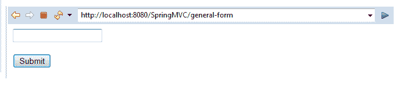

# Spring MVC 示例——读取 HTML 表单数据

> 原文：<https://www.tutorialandexample.com/spring-mvc-example-reading-html-form-data/>

我们之前讨论过 Spring MVC 的一个简单例子，在这个例子中我们创建了多个视图页面。这里，我们将创建另一个 Spring MVC 示例，在这个示例中，我们将读取 HTML 表单数据。

以下是创建此示例的步骤:

**Spring MVC 的目录结构示例**


1.  **创建 web 请求页面**

在这一步中，我们将创建一个名为**index.jsp，**的 web 请求页面，它提供了三个到不同视图页面的链接。

**index.jsp**

```
 <html>
 <body>
 <h2> Spring MVC Web application </h2>
 <a href = "home_page"> Home page | </a>
 <a href = "about_us"> About Us | </a>
 <a href = "general-form"> Query Form </a>
 </body>
 </html> 
```

*   **创建控制器类**

在这一步，我们将创建名为 **MainController，**的控制器类，它返回 JSP 页面。我们将通过使用 **@RequestMapping** 注释的方法来映射视图页面。

**MainController.java**

```
 import org.springframework.stereotype.Controller;
 import org.springframework.web.bind.annotation.RequestMapping;
 @Controller
 public class MainController {
    @RequestMapping("/general-form")
     public String showForm() {
                 return "genform" ;          
     }
     @RequestMapping("/processform")
     public String getFormData() {
                 return "formdata";
       }
  } 
```

*   **将控制器的条目添加到 web.xml 文件中。**

 **在这一步，我们将在 **web.xml** 文件中添加控制器的条目。

**web.xml**

```
 <?xml version = "1.0" encoding = "UTF-8"?>
 <web-app xmlns:xsi = "http://www.w3.org/2001/XMLSchema-instance"
                 xmlns = "http://xmlns.jcp.org/xml/ns/javaee"
                 xsi:schemaLocation = "http://xmlns.jcp.org/xml/ns/javaee                    http://xmlns.jcp.org/xml/ns/javaee/web-app_3_1.xsd"
                 id = "WebApp_ID" version = "3.1">
                 <display-name>spring-mvc</display-name>
                 <absolute-ordering />
                 <!-- Spring MVC Configs -->
                 <!-- Step 1: Configure Spring MVC Dispatcher Servlet -->
                 <servlet>
                                 <servlet-name>dispatcher</servlet-name>
                                 <servlet-class>org.springframework.web.servlet.DispatcherServlet</servlet-class>
                                 <init-param>
                                                 <param-name>contextConfigLocation</param-name>
                                                 <param-value>/WEB-INF/spring-servlet.xml</param-value>
                                 </init-param>
                                 <load-on-startup>1</load-on-startup>
                 </servlet>
                 <!-- Step 2: Set up URL mapping for Spring MVC Dispatcher Servlet -->
                 <servlet-mapping>
                                 <servlet-name>dispatcher</servlet-name>
                                 <url-pattern>/</url-pattern>
                 </servlet-mapping>
 </web-app> 
```

*   将 bean 的条目添加到另一个 XML 文件中。

在这一步中，我们将在 XML 文件(通常是 spring-servlet.xml)中定义 bean。我们将把我们的 JSP 文件保存在一个名为 **view，**的文件夹中，这个文件夹在 **WEB-INF** 文件夹中。以 **"/WEB-INF/view/"** 为前缀，**。jsp"** 用作 jsp 文件的后缀。

**spring-servlet.xml**

```
 <?xml version = "1.0" encoding = "UTF-8"?>
 <beans xmlns = "http://www.springframework.org/schema/beans"
                 xmlns:xsi = "http://www.w3.org/2001/XMLSchema-instance" 
                 xmlns:context = "http://www.springframework.org/schema/context"
                 xmlns:mvc = "http://www.springframework.org/schema/mvc"
                 xsi:schemaLocation = "  http://www.springframework.org/schema/beans
 http://www.springframework.org/schema/beans/spring-beans.xsd
 http://www.springframework.org/schema/context
 http://www.springframework.org/schema/context/spring-context.xsd
 http://www.springframework.org/schema/mvc
 http://www.springframework.org/schema/mvc/spring-mvc.xsd">
                 <!-- Step 3: Add support for component scanning -->
                 <context:component-scan base-package = "com.app.SpringMVC2" />
                 <!-- Step 4: Add support for conversion, formatting and validation support -->
                 <mvc:annotation-driven/>
                 <!-- Step 5: Define Spring MVC view resolver -->
                 <bean
                                 class="org.springframework.web.servlet.view.InternalResourceViewResolver">
                                 <property name = "prefix" value = "/WEB-INF/view/" />
                                 <property name = "suffix" value = ".jsp" />
                 </bean>
 </beans> 
```

*   **创建 JSP 文件**

在这一步中，我们将创建应用程序中所需的其他 JSP 文件。我们将创建两个 JSP 文件，一个是 **genform，**另一个是 **formdata** 。genform.jsp 文件包含一个 HTML 表单，formdata.jsp 将获取表单数据并显示出来。

**genform.jsp**

```
 <%@ page language = "java" contentType="text/html; charset=ISO-8859-1"
     pageEncoding = "ISO-8859-1"%>
 <!DOCTYPE html>
 <html>
 <head>
 <meta charset="ISO-8859-1">
 <title>Spring MVC Form</title>
 </head>
 <body>
 <form action = "processform" method = "get" >
  <input type = "text" name = "StudentName" placeholder = "Write your name "/>
  <br></br>
  <input type = "submit" value = "Submit"/>
 </form>
 </body>
 </html> 
```

**表单数据. jsp**

```
 <%@ page language = "java" contentType = "text/html; charset=ISO-8859-1"
     pageEncoding = "ISO-8859-1"%>
 <!DOCTYPE html>
 <html> 
 <head>
 <meta charset="ISO-8859-1">
 <title>Insert title here</title>
 </head>
 <body>
 <h4>welcome ${param.StudentName} </h4>
 <br></br>
 STUDENT NAME: ${param.StudentName}
 </body>
 </html> 
```

**输出**





**