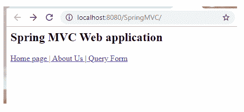
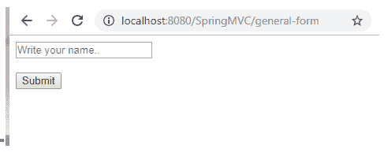
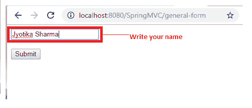
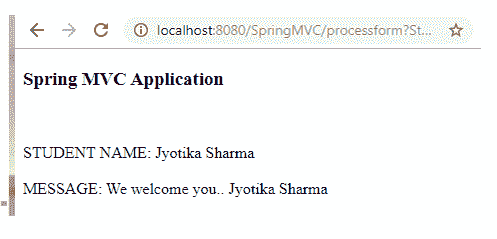

# 弹簧模型界面

> 原文：<https://www.tutorialandexample.com/spring-model-interface/>

### 模型界面

**模型**是一个定义模型属性容器的接口。它还用于在 Spring MVC 应用程序的不同部分之间传输数据。模型接口在 **org.springframework.ui** 包中。

模型接口充当包含 MVC 应用程序数据的数据容器。存储的数据可以是任何形式，如字符串、对象等。

以下是模型接口的一些方法:

| **方法** | **描述** |
| 模型添加属性(集合>属性值) | 它将所提供的集合中的所有属性复制到这个映射中。 |
| 模型添加属性(映射<string>属性)</string> | 它将所提供的地图中的所有属性复制到该地图中。 |
| 模型添加属性(对象属性值) | 它通过一个生成的名称将给定的属性添加到这个映射中。 |
| 模型添加属性(字符串属性名称，对象属性值) | 它用给定的名称包装给定的属性。 |
| 地图 <string object="">asMap()</string> | 它以地图的形式返回一组当前的模型属性。 |
| 布尔值 containsAttribute(字符串 attributeName) | 它搜索模型是否包含给定名称的属性。 |
| 模型合并属性(映射<string>属性)</string> | 它将给定贴图中的所有属性复制到该贴图中，并带有同名的现有对象。 |

**模型界面示例**

以下是创建向模型对象添加表单数据的示例的步骤:

1.  **创建 web 请求页面**

在这一步，我们将创建一个名为**index.jsp，**的请求页面，它包含到其他视图页面的链接。

**index.jsp**

```
 <html>
 <body>
 <h2> Spring MVC Web application </h2>
 <a href = "home_page"> Home page | </a>
 <a href = "about_us"> About Us | </a>
 <a href = "general-form"> Query Form </a>
 </body>
 </html> 
```

*   **创建控制器类**

在这一步，我们将创建一个名为**MainController.java，**的控制器类，它返回 JSP 视图页面。这里，我们使用的是为 HTTP servlets 提供请求信息的 **HttpServletRequest** 接口。

**MainController.java**

```
 import javax.servlet.http.HttpServletRequest;
 import org.springframework.stereotype.Controller;
 import org.springframework.ui.Model;
 import org.springframework.web.bind.annotation.RequestMapping;
 @Controller
 public class MainController {
             @RequestMapping("/general-form")
             public String showForm() {
                         return "genform";
             }
             @RequestMapping("/processform")
             public String addDataModel(HttpServletRequest request, Model model) {
                         // read form data from the HTML form
                         String name = request.getParameter("StudentName");
                         // create the message for display
                         String result = "We welcome you.. " + name ;
                         // add mesage to model
                         model.addAttribute("message", result) ;
                         return "formdata" ;
             }
   } 
```

*   **将控制器的条目添加到 web.xml 中**

在这一步，我们将把控制器的条目添加到一个 **web.xml** 文件中。

**web.xml**

```
 <?xml version = "1.0" encoding = "UTF-8"?>
 <web-app xmlns:xsi = "http://www.w3.org/2001/XMLSchema-instance"
             xmlns = "http://xmlns.jcp.org/xml/ns/javaee"
             xsi:schemaLocation = "http://xmlns.jcp.org/xml/ns/javaee http://xmlns.jcp.org/xml/ns/javaee/web-app_3_1.xsd"
             id = "WebApp_ID" version = "3.1">
             <display-name>spring-mvc-demo</display-name>
             <absolute-ordering />
             <!-- Spring MVC Configs -->
             <!-- Step 1: Configure Spring MVC Dispatcher Servlet -->
             <servlet>
                         <servlet-name>dispatcher</servlet-name>
                         <servlet-class>org.springframework.web.servlet.DispatcherServlet</servlet-class>
                         <init-param>
                                     <param-name>contextConfigLocation</param-name>
                                     <param-value>/WEB-INF/spring-servlet.xml</param-value>
                         </init-param>
                         <load-on-startup>1</load-on-startup>
             </servlet>
             <!-- Step 2: Set up URL mapping for Spring MVC Dispatcher Servlet -->
             <servlet-mapping>
                         <servlet-name>dispatcher</servlet-name>
                         <url-pattern>/</url-pattern>
             </servlet-mapping>
 </web-app> 
```

*   将 bean 定义到另一个 XML 文件中。

在这一步中，我们将在另一个 XML 文件(spring-servlet.xml)中声明 bean。

**spring-servlet.xml**

```
 <?xml version = "1.0" encoding = "UTF-8"?>
 <beans xmlns = "http://www.springframework.org/schema/beans"
             xmlns:xsi = "http://www.w3.org/2001/XMLSchema-instance" 
             xmlns:context = "http://www.springframework.org/schema/context"
             xmlns:mvc = "http://www.springframework.org/schema/mvc"
             xsi:schemaLocation = "  http://www.springframework.org/schema/beans
 http://www.springframework.org/schema/beans/spring-beans.xsd
 http://www.springframework.org/schema/context
 http://www.springframework.org/schema/context/spring-context.xsd
 http://www.springframework.org/schema/mvc
 http://www.springframework.org/schema/mvc/spring-mvc.xsd">
             <!-- Step 3: Add support for component scanning -->
             <context:component-scan base-package = "com.app.SpringMVC3" />
             <!-- Step 4: Add support for conversion, formatting and validation support -->
             <mvc:annotation-driven/>
             <!-- Step 5: Define Spring MVC view resolver -->
             <bean
                         class="org.springframework.web.servlet.view.InternalResourceViewResolver">
                         <property name = "prefix" value = "/WEB-INF/view/" />
                         <property name = "suffix" value = ".jsp" />
             </bean>
 </beans> 
```

*   创建其他 JSP 页面。

在这一步中，我们将创建其他 JSP 视图页面。

**genform.jsp**

```
 <%@ page language = "java" contentType = "text/html; charset = ISO-8859-1"
     pageEncoding = "ISO-8859-1"%>
 <!DOCTYPE html>
 <html>
 <head>
 <meta charset="ISO-8859-1">
 <title>Spring MVC Form</title>
 </head>
 <body>
 <form action = "processform" method = "get" >
  <input type = "text" name = "StudentName" placeholder = "Write your name.." />
  <br></br>
  <input type = "submit" value = "Submit"/>
 </form>
 </body>
 </html> 
```

**表单数据. jsp**

```
 <%@ page language = "java" contentType = "text/html; charset = ISO-8859-1"
     pageEncoding = "ISO-8859-1"%>
 <!DOCTYPE html>
 <html>
 <head>
 <meta charset = "ISO-8859-1">
 <title>Insert title here</title>
 </head>
 <body>
 <h3>Spring MVC Application</h3>
 <br></br>
 STUDENT NAME: ${param.StudentName}
 <br></br>
 MESSAGE: ${message}
 </body>
 </html> 
```

**输出**

以下是应用程序的输出:







