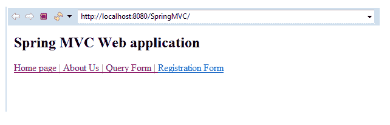
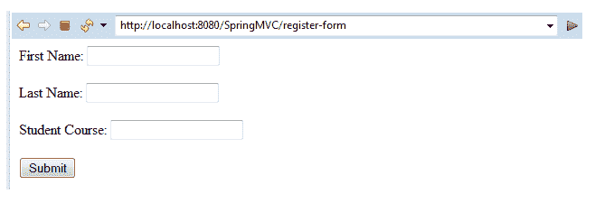
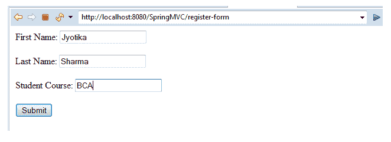
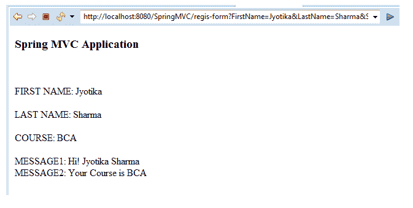

# spring MVC–@ requestparam

> 原文：<https://www.tutorialandexample.com/spring-mvc-requestparam/>

我们已经在之前的教程中讨论了 Spring MVC 的一个例子。在这里，我们要讨论的是 **@RequestParam** 注释。在最后一种情况下，我们创建了一个 bean 类来定义参数。但是在下面的例子中，我们将使用@RequestParam 注释来自动绑定方法参数和表单数据。

**@ request param–**用于将表单数据值与控制器类方法中可用的参数绑定。换句话说，它表明方法参数可以与 web 请求参数进行映射。它在控制器类方法中使用。

#### 使用@RequestParam 的 Spring MVC 示例

这里，我们将使用@RequestParam 注释创建一个 Spring MVC 示例。

以下是使用@RequestParam 创建示例的步骤:

*   **创建请求页面**

在这一步，我们将创建一个名为**index.jsp 的请求页面。**

**index.jsp**

```
 <html>
 <body>
 <h2> Spring MVC Web application </h2>
 <a href = "home_page"> Home page | </a>
 <a href = "about_us"> About Us | </a>
 <a href = "general-form"> Query Form | </a>
 <a href= "register-form" > Registration Form </a>
 </body>
 </html> 
```

*   **创建控制器类**

在这一步，我们将创建一个名为**MainController.java，**的控制器类，它返回 JSP 视图页面。

**MainController.java**

```
 import javax.servlet.http.HttpServletRequest;
 import org.springframework.stereotype.Controller;
 import org.springframework.ui.Model;
 import org.springframework.web.bind.annotation.RequestMapping;
 import org.springframework.web.bind.annotation.RequestParam;
 @Controller
 public class MainController {
             @RequestMapping("/register-form")
             public String showRegiterForm() {
                         return "registerform" ;
             }
             @RequestMapping("/regis-form")
             public String showRegisterFormData(@RequestParam("FirstName") String fname,
                                     @RequestParam("LastName") String lname, 
                                     @RequestParam("StudentCourse") String course,
                                     Model m) {
                         String result = "Hi! " + fname+" "+ lname ;  
                         String result2 = "Your Course is " + course ;
                         m.addAttribute("message", result);
                         m.addAttribute("message2" ,result2); 
                         return "regisformdata" ;
             }
  } 
```

在上面的类( **MainController** )中，我们已经使用了@RequestParam 注释，而不是使用 bean 类。它用于检索表单数据，并将其与方法中可用的参数进行映射。

这里，我们有三个可用的参数，形式为**名，姓，**和**学生课程。**

*   **在 web.xml 中添加控制器条目**

在这一步，我们将把控制器的条目添加到 **web.xml.**

**web.xml**

```
 <?xml version = "1.0" encoding = "UTF-8"?>
 <web-app xmlns:xsi = "http://www.w3.org/2001/XMLSchema-instance"
             xmlns = "http://xmlns.jcp.org/xml/ns/javaee"
             xsi:schemaLocation = "http://xmlns.jcp.org/xml/ns/javaee http://xmlns.jcp.org/xml/ns/javaee/web-app_3_1.xsd"
             id = "WebApp_ID" version = "3.1">
             <display-name>spring-mvc-demo</display-name>
             <absolute-ordering />
             <!-- Spring MVC Configs -->
             <!-- Step 1: Configure Spring MVC Dispatcher Servlet -->
             <servlet>
                         <servlet-name>dispatcher</servlet-name>
                         <servlet-class>org.springframework.web.servlet.DispatcherServlet</servlet-class>
                         <init-param>
                                     <param-name>contextConfigLocation</param-name>
                                     <param-value>/WEB-INF/spring-servlet.xml</param-value>
                         </init-param>
                         <load-on-startup>1</load-on-startup>
             </servlet>
             <!-- Step 2: Set up URL mapping for Spring MVC Dispatcher Servlet -->
             <servlet-mapping>
                         <servlet-name>dispatcher</servlet-name>
                         <url-pattern>/</url-pattern>
             </servlet-mapping>
 </web-app> 
```

*   **为组件扫描创建另一个 XML 文件**

在这一步中，我们将创建一个名为 **spring-servlet.xml，**的 XML 文件，用于组件扫描。

**spring-servlet.xml**

```
 <?xml version = "1.0" encoding = "UTF-8"?>
 <beans xmlns = "http://www.springframework.org/schema/beans"
             xmlns:xsi = "http://www.w3.org/2001/XMLSchema-instance" 
             xmlns:context = "http://www.springframework.org/schema/context"
             xmlns:mvc = "http://www.springframework.org/schema/mvc"
             xsi:schemaLocation = "  http://www.springframework.org/schema/beans
 http://www.springframework.org/schema/beans/spring-beans.xsd
 http://www.springframework.org/schema/context
 http://www.springframework.org/schema/context/spring-context.xsd
 http://www.springframework.org/schema/mvc
 http://www.springframework.org/schema/mvc/spring-mvc.xsd">
             <!-- Step 3: Add support for component scanning -->
             <context:component-scan base-package = " com.app.SpringMVC4" />
             <!-- Step 4: Add support for conversion, formatting and validation support -->
             <mvc:annotation-driven/>
             <!-- Step 5: Define Spring MVC view resolver -->
             <bean
                         class="org.springframework.web.servlet.view.InternalResourceViewResolver">
                         <property name = "prefix" value = "/WEB-INF/view/" />
                         <property name = "suffix" value = ".jsp" />
             </bean>
 </beans> 
```

*   **创建所有视图页面**

在这一步中，我们将创建应用程序中所需的所有视图页面(JSP 页面)。

**寄存器形式. jsp**

```
 <%@ page language = "java" contentType = "text/html; charset=ISO-8859-1"
     pageEncoding = "ISO-8859-1"%>
 <!DOCTYPE html>
 <html>
 <head>
 <meta charset = "ISO-8859-1">
 </head>
 <body>
 <form action = "regis-form" method="get" >
 First Name: <input type = "text" name = "FirstName" />
  <br></br>
 Last Name: <input type = "text" name = "LastName" />
  <br></br>
 Student Course: <input type = "text" name = "StudentCourse" />
 <br></br> 
 <input type = "submit" value  = "Submit"/>
 </form>
 </body>
 </html> 
```

**注册表单数据. jsp**

```
 <%@ page language = "java" contentType = "text/html; charset=ISO-8859-1"
     pageEncoding = "ISO-8859-1"%>
 <!DOCTYPE html>
 <html>
 <head>
 <meta charset = "ISO-8859-1">
 <title>Insert title here</title>
 </head>
 <body>
 <h3>Spring MVC Application</h3>
 <br></br>
 FIRST NAME: ${param.FirstName}
 <br></br>
 LAST NAME: ${param.LastName} 
 <br></br>
 COURSE: ${param.StudentCourse}
 <br></br>
 MESSAGE1: ${message}
 </br>
 MESSAGE2: ${message2}
 </body>
 </html> 
```

**输出**







