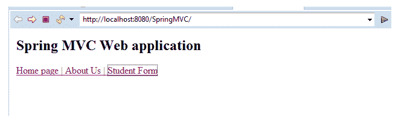
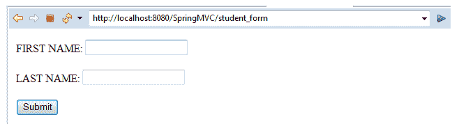
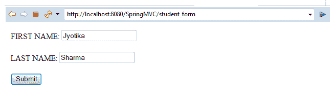
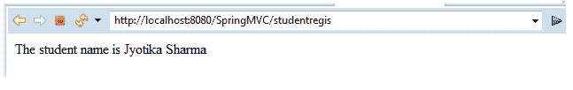

# Spring MVC 表单文本字段

> 原文：<https://www.tutorialandexample.com/spring-mvc-form-text-field/>

我们之前已经讨论过 Spring MVC 表单标签。表单标记库提供了各种用于构建 web 应用程序的表单标记。其中一个是 **<表单:输入用于生成文本字段的>** 标签。

**<表单:input > -** 它表示一个 HTML 输入标签，用于使用绑定值开发文本字段。

以下代码片段显示了如何使用<input>标签:

```
 <form:input path = "…" >
 </form:input> 
```

下面我们借助一个例子来简单了解一下<input>标签的概念。

**MVC 表单文本字段示例**

这里，我们将使用<input>标签创建一个表单文本字段的例子。

以下是创建表单文本字段示例的步骤:

*   **创建请求页面**

在这一步，我们将创建一个名为**index.jsp 的请求页面。**

**index.jsp**

```
 <html>
 <body>
 <h2> Spring MVC Web application </h2>
 <a href = "home_page">Home page | </a>
 <a href = "about_us"> About Us | </a>
 <a href = "student_form"> Student Form</a>
 </body>
 </html> 
```

*   **创建模型类**

在这一步，我们将创建名为**Student.java，**的模型类，它存储字段值。**T3】**

**Student.java**

```
 public class Student {
             private String fname;
             private String lname;
             public Student() {
             }
             public String getFname() {
                         return fname;
             }
             public void setFname(String fname) {
                         this.fname = fname;
             }
             public String getLname() {
                         return lname;
             }
             public void setLname(String lname) {
                         this.lname = lname;
             }
  } 
```

*   **创建控制器**

在这一步，我们将创建一个名为**StudentController.java，**的控制器类，它返回 JSP 页面。

**StudentController.java**

```
 import org.springframework.stereotype.Controller;
 import org.springframework.ui.Model;
 import org.springframework.web.bind.annotation.ModelAttribute;
 import org.springframework.web.bind.annotation.RequestMapping;
 import org.springframework.web.bind.annotation.RequestParam;
 @Controller
 public class StudentController {
             @RequestMapping("/student_form")
             public String showStudentForm( Model m) {
                         Student student = new Student();
                         m.addAttribute("student", student);
                         return "studentform" ;
             }
             @RequestMapping("/studentregis")
             public String showStudentData(@ModelAttribute("student") Student student) {
                         System.out.println("student:" + student.getFname() +" "+ student.getLname());
                         return "student-data" ;
             }
 } 
```

*   **在 web.xml 中添加控制器条目**

在这一步，我们将在 **web.xml** 文件**中添加控制器的条目。**

**web.xml**

```
 <?xml version = "1.0" encoding = "UTF-8"?>
 <web-app xmlns:xsi = "http://www.w3.org/2001/XMLSchema-instance"
             xmlns = "http://xmlns.jcp.org/xml/ns/javaee"
             xsi:schemaLocation = "http://xmlns.jcp.org/xml/ns/javaee http://xmlns.jcp.org/xml/ns/javaee/web-app_3_1.xsd"
             id = "WebApp_ID" version = "3.1">
             <display-name>spring-mvc-demo</display-name>
             <absolute-ordering />
             <!-- Spring MVC Configs -->
             <!-- Step 1: Configure Spring MVC Dispatcher Servlet -->
             <servlet>
                         <servlet-name>dispatcher</servlet-name>
                         <servlet-class>org.springframework.web.servlet.DispatcherServlet</servlet-class>
                         <init-param>
                                     <param-name>contextConfigLocation</param-name>
                                     <param-value>/WEB-INF/spring-servlet.xml</param-value>
                         </init-param>
                         <load-on-startup>1</load-on-startup>
             </servlet>
             <!-- Step 2: Set up URL mapping for Spring MVC Dispatcher Servlet -->
             <servlet-mapping>
                         <servlet-name>dispatcher</servlet-name>
                         <url-pattern>/</url-pattern>
             </servlet-mapping>
 </web-app> 
```

*   **在另一个 XML 文件中定义模型**

在这一步，我们将在另一个 XML 文件( **spring-servlet.xml** )中定义模型类。

**spring-servlet.xml**

```
 <?xml version = "1.0" encoding = "UTF-8"?>
 <beans xmlns = "http://www.springframework.org/schema/beans"
             xmlns:xsi = "http://www.w3.org/2001/XMLSchema-instance" 
             xmlns:context = "http://www.springframework.org/schema/context"
             xmlns:mvc = "http://www.springframework.org/schema/mvc"
             xsi:schemaLocation = "  http://www.springframework.org/schema/beans
 http://www.springframework.org/schema/beans/spring-beans.xsd
 http://www.springframework.org/schema/context
 http://www.springframework.org/schema/context/spring-context.xsd
 http://www.springframework.org/schema/mvc
 http://www.springframework.org/schema/mvc/spring-mvc.xsd">
             <!-- Step 3: Add support for component scanning -->
             <context:component-scan base-package = "com.app.SpringMVC5" />
             <!-- Step 4: Add support for conversion, formatting and validation support -->
             <mvc:annotation-driven/>
             <!-- Step 5: Define Spring MVC view resolver -->
             <bean
                         class="org.springframework.web.servlet.view.InternalResourceViewResolver">
                         <property name = "prefix" value = "/WEB-INF/view/" />
                         <property name = "suffix" value = ".jsp" />
             </bean>
 </beans> 
```

*   **创建所有视图页面**

在这一步中，我们将创建应用程序中所需的所有视图页面(JSP 页面)。

**studentform.jsp**

```
 <%@ taglib prefix = "form" uri = "http://www.springframework.org/tags/form" %>  
 <html>
 <head>
 <title>Student Registration Form</title>
 </head>
 <body>
 <form:form action = "studentregis" modelAttribute = "student" >
 FIRST NAME: <form:input path = "fname" /> 
 <br></br>
 LAST NAME: <form:input path = "lname" />
 <br></br>
 <input type = "submit" value = "Submit"/>
 </form:form>
 </body> 
</html>
```

**student-data.jsp**

```
 <%@ page language = "java" contentType = "text/html; charset = ISO-8859-1"
     pageEncoding = "ISO-8859-1"%>
 <!DOCTYPE html>
 <html>
 <head>
 <meta charset = "ISO-8859-1">
 <title>Student Registration Data</title>
 </head>
 <body>
 The student name is ${student.fname} ${student.lname}
 </body>
 </html> 
```

**输出**







