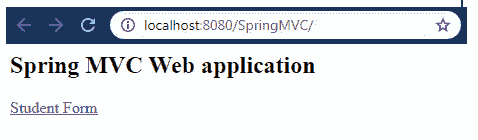
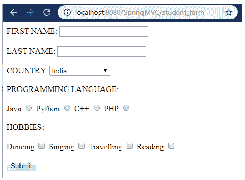
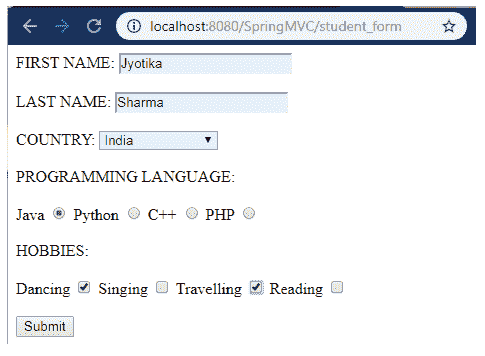
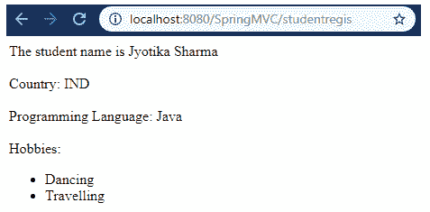

# Spring MVC 表单复选框

> 原文：<https://www.tutorialandexample.com/spring-mvc-form-checkbox/>

Spring MVC 提供了几个用于开发 web 应用程序(通常是 JSP 页面)的表单标签。其中之一是一个**复选框**标签。checkbox 标签让我们可以同时选择多个选项。

下面给出了一段代码，展示了如何使用<checkbox>标签:</checkbox>

```
 Dancing <form:checkbox path = "hobbies" value = "Dancing" />
 Singing <form:checkbox path = "hobbies" value = "Singing" /> 
```

<checkbox>标签用于创建一个 HTML 复选框字段，其中的值被硬编码在 JSP 页面中，而<checkboxes>标签用于创建多个复选框，其中的复选框值在运行时生成。只有当我们不想列出 JSP 页面中的元素时，才使用<checkboxes>标签。</checkboxes></checkboxes></checkbox>

下面给出了一段代码，展示了如何使用<checkboxes>标签:</checkboxes>

```
<form:checkboxes path =
"hobbies" items = "${student.list}" />  
```

**MVC 表单复选框示例**

这里，我们要创建一个<checkbox>的例子。</checkbox>

下面是创建一个<表单示例的步骤:复选框>标签:

*   **创建请求页面**

在这一步，我们将创建一个名为**index.jsp**的请求页面。

**index.jsp**

```
 <html>
 <body>
 <h2> Spring MVC Web application </h2>
 <a href = "student_form"> Student Form </a>
 </body>
 </html> 
```

*   **创建存储数据的模型类**

在这一步，我们将创建一个名为**Student.java，**的模型类，它存储复选框值。

**Student.java**

```
 import java.util.LinkedHashMap;
 public class Student {
             private String fname;
             private String lname;
             private String country;
             private LinkedHashMap<String, String> countryoptions;
             private String planguage;
             private String[] hobbies;
             public Student() {
               countryoptions = new LinkedHashMap<String, String>();
                         countryoptions.put("IND","India");
                         countryoptions.put("FRA","France");
                         countryoptions.put("USA","America");
                         countryoptions.put("DUB","Dubai");
                         countryoptions.put("NEP", "Nepal");
                         countryoptions.put("BHU", "Bhutan");
                         countryoptions.put("UK", "United Kingdom");
             }
             public String getCountry() {
                         return country;
             }
             public LinkedHashMap<String, String> getCountryoptions() {
                         return countryoptions;
             }
             public void setCountry(String country) {
                         this.country = country;
             }
             public String getFname() {
                         return fname;
             }
             public void setFname(String fname) {
                         this.fname = fname;
             }
             public String getLname() {
                         return lname;
             }
             public void setLname(String lname) {
                         this.lname = lname;
             }
             public String getPlanguage() {
                         return planguage;
             }
             public void setPlanguage(String planguage) {
                         this.planguage = planguage;
             }
             public String[] getHobbies() {
                         return hobbies;
             }
             public void setHobbies(String[] hobbies) {
                         this.hobbies = hobbies;
             }
  } 
```

*   **创建控制器类**

在这一步，我们将创建一个名为**StudentController.java 的控制器。**

**StudentController.java**

```
 import org.springframework.stereotype.Controller;
 import org.springframework.ui.Model;
 import org.springframework.web.bind.annotation.ModelAttribute;
 import org.springframework.web.bind.annotation.RequestMapping;
 import org.springframework.web.bind.annotation.RequestParam;
 @Controller
 public class StudentController {
             @RequestMapping("/student_form")
             public String showStudentForm( Model m) {
                         Student student = new Student();
                         m.addAttribute("student", student);
                         return "studentform" ;
             }
             @RequestMapping("/studentregis")
             public String showStudentData(@ModelAttribute("student") Student student) {
                         return "student-data" ;
             }
  } 
```

*   **在 web.xml 中添加控制器条目**

在这一步，我们将在 **web.xml** 中添加控制器的条目。

**web.xml**

```
 <?xml version = "1.0" encoding = "UTF-8"?>
 <web-app xmlns:xsi = "http://www.w3.org/2001/XMLSchema-instance"
             xmlns = "http://xmlns.jcp.org/xml/ns/javaee"
             xsi:schemaLocation = "http://xmlns.jcp.org/xml/ns/javaee http://xmlns.jcp.org/xml/ns/javaee/web-app_3_1.xsd"
             id = "WebApp_ID" version = "3.1">
             <display-name>spring-mvc-demo</display-name>
             <absolute-ordering />
             <!-- Spring MVC Configs -->
             <!-- Step 1: Configure Spring MVC Dispatcher Servlet -->
             <servlet>
                         <servlet-name>dispatcher</servlet-name>
                         <servlet-class>org.springframework.web.servlet.DispatcherServlet</servlet-class>
                         <init-param>
                                     <param-name>contextConfigLocation</param-name>
                                     <param-value>/WEB-INF/spring-servlet.xml</param-value>
                         </init-param>
                         <load-on-startup>1</load-on-startup>
             </servlet>
             <!-- Step 2: Set up URL mapping for Spring MVC Dispatcher Servlet -->
             <servlet-mapping>
                         <servlet-name>dispatcher</servlet-name>
                         <url-pattern>/</url-pattern>
             </servlet-mapping>
 </web-app> 
```

*   **在另一个 XML 文件中定义模型类**

在这一步中，我们将在另一个 XML 文件 **(spring-servlet.xml)中定义 bean。**

**spring-servlet.xml**

```
 <?xml version = "1.0" encoding = "UTF-8"?>
 <beans xmlns = "http://www.springframework.org/schema/beans"
             xmlns:xsi = "http://www.w3.org/2001/XMLSchema-instance" 
             xmlns:context = "http://www.springframework.org/schema/context"
             xmlns:mvc = "http://www.springframework.org/schema/mvc"
             xsi:schemaLocation = "  http://www.springframework.org/schema/beans
             http://www.springframework.org/schema/beans/spring-beans.xsd
             http://www.springframework.org/schema/context
             http://www.springframework.org/schema/context/spring-context.xsd
             http://www.springframework.org/schema/mvc
         http://www.springframework.org/schema/mvc/spring-mvc.xsd"> 
             <!-- Step 3: Add support for component scanning -->
             <context:component-scan base-package = "com.app.SpringMVCFormTag"  />
             <!-- Step 4: Add support for conversion, formatting and validation support -->
             <mvc:annotation-driven/>
             <!-- Step 5: Define Spring MVC view resolver -->
             <bean
                         class="org.springframework.web.servlet.view.InternalResourceViewResolver">
                         <property name = "prefix" value = "/WEB-INF/view/" />
                         <property name = "suffix" value = ".jsp" />
             </bean>
 </beans> 
```

*   **创建所有视图页面**

在这一步中，我们将创建其他视图页面(JSP 页面)。

**studentform.jsp**

```
 <%@ taglib prefix = "form" uri = "http://www.springframework.org/tags/form" %>  
 <html>
 <head>
 <title>Student Registration Form
 </title>
 </head>
 <body>
 <form:form action = "studentregis" modelAttribute = "student" >
 FIRST NAME: <form:input path = "fname" />
 <br></br>
 LAST NAME: <form:input path = "lname" />
 <br></br>
 COUNTRY: <form:select path="country">
    <form:options items = "${student.countryoptions}"></form:options>
 </form:select>
 <br></br>
 PROGRAMMING LANGUAGE:
 <br></br>
 Java <form:radiobutton path = "planguage" value = "Java" />
 Python <form:radiobutton path = "planguage" value = "Python" />
 C++ <form:radiobutton path = "planguage" value = "C++" />
 PHP <form:radiobutton path = "planguage" value = "PHP" />
 <br></br>
 HOBBIES:
 <br></br>
 Dancing <form:checkbox path = "hobbies" value = "Dancing" />
 Singing <form:checkbox path = "hobbies" value = "Singing" />
 Travelling <form:checkbox path = "hobbies" value = "Travelling"/>
 Reading <form:checkbox path = "hobbies" value = "Reading" />
 <br></br>
 <input type = "submit" value = "Submit"/>
 </form:form>
 </body>
 </html> 
```

**student-data.jsp**

```
 <%@ taglib prefix = "c" uri = "http://java.sun.com/jsp/jstl/core" %>
 <!DOCTYPE html>
 <html>
 <head>
 <title>Student Registration Data</title>
 </head>
 <body>
 The student name is ${student.fname} ${student.lname}
 <br></br>
 Country: ${student.country}
 <br></br>
 Programming Language: ${student.planguage}
 <br></br>
 Hobbies:
 <ul>
    <c:forEach var = "temp" items ="${student.hobbies}">
        <li> ${temp} </li>
    </c:forEach>
 </ul>
 </body>
 </html> 
```

**输出**







