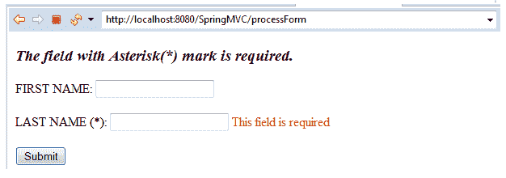
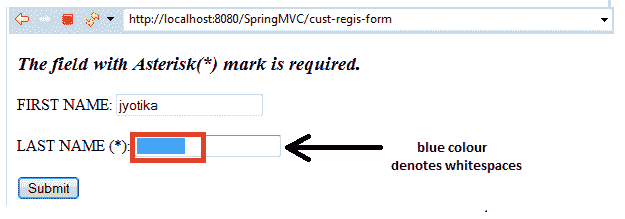

# Spring MVC 表单验证

> 原文：<https://www.tutorialandexample.com/spring-mvc-form-validation/>

Spring 验证用于验证@Controller 输入。它用于检查和接受任何 web 应用程序中的用户输入。使用 Spring 验证，我们可以在服务器端验证用户输入。

### Bean 验证 API

从 Spring framework 版本 4 及更高版本开始，Spring framework 支持 Bean 验证 1.0 (JSR-303)和 Bean 验证 1.1 (JSR-349)。

下面给出了用于验证的注释:

**@ Valid–**@ Valid 注释用于注释方法参数、属性或方法返回类型以进行验证。它用于注释我们想要验证的模型对象。

**绑定结果****–**表示绑定结果的界面。它扩展了一个错误注册接口，允许应用验证器，并添加了特定于绑定的分析。

### 验证注释

Spring MVC 表单验证中使用了多种注释，这些注释可以在**javax . Validation . constraints**包中找到。

以下是常用验证注释的列表:

| **注解** | **描述** |
| @大小 | 它指定被注释元素的大小必须在指定的边界之间。 |
| @模式 | 它指定带注释的**字符序列**必须匹配正则表达式。 |
| @过去 | 它指定带注释的元素必须是过去的日期。 |
| @Null | 它指定带注释的元素必须为空。 |
| @NotNull | 它指定带注释的元素不应该为空。 |
| @Min | 它指定带注释的元素必须是一个数字，其值必须等于或大于指定的最小数字。 |
| @Max | 它指定带注释的元素必须是一个数字，其值必须等于或小于指定的最大值。 |
| @未来 | 它指定带注释的元素必须是未来的日期。 |
| @数字 | 它指定带注释的元素必须是指定范围内的数字。支持的类型有 short、int、long、byte 等。 |
| @DecimalMin | 它指定带注释的元素必须是一个数字，其值必须等于或大于指定的最小值。它与 **@Min** 注释非常相似，但唯一的区别是它支持**字符序列**类型**。** |
| @DecimalMax | 它指定带注释的元素必须是一个数字，其值应该等于或小于指定的最大值。它与 **@Max** 注释非常相似，唯一的区别是它支持**字符序列**类型**。** |
| @AssertTrue | 它确定被注释的元素必须为真。 |
| @AssertFalse | 它确定被注释的元素必须为假。 |

### Spring MVC 验证示例

这里，我们将在控制器类中使用@Valid 注释创建一个 Spring MVC 验证的例子。

下面是创建 Spring Validator 示例的步骤:

*   **创建请求页面**

在这一步，我们将创建一个名为**index.jsp 的请求页面。**

**index.jsp**

```
 <html>
 <body>
 <h2> Spring MVC Web application </h2>
 <a href = "cust-regis-form"> Customer Registration Form </a>
 </body>
 </html> 
```

*   **创建模型类**

在这一步，我们将创建一个名为**Customer.java，**的模型类来存储数据。在 Customer 类中，我们将在**“lname”**变量上使用 **@NotNull** 和 **@Size** 注释。

**Customer.java**

```
 import javax.validation.constraints.NotNull;
 import javax.validation.constraints.Size;
 public class Customer {
                 private String fname;
                 @NotNull
                 @Size(min = 3, message = " This field is required ")
                 private String lname;
                 public String getFname() {
                                 return fname;
                 }
                 public void setFname(String fname) {
                                 this.fname = fname;
                 }
                 public String getLname() {
                                 return lname;
                 }
                 public void setLname(String lname) {
                                 this.lname = lname;
                 }
  } 
```

*   **创建控制器**

在这一步，我们将创建名为**MainController.java、**的控制器，它返回 JSP 视图页面。在控制器类中，我们将使用 **@Valid** 注释和 **BindingResult** 进行验证。

**MainController.java**

```
 import javax.validation.Valid;
 import org.springframework.stereotype.Controller;
 import org.springframework.ui.Model;
 import org.springframework.validation.BindingResult;
 import org.springframework.web.bind.annotation.ModelAttribute;
 import org.springframework.web.bind.annotation.RequestMapping;
 @Controller
 public class MainController {
                 @RequestMapping("/cust-regis-form")
                 public String showCustomerForm(Model m) {
                                 m.addAttribute("customer", new Customer()) ;
                                 return "customerform" ;
                 }
                 @RequestMapping("/processForm")
                 public String showCustomerData( @Valid @ModelAttribute("customer") Customer custom,
                                                 BindingResult thebindingresult) {
                                 if (thebindingresult.hasErrors()) {
                                                 return "customerform" ;
                                 }
                                 else {
                                                 return "customerformdata" ;
                                 }
     }
  } 
```

*   **将控制器的条目添加到 web.xml 中**

在这一步，我们将在 **web.xml** 文件中添加控制器的条目。

**web.xml**

```
 <?xml version = "1.0" encoding = "UTF-8"?>
 <web-app xmlns:xsi = "http://www.w3.org/2001/XMLSchema-instance"
                 xmlns = "http://xmlns.jcp.org/xml/ns/javaee"
                 xsi:schemaLocation = "http://xmlns.jcp.org/xml/ns/javaee http://xmlns.jcp.org/xml/ns/javaee/web-app_3_1.xsd"
                 id = "WebApp_ID" version = "3.1">
                 <display-name>spring-mvc-demo</display-name>
                 <absolute-ordering />
                 <!-- Spring MVC Configs -->
                 <!-- Step 1: Configure Spring MVC Dispatcher Servlet -->
                 <servlet>
                                 <servlet-name>dispatcher</servlet-name>
                                 <servlet-class>org.springframework.web.servlet.DispatcherServlet</servlet-class>
                                 <init-param>
                                                 <param-name>contextConfigLocation</param-name>
                                                 <param-value>/WEB-INF/spring-servlet.xml</param-value>
                                 </init-param>
                                 <load-on-startup>1</load-on-startup>
                 </servlet>
                 <!-- Step 2: Set up URL mapping for Spring MVC Dispatcher Servlet -->
                 <servlet-mapping>
                                 <servlet-name>dispatcher</servlet-name>
                                 <url-pattern>/</url-pattern>
                 </servlet-mapping>
 </web-app> 
```

*   **将模型的条目添加到另一个 XML 文件中**

在这一步中，我们将把模型/ bean 定义到另一个名为 **spring-servlet.xml.** 的 XML 文件中

**spring-servlet.xml**

```
  <?xml version = "1.0" encoding = "UTF-8"?>
 <beans xmlns = "http://www.springframework.org/schema/beans"
                 xmlns:xsi = "http://www.w3.org/2001/XMLSchema-instance" 
                 xmlns:context = "http://www.springframework.org/schema/context"
                 xmlns:mvc = "http://www.springframework.org/schema/mvc"
                 xsi:schemaLocation = "  http://www.springframework.org/schema/beans
 http://www.springframework.org/schema/beans/spring-beans.xsd
 http://www.springframework.org/schema/context
 http://www.springframework.org/schema/context/spring-context.xsd
 http://www.springframework.org/schema/mvc
 http://www.springframework.org/schema/mvc/spring-mvc.xsd">
                 <!-- Step 3: Add support for component scanning -->
                 <context:component-scan base-package = "com.app.SpringMVCValidation"  />
                 <!-- Step 4: Add support for conversion, formatting and validation support -->
                 <mvc:annotation-driven/>
                 <!-- Step 5: Define Spring MVC view resolver -->
                 <bean
                                 class="org.springframework.web.servlet.view.InternalResourceViewResolver">
                                 <property name = "prefix" value = "/WEB-INF/view/" />
                                 <property name = "suffix" value = ".jsp" />
                 </bean>
 </beans> 
```

*   **创建其他 JSP 页面**

在这一步中，我们将创建其他视图页面(JSP 页面)。

**customerform.jsp**

```
 <%@ taglib prefix = "form" uri = "http://www.springframework.org/tags/form" %>
 <!DOCTYPE html>
 <html>
 <head>
 <meta charset = "ISO-8859-1">
 <title> Customer Form </title>
   <style>
        .error {color:red}
    </style>
 </head>
 <body>
 <h3><i>The field with Asterisk(*) mark is required.</i></h3>
 <form:form action = "processForm" modelAttribute = "customer" >
 FIRST NAME: <form:input path = "fname" />
 <br></br>
 LAST NAME (*): <form:input path = "lname" />
   <form:errors path = "lname" cssClass = "error" >
   </form:errors>
 <br></br>
 <input type = "submit" value = "Submit" />
  </form:form>
 </body>
 </html> 
```

**客户表单数据. jsp**

```
 <%@ taglib prefix = "c" uri = "http://java.sun.com/jsp/jstl/core" %>
 <!DOCTYPE html>
 <html>
 <head>
 <title>Customer data</title>
 </head>
 <body>
 The customer is confirmed: ${customer.fname} ${customer.lname}
 </body>
 </html> 
```

**输出**





### 所需验证器的空白问题

如果我们在必需的验证器字段中传递空白，那么只包含空白的字符串将通过验证。例如，我们将**姓氏**创建为必填字段，如果我们在该字段中输入空格，它将通过验证。

以下输出显示了空白问题:




为了克服所讨论的问题，我们将在控制器内部使用 **@InitBinder** 注释。@InitBinder 作为一个预处理器工作，用于修剪字符串前的空白。

**Spring MVC @InitBinder**

@InitBinder 注释用于初始化 **WebDataBinder，**，它用于传播命令和带注释的处理程序方法的表单对象参数。

为了访问@InitBinder 注释，我们需要在名为**MainController.java**类的控制器中编写给定的代码片段。

**MainController.java**

```
 @InitBinder
 public void initBinder(WebDataBinder dataBinder)  {
                 StringTrimmerEditor stringEditor = new StringTrimmerEditor(true);
                 dataBinder.registerCustomEditor(String.class,stringEditor ); 
}
```

使用@InitBinder 之后，应用程序中的空白问题就解决了，因为只有文本字段中的空白没有通过验证，如输出所示。


