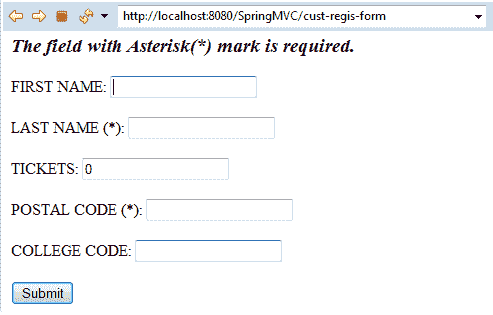

# Spring MVC 表单自定义验证

> 原文：<https://www.tutorialandexample.com/spring-mvc-form-custom-validation/>

我们之前已经讨论过其他形式的验证，比如**正则表达式**和**数**验证。Spring Validation 还为用户提供了执行定制验证的功能。它允许我们创建注释，这将用于实现验证规则。例如，字段 **collegeCode** 用于自定义验证，ConstraintValidator 用于验证 collegeCode 是否以单词“TIPS”开头。

在自定义验证的示例中，我们将使用以下注释:

*   **@ Constraint****–**@ Constraint 注释用于将注释标记为 Bean 验证约束。它在 **javax.validation** 包中提供。

*   **@ Target–**@ Target 注释表示注释类型适用的文本。它在 **java.lang.annotation** 包中。

*   **@ Retention–**@ Retention 注释表明该注释将以所提供的注释类型保留多长时间。在 **java.lang.annotation** 包中有。

让我们借助一个例子来理解自定义验证的概念。

**自定义验证的目录结构**


### 自定义验证示例

这里，我们将创建一个自定义验证的示例。

以下是创建自定义验证示例的步骤:

*   **创建请求页面**

在这一步，我们将创建一个请求页面**index.jsp。**

**index.jsp**

```
<html>
 <body>
 <h2> Spring MVC Web application </h2>
 <a href = "cust-regis-form"> Customer Registration Form </a>
 </body>
</html> 
```

*   **创建模型类**

在这一步，我们将创建存储表单数据的模型类**Customer.java，**。

**Customer.java**

```
 import javax.validation.constraints.Max;
 import javax.validation.constraints.Min;
 import javax.validation.constraints.NotNull;
 import javax.validation.constraints.Pattern;
 import javax.validation.constraints.Size;
 import com.SpringMVC.CustomValidation.CollegeCode;
 public class Customer {
                 private String fname;
                 @NotNull 
                 @Size(min = 3, message = " This field is required ")
                 private String lname;
                 @Min(value = 1, message = "Tickets must be greater than or equal to 1 ")
                 @Max(value = 100, message = "Tickets must be smaller than or equal to 100")
                 private int tick ;
                 @NotNull(message = "is Required")
                 @Pattern(regexp = "^[a-zA-Z0-9]{6}", message = "must be of 6 char/digit")
                 private String postal_code;
                 @CollegeCode
                 private String collegeCode;
                 public String getCollegeCode() {
                                 return collegeCode;
                 }
                 public void setCollegeCode(String collegeCode) {
                                 this.collegeCode = collegeCode;
                 }
                 public String getpostal_code() {
                                 return postal_code;
                 }
                 public void setpostal_code(String postal_code) {
                                 this.postal_code = postal_code;
                 }
                 public int gettick() {
                                 return tick;
                 }
                 public void settick(int tick) {
                                 this.tick = tick;
                 }
                 public String getFname() {
                                 return fname;
                 }
                 public void setFname(String fname) {
                                 this.fname = fname;
                 }
                 public String getLname() {
                                 return lname;
                 }
                 public void setLname(String lname) {
                                 this.lname = lname;
                 }
   } 
```

*   **创建控制器类**

在这一步，我们将创建一个返回 JSP 视图页面的控制器类**MainController.java，**。

**MainController.java**

```
 import javax.validation.Valid;
 import org.springframework.beans.propertyeditors.StringTrimmerEditor;
 import org.springframework.stereotype.Controller;
 import org.springframework.ui.Model;
 import org.springframework.validation.BindingResult;
 import org.springframework.web.bind.WebDataBinder;
 import org.springframework.web.bind.annotation.InitBinder;
 import org.springframework.web.bind.annotation.ModelAttribute;
 import org.springframework.web.bind.annotation.RequestMapping;
 @Controller
 public class MainController {
                 @InitBinder
                 public void initBinder(WebDataBinder dataBinder) {
                                 StringTrimmerEditor stringEditor = new StringTrimmerEditor(true);
                                 dataBinder.registerCustomEditor(String.class,stringEditor );
                 }
                 @RequestMapping("/cust-regis-form")
                 public String showCustomerForm(Model m) {
                                 m.addAttribute("customer", new Customer()) ;
                                 return "customerform" ;
                 }
                 @RequestMapping("/processForm")
                 public String showCustomerData( @Valid @ModelAttribute("customer") Customer custom,
                                                 BindingResult thebindingresult) {
                                                                 if (thebindingresult.hasErrors()) {
                                                 return "customerform" ;
                                 }
                                 else {
                                                 return "customerformdata" ;
                                 }
               }
   } 
```

*   **创建验证器注释**

在这一步中，我们将为应用程序创建验证器注释。我们的验证器注释是 **CollegeCode，**，它将注释 **collegeCode** 字段。

**CollegeCode.java**

```
 import java.lang.annotation.ElementType;
 import java.lang.annotation.Retention;
 import java.lang.annotation.RetentionPolicy;
 import java.lang.annotation.Target;
 import javax.validation.Constraint;
 import javax.validation.Payload;
 @Constraint(validatedBy = Clge_CodeConstraintValidator.class)
 @Target({ElementType.METHOD, ElementType.FIELD})
 @Retention(RetentionPolicy.RUNTIME)
 public @interface CollegeCode {
                 // default college code
                 public String value() default "TIPS";
                 // default error message
                 public String message() default "College code must start with 'TIPS'" ;
                 public Class<?>[] groups() default {};
                 public Class<? extends Payload>[] payload()  default {};
   } 
```

*   **创建验证器类**

在这一步，我们将创建一个名为**Clge _ CodeConstraintValidator，**的验证器类，它包含验证代码。

**Clge _ codeconstraintvalidator . Java**

```
 import javax.validation.ConstraintValidator;
 import javax.validation.ConstraintValidatorContext;
 public class Clge_CodeConstraintValidator implements ConstraintValidator<CollegeCode, String> 
 {
                 private String collegePrefix;
                 public void initialize(CollegeCode thecc) {
                                 collegePrefix = thecc.value();
                 }
                 public boolean isValid(String code, ConstraintValidatorContext context) {
                                 boolean result; 
                                 if(code != null) {
                                                 result = code.startsWith(collegePrefix);
                                 }
                                 else
                                 {
                                                 result = true;
                                 }
                                 return result ;
                 }
  }  
```

*   **在 web.xml 中添加控制器条目**

在这一步，我们将在 **web.xml** 中添加控制器的条目。

**web.xml**

```
 <?xml version = "1.0" encoding = "UTF-8"?>
 <web-app xmlns:xsi = "http://www.w3.org/2001/XMLSchema-instance"
                 xmlns = "http://xmlns.jcp.org/xml/ns/javaee"
                 xsi:schemaLocation = "http://xmlns.jcp.org/xml/ns/javaee http://xmlns.jcp.org/xml/ns/javaee/web-app_3_1.xsd"
                 id = "WebApp_ID" version = "3.1">
                 <display-name>spring-mvc-demo</display-name>
                 <absolute-ordering />
                 <!-- Spring MVC Configs -->
                 <!-- Step 1: Configure Spring MVC Dispatcher Servlet -->
                 <servlet>
                                 <servlet-name>dispatcher</servlet-name>
                                 <servlet-class>org.springframework.web.servlet.DispatcherServlet</servlet-class>
                                 <init-param>
                                                 <param-name>contextConfigLocation</param-name>
                                                 <param-value>/WEB-INF/spring-servlet.xml</param-value>
                                 </init-param>
                                 <load-on-startup>1</load-on-startup>
                 </servlet>
                 <!-- Step 2: Set up URL mapping for Spring MVC Dispatcher Servlet -->
                 <servlet-mapping>
                                 <servlet-name>dispatcher</servlet-name>
                                 <url-pattern>/</url-pattern>
                 </servlet-mapping>
 </web-app> 
```

*   **将模型定义到另一个 XML 文件中**

在这一步中，我们将在另一个 XML 文件( **spring-servlet.xml** )中添加模型类的条目。

**spring-servlet.xml**

```
 <?xml version = "1.0" encoding = "UTF-8"?>
 <beans xmlns = "http://www.springframework.org/schema/beans"
                 xmlns:xsi = "http://www.w3.org/2001/XMLSchema-instance" 
                 xmlns:context = "http://www.springframework.org/schema/context"
                 xmlns:mvc = "http://www.springframework.org/schema/mvc"
                 xsi:schemaLocation = " http://www.springframework.org/schema/beans
                 http://www.springframework.org/schema/beans/spring-beans.xsd
                 http://www.springframework.org/schema/context
                 http://www.springframework.org/schema/context/spring-context.xsd
                 http://www.springframework.org/schema/mvc
         http://www.springframework.org/schema/mvc/spring-mvc.xsd">
                 <!-- Step 3: Add support for component scanning -->
                 <context:component-scan base-package = "com.app.SpringMVCValidation" />
                 <!-- Step 4: Add support for conversion, formatting and validation support -->
                 <mvc:annotation-driven/>
                 <!-- Step 5: Define Spring MVC view resolver -->
                 <bean
                                 class="org.springframework.web.servlet.view.InternalResourceViewResolver">
                                 <property name = "prefix" value = "/WEB-INF/view/" />
                                 <property name = "suffix" value = ".jsp" />
                 </bean>
 </beans> 
```

*   **创建所有视图页面**

在这一步中，我们将创建应用程序中所需的所有视图页面(JSP 页面)。

**customerform.jsp**

```
 <%@ taglib prefix = "form" uri = "http://www.springframework.org/tags/form" %>
 <!DOCTYPE html>
 <html>
 <head>
 <meta charset = "ISO-8859-1">
 <title> Customer Form </title>
 <style>
      .error {color:blue}
 </style>
 </head>
 <body>
 <h3><i>The field with Asterisk(*) mark is required.</i></h3>
 <form:form action = "processForm" modelAttribute = "customer" >
 FIRST NAME: <form:input path = "fname" />
 <br></br>
 LAST NAME (*): <form:input path = "lname" />
   <form:errors path = "lname" cssClass = "error" >
   </form:errors>
 <br> </br>
 TICKETS: <form:input path = "tick" />
      <form:errors path = "tick" cssClass = "error">
     </form:errors>
     <br> </br>
 POSTAL CODE (*): <form:input path = "postal_code" />
    <form:errors path = "postal_code" cssClass = "error"> 
    </form:errors>
 <br></br>
 COLLEGE CODE: <form:input path = "collegeCode" />
    <form:errors path = "collegeCode" cssClass = "error"> 
    </form:errors>
  <br> </br>  
 <input type = "submit" value = "Submit" />
  </form:form>
 </body>
 </html> 
```

**客户表单数据. jsp**

```
 <%@ taglib prefix = "c"  uri = "http://java.sun.com/jsp/jstl/core" %>
 <!DOCTYPE html>
 <html>
 <head>
 <title>Customer data</title>
 </head>
 <body>
 The customer is confirmed: ${customer.fname} ${customer.lname}
 <br> </br>
 Tickets : ${customer.tick}
 <br> </br>
 Postal Code: ${customer.postal_code}
 <br> </br>
 College Code: ${customer.collegeCode} 
 </body>
 </html> 
```

**输出**





