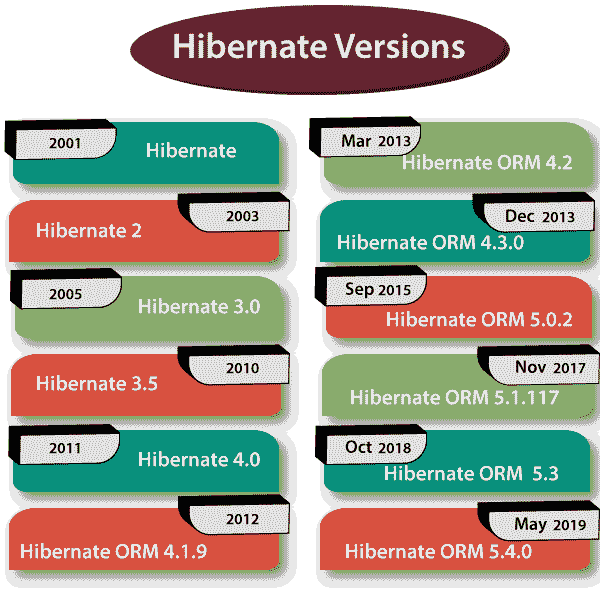

# 休眠历史和版本

> 原文：<https://www.tutorialandexample.com/hibernate-history/>

**冬眠的历史**

Hibernate 是由 Gavin king 和他来自 Circus Technologies 的同事在 2001 年开发的。主要目的是通过降低复杂性和添加一些缺失的特性，提供比 EJB2 更好的持久性功能。

Hibernate 是一个 ORM(对象关系映射)工具，它简化了应用程序的开发。Hibernate 提供了一个与存储在数据库中的数据进行交互的框架，它是一个用于 Java EE 5 的框架。加文·金也为 EJB 3.0 和 JPA 的设计做出了贡献。

以下是 Hibernate 的版本:

*   **2001:**Hibernate 第一个版本发布。主要目的是通过降低复杂性和添加一些缺失的特性，提供比 EJB2 更好的持久性功能。
*   2003 年:Hibernate 的新版本 hibernate2 发布了，它在第一个版本的基础上做了很多改进。
*   2005 年:Hibernate 的第三个版本发布了，叫做 hibernate 3.0，它有一些新的关键特性。一些功能是拦截器，用户定义的过滤器，和 JDK 5.0 的注释。
*   2010 年: Hibernate 3(版本 3.5 及以上)已经成为 JPA 2.0 规范的认证实现。
*   2011 年:发布了 Hibernate 的新版本 Hibernate 4.0.0，增加了一些新特性，比如支持、多租户、更好的会话开放等等。
*   2012 年:Hibernate 的另一个版本发布了，叫做 Hibernate ORM 4.1.9。
*   **2013:** 新版本 Hibernate ORM 4.2 最终版于 2013 年 3 月发布。新版 Hibernate ORM 4.3.0 最终版于 2013 年 12 月发布，新增了 JPA 2.1 特性。
*   **2015:** 新版本 Hibernate ORM 5.0.2 Final 于 2015 年 9 月发布，进行了一些改进，如引导、hibernate-java8、Karaf 支持等。
*   **2017:**2017 年 11 月，Hibernate ORM 5.1.17 发布。
*   **2018:** 新版本 Hibernate ORM 5.3 Final 于 2018 年 10 月发布。
*   **2019:** 新版本 Hibernate ORM 5.4.0 最终版于 2019 年 5 月发布。

它运行在一个叫做 JVM (Java 虚拟机)的平台上。Java 虚拟机(JVM)是用于在计算机上运行 Java 程序和应用程序的虚拟机。其他语言程序也编译成 Java 字节码，可以在 JVM 上运行。换句话说，JVM 是一个虚拟引擎，为 Java 程序和应用程序提供运行时环境。JVM 将 Java 字节码转换成机器语言。