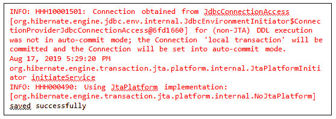
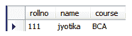

# 休眠第一个例子

> 原文：<https://www.tutorialandexample.com/hibernate-first-example/>

现在我们要在 Hibernate 中创建第一个例子。我们将一步一步地在 Hibernate 中开发第一个 Java 应用程序。下面列出了这些步骤

1.  **创建 POJO /Persistent/Bean 类**

将许多对象封装成单个对象是由 POJO 类或 Bean 类完成的。

bean 类的所有变量都用 public setter 和 getter 方法设置为 private，并且它必须包含一个无参数构造函数。

让我们创建 Bean 类-**Student.java**

```
 public class Student {

  private int rollno;
  private String name,course;

  public int getRollno() {
  return rollno;
  }
  public void setRollno(int rollno) {
  this.rollno = rollno;
  }
  public String getName() {
  return name;
  }
  public void setName(String name) {
  this.name = name;
  }
  public String getCourse() {
  return course;
  }
  public void setCourse(String course) {
  this.course = course;
  }
  } 
```

2.**为 Hibernate bean 类**创建一个映射文件

映射类的格式应该是 <classname>.hbm.xml 文件。例如，如果我们的 POJO 类名称是 **Student** ，那么映射类的名称应该是 Student.hbm.xml. Hibernate 映射文件包含许多元素，例如<Hibernate-mapping></Hibernate-mapping>、< class > < /class >、< id > < /id >、<generator></generator>、< property > <</classname>

让我们创建一个 **Student.hbm.xml** 映射文件。

```

 ttp://hibernate.sourceforge.net/hibernate-mapping-5.3.dtd">
http://hibernate.sourceforge.net/hibernate-mapping-5.3.dtd"> 

 <class name="com.hibernate.mypack.Student" table="student01"> 
 <id name="rollno"> 
 <generator class="assigned"></generator> </id> 

 </class> 

```

3.**创建一个配置文件**

配置文件的名称应该始终是 **hibernate.cfg.xml** 。它包含关于映射文件和关系数据库的信息。

让我们创建一个名为 **hibernate.cfg.xml** 的配置文件

```

 <session-factory><property name="hibernate.hbm2ddl.auto">update</property>  
<property name="hibernate.dialect">org.hibernate.dialect.MySQL5Dialect</property> 
<property name="hibernate.connection.driver_class">com.mysql.jdbc.Driver</property> 
<property name="hibernate.connection.url">jdbc:mysql://localhost:3306
/test2</property>
<property name="connection.username">root</property>                        
<property name="connection.password">root</property>                        

 <mapping resource="student.hbm.xml"></mapping></session-factory>  

```

4.**创建应用程序类**

它是一个包含用于运行应用程序的 **main()** 方法的类。

让我们创造**Application.java。**

```
 import org.hibernate.Session;
import org.hibernate.SessionFactory;
import org.hibernate.cfg.Configuration;

public class App 
{
public static void main( String[] args )
{
Configuration cfg= new Configuration();
cfg.configure("hibernate.cfg.xml");
SessionFactory fact = cfg.buildSessionFactory();
Session session = fact.openSession();
session.beginTransaction();   

Student student= new Student();
student.setRollno(111);
student.setName("jyotika");
student.setCourse("BCA");

session.save(student);  
session.getTransaction().commit(); 
System.out.println("saved successfully ");    
session.close();        
}    
}

```

**输出**



**数据库表-学生 01**

