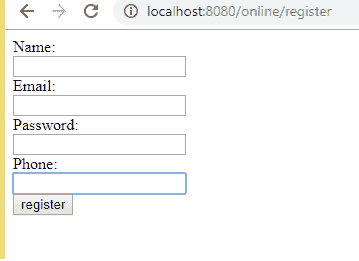
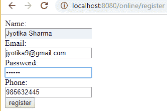

# Hibernate Web 应用程序示例

> 原文：<https://www.tutorialandexample.com/hibernate-web-application-example/>

**使用 Hibernate 的 Web 应用示例**

在本节中，我们将创建一个 hibernate web 应用程序。这里我们使用一个 JSP 文件进行演示。

**使用 hibernate 创建 web 应用程序的示例**

**index.jsp**

这一页将显示一个注册表单。它从表单中获取输入，并将其发送到关联的(在本例中是 register.jsp)页面。

```

 Name:
 <input type="text" name="name">
 Mobile No: 
 <input type="text" name="phnno">
 Password:
 <input type="password" name="password">
 Email ID: 
 <input type="text" name="email">
 <input type="submit" value="register">

**register.jsp**

register.jsp 将从 index.jsp 获取所有信息，并将其存储在学生类的对象中。

```

 0)
 out.print("Registration is successfull");
 %> 
```

**Student.java**

这是一个 bean 类。bean 类的所有变量都用公共 setter 和 getter 方法设置为 private。

```
public class Student {
  private int id,phnno;
  private String name,email,password;
  public int getId() { 
  return id;
  }
  public void setId(int id) {
  this.id = id; 
  }
  public int getPhnno() {
  return phnno;
  } 
  public void setPhnno(int phnno) {
  this.phnno = phnno;
  } 
  public String getName() {
  return name;
  } 
  public void setName(String name) {
  this.name = name;
  } 
  public String getEmail() {
  return email;
  } 
  public void setEmail(String email) {
  this.email = email;
  } 
  public void setPassword(String password) {
  this.password = password;
  }
 } 
```

**StudentDao.java**

它包含了存储学生类的对象的方法。

```
import org.hibernate.Session; 
 import org.hibernate.SessionFactory; 
 import org.hibernate.Transaction; 
 public class StudentDao { 
 public static int register(Student student){  
 int i=0; 
 Configuration cfg= new Configuration();
 cfg.configure("hibernate.cfg.xml");
 SessionFactory factory= cfg.buildSessionFactory(); 
 Session session = factory.openSession(); 
 Transaction t = session.beginTransaction(); 
 i=(Integer)session.save(student); 
 t.commit();  
 session.close(); 
 return i; 
  } 
  }  
```

 **student.hbm.xml** 

它将学生类的对象与数据库表进行映射。

```

 ttp://hibernate.sourceforge.net/hibernate-mapping-5.3.dtd">http://hibernate.sourceforge.net/hibernate-mapping-5.3.dtd"> 

 <class name="com.hibernate.webap.Student" table="student001"> 
 <id name="id"> 
 <generator class="increment"></generator> </id> 
 </class> 

```

 **hibernate.cfg.xml** 

它包含关于映射文件和关系数据库的信息。

```
 ttp://hibernate.sourceforge.net/hibernate-configuration-5.3.dtd">http://hibernate.sourceforge.net/hibernate-configuration-5.3.dtd"> 

 <session-factory><property name="hbm2ddl.auto">create</property>
 <property name="dialect">org.hibernate.dialect.Oracle9Dialect</property> 
 <property name="connection.driver_class">oracle.jdbc.driver.OracleDriver</property>
 <property name="connection.url">jdbc:oracle:thin:@localhost:1521:xe</property>
 <property name="connection.username">root</property> //write your own username
 <property name="connection.password">root</property> //write your own password 
 <mapping resource="student.hbm.xml"></mapping></session-factory> 

```

**输出**





```