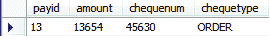

# 每个类的 Hibernate 继承表

> 原文：<https://www.tutorialandexample.com/hibernate-inheritance-table-per-class/>

在这种继承策略中，生成每个类的表。这意味着为层次结构中涉及的每个 POJO 类生成一个单独的表。与 **SINGLE_TABLE** 策略不同，表中没有可空值。因此，为了克服**单表**策略的缺点，我们使用 TABLE_PER_CLASS。

**TABLE _ PER _ CLASS 继承的语法**

```
@Inheritance(strategy=InheritanceType.TABLE_PER_CLASS)
```

这里，继承类型定义了我们正在使用的继承策略。

### TABLE_PER_CLASS 继承的示例

在这个例子中，我们要上三节课；即**Payment.java、**Card.java、**Cheque.java。**

类别层次如下:-


#### 1) **创建所有 POJO 类**

在这一步中，我们将创建所有的 POJO 类，即**Payment.java、Card.java**和**Cheque.java**。

**Payment.java**

```
 import javax.persistence.Column;
 import javax.persistence.Entity;
 import javax.persistence.GeneratedValue;
 import javax.persistence.GenerationType;
 import javax.persistence.Id;
 import javax.persistence.Inheritance;
 import javax.persistence.InheritanceType;
 import javax.persistence.Table;
 @Entity
 @Table(name="p1")
 @Inheritance(strategy=InheritanceType.TABLE_PER_CLASS)
 public class Payment {
@Id
@GeneratedValue(strategy=GenerationType.AUTO)
@Column(name="payid")
private int id;
@Column(name="amount")
private int amount;
public int getId() {
return id;
}
public void setId(int id) {
this.id = id;
}
public int getAmount() {
return amount;
}
public void setAmount(int amount) {
this.amount = amount;
}
} 
```

**Card.java**

```
 import javax.persistence.Column;
import javax.persistence.Entity;
import javax.persistence.Table;
@Entity
@Table(name="c1")
public class Card extends Payment {
@Column(name="cardnum")
private int cardno;
@Column(name="cardtype")
private String card_type;
public int getCardno() {
return cardno;
}
public void setCardno(int cardno) {
this.cardno = cardno;
}
public String getCard_type() {
return card_type;
}
public void setCard_type(String card_type) {
this.card_type = card_type;
}
} 
```

**Cheque.java**

```
 import javax.persistence.Column;
 import javax.persistence.Entity;
 import javax.persistence.Table;
 @Entity
 @Table(name="ch1")
 public class Cheque extends Payment {
@Column(name="chequeno")
private int chequeno;
@Column(name="chequetype")
private String cheque_type;
public int getChequeno() {
return chequeno;
}
public void setChequeno(int chequeno) {
this.chequeno = chequeno;
}
public String getCheque_type() {
return cheque_type;
}
public void setCheque_type(String cheque_type) {
this.cheque_type = cheque_type;
}
} 
```

#### 2)创建配置文件。

配置文件包含映射类和数据库的信息。我们将在配置文件( **hibernate.cfg.xml** )中映射所有的 POJO 类。

**hibernate.cfg.xml**

```

 <session-factory><property name="hibernate.hbm2ddl.auto">update</property>  
<property name="hibernate.dialect">org.hibernate.dialect.MySQL5Dialect</property> 
<property name="hibernate.connection.url">jdbc:mysql://
localhost:3306/example</property>
<property name="hibernate.connection.driver_class">com.mysql.jdbc.Driver</property> 
<property name="connection.username">root</property>  
<property name="connection.password">root</property>  

 <mapping class="com.app.Concrete_Map2.Payment"><mapping class="com.app.Concrete_Map2.Card"><mapping class="com.app.Concrete_Map2.Cheque"></mapping></mapping></mapping></session-factory>  

```

#### **3)创建存储 POJO 对象的主类**

在这一步中，我们将创建存储 POJO 类对象的主类(包含 main 方法)。

**App.java**

```
import org.hibernate.Session;
import org.hibernate.SessionFactory;
import org.hibernate.cfg.Configuration;

public class App 
{
public static void main( String[] args )
{
Configuration cfg= new Configuration();
cfg.configure("hibernate.cfg.xml");
SessionFactory s= cfg.buildSessionFactory();
ssion session=s.openSession();
session.beginTransaction();

Payment pay=new Payment();
pay.setAmount(19800);

Card card= new Card();
card.setCardno(540213);
card.setCard_type("MASTER");
card.setAmount(8956);

Cheque cheque= new Cheque();
cheque.setChequeno(45630);
cheque.setCheque_type("ORDER");
cheque.setAmount(13654);

session.save(pay);
session.save(card);
session.save(cheque);

session.getTransaction().commit();
System.out.println("Successfull!!");     
}
}  
```

**4。输出**


**5。数据库表**

**付款表**


**卡片表**


**支票表格**



### **TABLE _ PER _ CLASS 继承策略的缺点**

以下是 TABLE_PER_CLASS 继承策略中的问题:

*   属于超类的数据分散在许多子类中。因此，重复的列(数量)出现在子类中。
*   对超类的任何改变都会影响子类的表。

尽管这种策略比单表继承策略好，但它也有一些缺点。为了克服这些缺点，我们使用 JOINED_TABLE 继承策略。