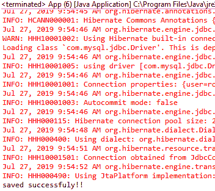
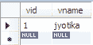
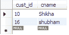
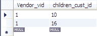

# Hibernate 一对多映射

> 原文：<https://www.tutorialandexample.com/one-to-many-hibernate-mapping/>

**一对多 Hibernate 映射示例**

在一对多关联映射中，一个持久类中只有一个对象与另一个持久类中的许多对象相关。它是一个(**父**)与多个(**子**)相关的关系。这是 1 对 N 的关系。

例如，一个*供应商*可以有多个*客户；*因此，我们需要在父类中取一个集合属性，比如 Set、Map、List。

现在，我们将创建一个示例，其中有两个持久类可用，即 Vendor (parent)和 Customer (child)。这里，我们需要在持久类中定义 **@OneToMany** 和 **@JoinColumn** 注释。

以下是创建示例的步骤:

1.  **创建所有持久类**

在这一步，我们将开发持久类，即**Vendor.java**和**Customer.java。**

**Vendor.java**

```
import java.util.Set;
 import javax.persistence.CascadeType;
 import javax.persistence.Column;
 import javax.persistence.Entity;
 import javax.persistence.FetchType;
 import javax.persistence.Id;
 import javax.persistence.OneToMany;
 import javax.persistence.Table;
 @Entity
 @Table(name="vendor")
 public class Vendor {
  @Id
  @Column(name="vid")
  private int vendid;
  @Column(name="vname")
  private String name;
  @OneToMany(fetch=FetchType.LAZY,targetEntity=Customer.class,cascade=CascadeType.ALL)
  private Set children;
  public int getVendid() {
  return vendid;
  }
  public void setVendid(int vendid) {
  this.vendid = vendid;
  }
  public String getName() {
  return name;
  }
  public void setName(String name) {
  this.name = name;
  }
  public Set getChildren() {
  return children;
  }
  public void setChildren(Set children) {
  this.children = children;
  }
  } 
```

**Customer.java**

```
import javax.persistence.Column;
 import javax.persistence.Entity;
 import javax.persistence.Id;
 import javax.persistence.Table;
 @Entity
 @Table(name="customers")
 public class Customer {
  @Id
  @Column(name="cust_id")
  private int cid;
  @Column(name="cname")
  private String cname;
  public int getCid() {
  return cid;
  }
  public void setCid(int cid) {
  this.cid = cid;
  }
  public String getCname() {
  return cname;
  }
  public void setCname(String cname) {
  this.cname = cname;
  }
  } 
```

*   **创建配置文件**

在这一步，我们将创建配置类( **hibernate.cfg.xml** )，它包含持久类和数据库的信息。

**hibernate.cfg.xml**

```

 <session-factory> 
 <property name="hibernate.hbm2ddl.auto">update</property> 
 <property name="hibernate.dialect">org.hibernate.dialect.MySQL5Dialect</property>
 <property name="hibernate.connection.driver_class">com.mysql.jdbc.Driver</property>
 <property name="hibernate.connection.url">jdbc:mysql://localhost:3306/hibernate</property>
 <property name="connection.username">root</property> 
 <property name="connection.password">root</property> 
  <mapping class="com.app.Onetomany.Vendor"><mapping class="com.app.Onetomany.Customer"></mapping></mapping> </session-factory> 

```

*   **创建存储持久类对象的主类**

在这一步，我们将创建一个由 **main()** 方法组成的类，并存储持久类的对象。

**App.java**

```
import java.util.HashSet;
 import java.util.Set;
 import org.hibernate.Session;
 import org.hibernate.SessionFactory;
 import org.hibernate.Transaction;
 import org.hibernate.cfg.Configuration;
 public class App 
 {
  public static void main( String[] args )
  {
  Configuration cfg= new Configuration();
  cfg.configure("hibernate.cfg.xml");
  SessionFactory factory= cfg.buildSessionFactory();
  Session session= factory.openSession();
  Vendor vendor= new Vendor();
  vendor.setVendid(01);
  vendor.setName("jyotika");
  Customer customer= new Customer();
  customer.setCid(10);
  customer.setCname("Shikha");
  Customer c= new Customer();
  c.setCid(16);
  c.setCname("shubham");
  Set s= new HashSet();
  s.add(customer);
  s.add(c);
  vendor.setChildren(s);
  Transaction t= session.beginTransaction();
  session.persist(vendor);
  t.commit();
  session.close();
  System.out.println("saved successfully");
  factory.close();
  }
 } 
```

*   **输出**



*   **表格**

**供应商**



**客户**



**供应商 _ 客户**

