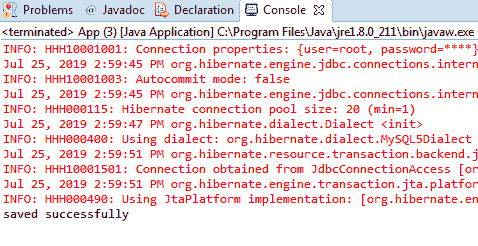
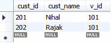
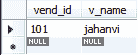

# Hibernate 多对一映射

> 原文：<https://www.tutorialandexample.com/hibernate-mapping-many-to-one/>

**多对一休眠映射** **与示例**

多对一关联映射与一对多关联映射相反。例如，许多(**客户**)与一个(**供应商**)相关联。在 Hibernate 中，从子类对象到父类对象应用了多对一的关联映射。这是一种一对一的关系。

比如单个 ***厂商*** 有多个 ***客户***；这与一对多关联映射正好相反。这里，我们需要在 Customer.java 类中获取一个集合属性，如 Set、Map、Bag 和 List。

现在，我们将创建一个示例，其中有两个持久类，即 Customers 和 Vendor。在这里，我们采取单向映射，所以我们需要在 Customer 类中定义 **@ManyToOne** 和 **@JoinColumn annotations** 。

以下是创建示例的步骤:

1.  **创建所有持久类**

在这一步，我们将开发持久类，即**Vendor.java**和**Customer.java。**

**Vendor.java**

```
import javax.persistence.Column;
 import javax.persistence.Entity;
 import javax.persistence.Id;
 import javax.persistence.Table;
 @Entity 
 import javax.persistence.Entity;
 import javax.persistence.Id;
 import javax.persistence.Table;
 @Entity 
 @Table(name="vend")
 public class Vendor {
  @Id
  @Column(name="vend_id")
  private int v_id; 
  @Column(name="v_name")
  private String name;
  public int getV_id() {
  return v_id;
  } 
  public void setV_id(int v_id) {
  this.v_id = v_id;
  }
  public String getName() {
  return name; 
  }
  public void setName(String name) {
  this.name = name;
  }
  } 
```

**Customer.java**

```
import javax.persistence.CascadeType;
 import javax.persistence.Column;
 import javax.persistence.Entity;
 import javax.persistence.Id;
 import javax.persistence.JoinColumn;
 import javax.persistence.ManyToOne;
 import javax.persistence.Table; 
 @Entity
 @Table(name="custo")
 public class Customer {
  @Id
  @Column(name="cust_id")
  private int c_id;
  @Column(name="cust_name")
  private String name;
  @ManyToOne(cascade=CascadeType.ALL)
  @JoinColumn(name="v_id",referencedColumnName="vend_id")
  private Vendor v;
  public int getC_id() {
  return c_id;
  }
  public void setC_id(int c_id) {
  this.c_id = c_id;
  }
  public String getName() {
  return name;
  }
  public void setName(String name) {
  this.name = name;
  }
  public Vendor getV() {
  return v;
  }
  public void setV(Vendor v) {
  this.v = v;
  }
  } 
```

*   **创建配置文件**

在这一步中，我们将创建配置类(hibernate.cfg.xml ),它包含持久类和数据库的信息。

**hibernate.cfg.xml**

```

 <session-factory> 
 <property name="hibernate.hbm2ddl.auto">update</property> 
 <property name="hibernate.dialect">org.hibernate.dialect.MySQL5Dialect</property>
 <property name="hibernate.connection.driver_class">com.mysql.jdbc.Driver</property>
 <property name="hibernate.connection.url">jdbc:mysql://localhost:3306/test</property>
 <property name="connection.username">root</property> 
 <property name="connection.password">root</property> 
  <mapping class="com.app.Manytoone.Vendor"><mapping class="com.app.Manytoone.Customer"></mapping></mapping> </session-factory> 

```

*   **创建存储持久类对象的主类**

在这一步，我们将创建一个由 **main()** 方法组成的类，并存储持久类的对象。

**App.java**

```
import org.hibernate.Session;
 import org.hibernate.SessionFactory;
 import org.hibernate.Transaction;
 import org.hibernate.cfg.Configuration;
 public class App 
 {
  public static void main( String[] args )
  {
  Configuration cfg= new Configuration();
  cfg.configure("hibernate.cfg.xml");
  SessionFactory factory= cfg.buildSessionFactory();
  Session session= factory.openSession();
  Vendor ven= new Vendor();
  ven.setV_id(101);
  ven.setName("jahanvi");
  Customer c= new Customer();
  c.setC_id(201);
  c.setName("Nihal");
  c.setV(ven);
  Customer c2 =new Customer();
  c2.setC_id(202);
  c2.setName("Rajak");
  c2.setV(ven);
  Transaction t= session.beginTransaction();
  session.save(c);
  session.save(c2);
  t.commit();
  session.close();
  System.out.println("saved successfuly!!");
  factory.close();
  }
 } 
```

*   **输出**



*   **表**

表成本



**卖表**

