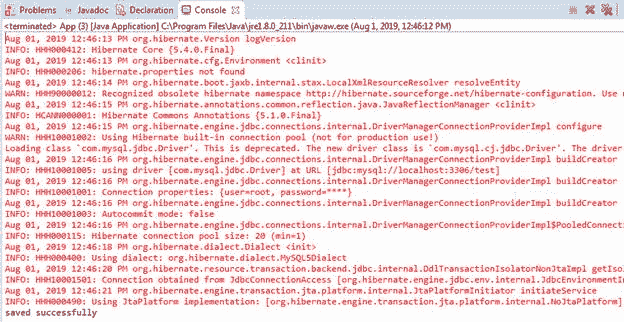
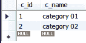
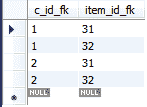

# 休眠多对多映射

> 原文：<https://www.tutorialandexample.com/hibernate-many-to-many-mapping/>

**多对多 Hibernate 映射示例**

在多对多关联映射中，一个持久类的多个对象与另一个持久类的多个对象相关联。例如，许多(**类别**)与许多(**项目**)相关，反之亦然，因为这是双向映射。

这里，我们正在创建一个多对多关联映射的例子。在这个例子中，我们需要在持久类中指定 **@ManyToMany** 和 **@JoinTable annotations** 。这里，我们需要在两个持久类中获取一个集合属性，如 Set、Map、Bag 和 List。

以下是创建示例的步骤:

1.  **创建所有持久类**

在这一步，我们将开发持久类，即**Categories.java**和**Items.java。**

**Categories.java**

```
import java.util.Set;
 import javax.persistence.CascadeType;
 import javax.persistence.Column;
 import javax.persistence.Entity;
 import javax.persistence.Id; 
 import javax.persistence.JoinColumn;
 import javax.persistence.JoinTable;
 import javax.persistence.ManyToMany;
 import javax.persistence.Table;
 @Entity 
 @Table(name="categories")
 public class Categories {
  @Id
  @Column(name="c_id")
  private int cate_id;
  @Column(name="c_name") 
  private String cate_name;
  @ManyToMany(targetEntity=Items.class, cascade=CascadeType.ALL)
  @JoinTable(name="cate_items",[email protected](name="c_id_fk",referencedColumnName="c_id"),[email protected](name="item_id_fk",referencedColumnName="i_id")) 
  private Set items;
  public int getCate_id() {
  return cate_id;
  } 
  public void setCate_id(int cate_id) {
  this.cate_id = cate_id;
  }
  public String getCate_name() { 
  public void setCate_id(int cate_id) {
  this.cate_id = cate_id;
  }
  public String getCate_name() {
  return cate_name; 
  }
  public void setCate_name(String cate_name) {
  this.cate_name = cate_name;
  }
  public Set getItems() {
  return items; 
  }
  public void setItems(Set items) {
  this.items = items;
  }
  } 

```

**Items.java**

```
import java.util.Set;
 import javax.persistence.Column;
 import javax.persistence.Entity;
 import javax.persistence.Id;
 import javax.persistence.ManyToMany;
 import javax.persistence.Table; 
 import javax.persistence.Column;
 import javax.persistence.Entity;
 import javax.persistence.Id;
 import javax.persistence.ManyToMany;
 import javax.persistence.Table; 
 import javax.persistence.Column;
 import javax.persistence.Entity;
 import javax.persistence.Id;
 import javax.persistence.ManyToMany;
 import javax.persistence.Table; 
 import javax.persistence.Column;
 import javax.persistence.Entity;
 import javax.persistence.Id;
 import javax.persistence.ManyToMany;
 import javax.persistence.Table; 
 import javax.persistence.Column;
 import javax.persistence.Entity;
 import javax.persistence.Id;
 import javax.persistence.ManyToMany;
 import javax.persistence.Table;
 @Entity
 @Table(name="items")
 public class Items {
  @Id
  @Column(name="i_id")
  private int item_id;
  @Column(name="i_name")  
  private String item_name;
  @ManyToMany(targetEntity=Categories.class,mappedBy="items")
  private Set categories;
  public int getItem_id() {
  return item_id;
  } 
  public void setItem_id(int item_id) {
  this.item_id = item_id;
  }
  public String getItem_name() {
  return item_name;
  } 
  public void setItem_name(String item_name) {
  this.item_name = item_name;
  }
  public Set getCategories() {
  return categories;
  }
  public void setCategories(Set categories) { 
  this.categories = categories;
  }
  } 
```

*   **创建配置文件**

在这一步中，我们将创建配置类(hibernate.cfg.xml ),它包含持久类和数据库的信息。

**hibernate.cfg.xml**

```

 <session-factory>  
 <property name="hibernate.hbm2ddl.auto">update</property> 
 <property name="hibernate.dialect">org.hibernate.dialect.MySQL5Dialect</property>
 <property name="hibernate.connection.driver_class">com.mysql.jdbc.Driver</property>
 <property name="hibernate.connection.url">jdbc:mysql://localhost:3306/test</property>
 <property name="connection.username">root</property>
 <property name="connection.password">root</property> 
  <mapping class="com.app.Manytomany.Categories"><mapping class="com.app.Manytomany.Items"></mapping></mapping> </session-factory> 

```

*   **创建存储持久类对象的主类**

在这一步，我们将创建一个由 **main()** 方法组成的类，并存储持久类的对象。

**App.java**

```
import java.util.HashSet;
 import java.util.Set;
 import org.hibernate.Session;
 import org.hibernate.SessionFactory;
 import org.hibernate.Transaction;
 import org.hibernate.cfg.Configuration;
 public class App  
 {
  public static void main( String[] args )
  {
  Configuration cfg= new Configuration();
  cfg.configure("hibernate.cfg.xml");
  SessionFactory factory = cfg.buildSessionFactory(); 
  Session session= factory.openSession();
  Categories cate1 = new Categories();
  cate1.setCate_id(01);
  cate1.setCate_name("category 01");
  Categories cate2 = new Categories();
  cate2.setCate_id(02); 
  cate2.setCate_name("category 02");
  Items i= new Items();
  i.setItem_id(31);
  i.setItem_name("item 11");
  Items i2 =new Items();
  i2.setItem_id(32);
  i2.setItem_name("item 21"); 
  Set set= new HashSet();
  set.add(i);
  set.add(i2);
  cate1.setItems(set);
  cate2.setItems(set);
  Transaction t= session.beginTransaction(); 
  session.save(cate1);
  session.save(cate2);
  t.commit();
  System.out.println("saved successfully!!!!");
  session.close();
  }
 } 
```

*   **输出**



*   **数据库表**

**类别表**



**物品表**


**美食 _ 项目表**

