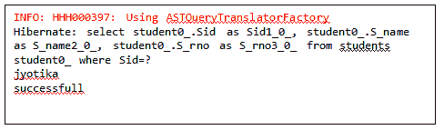
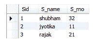

# 使用 XML 休眠命名查询

> 原文：<https://www.tutorialandexample.com/hibernate-named-query-using-xml/>

命名查询是一种技术，用于将所有查询(本地 SQL 和 HQL)组装到一个特定的位置，并通过某个名称引用它们。它有助于减少分散在所有 java 代码中的查询所造成的混乱。

创建 SessionFactory 时会验证命名查询。它使得应用程序在出错时很快失败。命名查询对 access 是全局的，这意味着它们一旦定义就可以在整个应用程序中使用。对于整个应用程序，命名查询被赋予一个唯一的名称。这样，应用程序多次使用同一个查询，而无需重写同一个查询。因此，命名查询的主要优势是**故障快速**和**可重用性**。

就性能而言，命名查询没有太大的区别。

**使用 XML 的命名查询示例**

这里，我们将使用映射文件创建一个命名查询的示例。在映射文件中，我们使用元素 <query>…</query> 来定义命名查询。

假设数据库中有一个包含三列(Sid、S_name 和 S_rno)的表(students)。

下面是使用 XML 创建命名查询示例的步骤。

1.  **添加依赖关系**

对于这个例子，您需要在 pom.xml 中添加一些依赖项。

```
 <groupid>org.hibernate</groupid>
<artifactid>hibernate-core</artifactid>
<version>5.4.0.Final</version> 
 <groupid>mysql</groupid>
<artifactid>mysql-connector-java</artifactid>
<version>8.0.16</version> 
```

*   **创建一个 POJO 类**

在这一步中，我们将创建一个 POJO 类，即**Student.java**。

**Student.java**

```
public class Student {
private int id;
private String name;
private int rollno;
public int getId() {
return id;
}
public void setId(int id) {
this.id = id;
}
public String getName() {
return name;
}
public void setName(String name) {
this.name = name;
}
public int getRollno() {
return rollno;
}
public void setRollno(int rollno) {
this.rollno = rollno;
}                  
} 
```

*   **为 POJO 类创建映射文件。**

在这一步中，我们将为 POJO 类创建一个映射文件，即 **student.hbm.xml** 文件，在该文件中我们定义了<查询>……</查询>元素。

**student.hbm.xml**

```

"-//Hibernate/Hibernate Mapping DTD 5.3//EN"  
"http://hibernate.sourceforge.net/
hibernate-mapping-5.3.dtd">  

<class name="com.app.NQ_xml.Student" table="students"><id name="id" column="Sid"><generator class="assigned"></generator></id></class>   

```

*   **创建配置文件。**

在这一步中，我们将在配置文件( **hibernate.cfg.xml** )中添加映射文件( **student.hbm.xml** )的条目。

**hibernate.cfg.xml**

```

 <session-factory><property name="hibernate.dialect">org.hibernate.
dialect.MySQL5Dialect</property>
<property name="hibernate.connection.driver_class">com.mysql.
jdbc.Driver</property>
<property name="hibernate.connection.url">jdbc:mysql:
//localhost:3306/test2</property>
<property name="hibernate.connection.username">root</property>
<property name="hibernate.connection.password">root</property>
<property name="hibernate.hbm2ddl.auto">update</property>   
<property name="show_sql">true</property> 

 <mapping resource="student.hbm.xml"></mapping></session-factory> 
```

*   创建存储 POJO 类对象的主类。

在这一步中，我们将创建一个 main 类(包含 main 方法),它存储 POJO 类的对象。

**App.java**

```
import java.util.List;
import org.hibernate.Query;
import org.hibernate.Session;
import org.hibernate.SessionFactory;
import org.hibernate.cfg.Configuration;
public class App 
{
public static void main( String[] args )
{
Configuration cfg = new Configuration();
cfg.configure("hibernate.cfg.xml");
SessionFactory factory= cfg.buildSessionFactory();
Session session=factory.openSession();
session.beginTransaction();
Query query=session.getNamedQuery("Student.byId");
query.setInteger("Sid", 2);
List std= (List<student>) query.list();
session.getTransaction().commit();
session.close();
for(Student student : std)
{
System.out.println(student.getName());
}
System.out.println("successfull");
}
}</student> 
```

**输出**



**数据库表**

