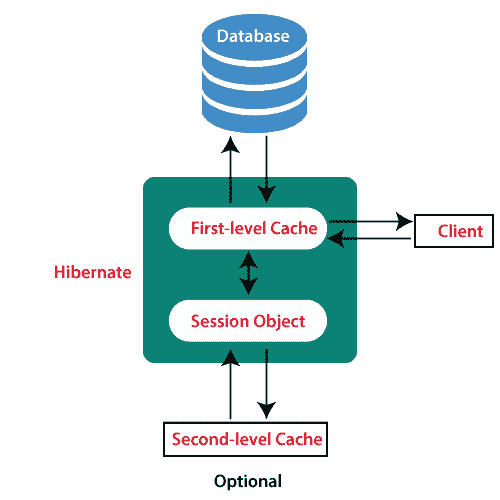

# 休眠缓存

> 原文：<https://www.tutorialandexample.com/hibernate-caching/>

### 什么是缓存？

缓存是将数据保存到缓存内存中的过程。缓存是一个临时存储层，用于提高数据访问的速度。它允许我们重用存储在高速缓存中的数据，以改进数据检索。

### 什么是 Hibernate 缓存？

Hibernate ORM 框架提供了一个缓存工具，通过减少数据库中的查询(SQL 和原生 HQL)来获得快速运行的应用程序。换句话说，它通过在缓存中合并对象来提高应用程序的性能。它有助于多次检索相同的数据。

**缓存有三种类型:** -

1.  一级缓存
2.  二级缓存
3.  查询缓存

### 一级缓存

一级缓存与会话对象相关。它是强制缓存，因为应用程序中的所有请求都要经过它。默认是启用的，我们无法禁用。一级缓存的范围是会话，这意味着它对整个应用程序不可用。

一级缓存中使用了一些基本方法。它们列在下面-

1.  **evict()-** 用于从一级缓存中移除加载的对象。
2.  **clear()-** 用于移除一级缓存中存储的所有对象。
3.  **contains()-** 它用于检查一个对象是否存在于缓存中。如果找到该对象，则返回 true，否则返回 false。

### 二级缓存

二级缓存与 SessionFactory 对象相关，是可选的。二级缓存的范围是全局的，这意味着它可供整个应用程序使用。与一级缓存不同，默认情况下不启用。因此，我们需要明确地启用它。

当用户第一次从数据库中检索数据时，数据存储在二级缓存中(如果为该对象启用了缓存)。

### 查询缓存

Hibernate 还为查询结果集提供了一个与二级缓存相链接的缓存。这对于定期运行的查询非常有用。