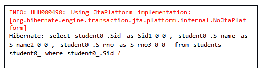

# 休眠二级缓存

> 原文：<https://www.tutorialandexample.com/hibernate-second-level-cache/>

二级缓存与 SessionFactory 对象相关。一旦 SessionFactory 关闭，与之关联的所有二级缓存数据都将丢失。缓存管理器也将关闭。

### 缓存提供者

以下是流行的缓存提供程序:

#### **JBoss 缓存**

它是一个事务性的复制缓存。它包含两个组件，一个**通用缓存**，和一个 **POJO 缓存**。它还支持同步/异步通信，即乐观和悲观锁定。它位于**org . hibernate . cache . treecacheprovider**包中。

#### 嗯缓存

EH Cache 是著名的开源 Java 缓存，可以作为 Hibernate 二级缓存。此外，它还可以用作独立的二级缓存。它位于**org . hibernate . cache . ehcacheprovider**包中。

#### **操作系统缓存**

OS Cache 由 Java 框架 **OpenSymphony、**开发。可以将其配置为二级缓存。它在**org . hibernate . cache . oscacheprovider**包中。

#### **群缓存**

群缓存是一个简单的分布式缓存。它在内部使用 JavaGroups 来管理其分布式缓存的成员和通信。它不支持 Hibernate 查询缓存。在**org . hibernate . cache . swarm cacheprovider**包中提供。

#### **哈希表**

它不用于生产用途。它仅用于测试目的，在**org . hibernate . cache . hashtablecacheprovider**包中提供。**T3】**

### 二级缓存的并发策略

它们充当中介，负责将数据存储到缓存中，并从缓存中获取数据。当用户启用二级缓存时，有五种并发策略可供使用。以下是并发策略:

1.  **只读**
2.  **读写**
3.  **非严格读写**
4.  **交易型**
5.  **无**

#### **只读**

只读缓存策略用于永远不想改变的数据。适用于需要经常读取但不需要修改的数据。在集群环境中使用它既安全又简单。

#### **读写**

读写缓存策略适用于需要定期更新的应用程序。如果需要可序列化的事务隔离，就不应该使用它。如果我们想在集群中使用这种策略，我们应该检查缓存实现是否支持锁定。

#### **非严格读写**

如果应用程序很少更新(即不定期更新)，则使用非限制性读写缓存策略。在这种策略中，无法保证缓存和数据库之间的一致性。

#### **交易型**

它为 JBoss TreeCache 这样的事务性缓存提供者提供支持。这种缓存策略只能在 JTA 环境中使用，我们必须指定一个**hibernate . transaction . manager _ lookup _ class**。

#### **无**

在这种策略中，不会发生缓存。

**缓存并发策略支持表**

并非所有的缓存提供程序都支持所有的缓存并发策略。下表显示了哪个缓存提供程序与哪个缓存使用功能兼容。

| **缓存** | **只读** | **读写** | **非严格读写** | **交易型** |
| 嗯缓存 | 是 | 是 | 是 | 不 |
| **操作系统缓存** | 是 | 是 | 是 | 不 |
| **JBoss 缓存** | 是 | 不 | 不 | 是 |
| **群缓存** | 是 | 不 | 是 | 不 |
| **哈希表** | 是 | 是 | 是 | 不 |

### 二级缓存的示例

让我们创建一个二级缓存的例子。在本例中，我们使用 **EH Cache** provider 作为二级缓存。我们假设数据库中已经有一个包含一些记录的表(**学生**)。

以下是创建二级缓存示例的步骤:

1.  **创建 POJO 类**

在这一步中，我们将创建一个 POJO 类，即 Student .java。

**Student.java**

```
import javax.persistence.Cacheable;
import javax.persistence.Column;
import javax.persistence.Entity;
import javax.persistence.GeneratedValue;
import javax.persistence.GenerationType;
import javax.persistence.Id;
import javax.persistence.Table;
import org.hibernate.annotations.Cache;
import org.hibernate.annotations.CacheConcurrencyStrategy;
@Entity
@Table(name="students")
@Cacheable
@Cache(usage=CacheConcurrencyStrategy.READ_ONLY)
public class Student {
@Id
@GeneratedValue(strategy=GenerationType.AUTO)
@Column(name="Sid")
private int id;
@Column(name="S_name")
private String name;
@Column(name="S_rno")
private int rollno;
public int getId() {
return id;
}
public void setId(int id) {
this.id = id;
}
public String getName() {
return name;
}
public void setName(String name) {
this.name = name;
}
public int getRollno() {
return rollno;
}
public void setRollno(int rollno) {
this.rollno = rollno;
}
} 
```

*   **添加依赖关系**

在这一步中，我们将在 pom.xml 中的 <dependencies>…</dependencies> 标签之间添加项目所需的依赖关系。

```
 <groupid>net.sf.ehcache</groupid>
<artifactid>ehcache</artifactid>
<version>2.9.1</version> 
 <groupid>org.hibernate</groupid>
<artifactid>hibernate-ehcache</artifactid>
<version>5.4.0.Final</version> 
```

*   **创建配置文件。**

配置文件包含映射类和数据库的信息。

**hibernate.cfg.xml**

```

"-//Hibernate/Hibernate Configuration DTD 5.3//EN"  
"http://hibernate.sourceforge.net/
hibernate-configuration-5.3.dtd">  
<session-factory><property name="hibernate.hbm2ddl.auto">update</property>  
<property name="hibernate.dialect">org.hibernate.
dialect.MySQL5Dialect</property>
<property name="hibernate.connection.url">jdbc:mysql://
localhost:3306/test2</property>
<property name="hibernate.connection.driver_class">com.mysql.
jdbc.Driver</property>
<property name="connection.username">root</property>  
<property name="connection.password">root</property>   
<property name="show_sql">true</property>
<property name="hibernate.cache.use_second_level_cache">true</property>
<property name="hibernate.cache.region.factory_class">           
org.hibernate.
cache.ehcache.EhCacheRegionFactory</property>
 <mapping class="com.app.SL_cache.Student"></mapping></session-factory>    
```

*   **创建一个检索 POJO 对象的类**

它是一个包含用于运行应用程序的 **main()** 方法的类，并且它检索 POJO 类的对象。

**App.java**

```
import org.hibernate.Session;
import org.hibernate.SessionFactory;
import org.hibernate.cfg.Configuration;
public class App 
{
public static void main( String[] args )
{
Configuration cfg= new Configuration();
cfg.configure("hibernate.cfg.xml");
SessionFactory fact= cfg.buildSessionFactory();
Session sess= fact.openSession();
sess.beginTransaction();
Student std=  (Student) sess.get(Student.class, 2);   
sess.getTransaction().commit();
sess.close();
System.out.println(std);
//opening a new session
Session sess2= fact.openSession();
sess2.beginTransaction();
Student student=(Student) sess2.get(Student.class, 2);
sess2.getTransaction().commit();
sess2.close();
System.out.println(student);
}
} 
```

**输出**

