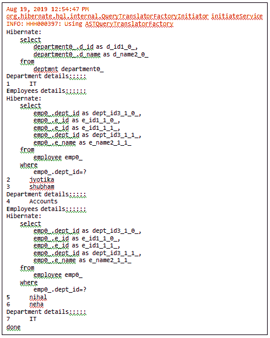
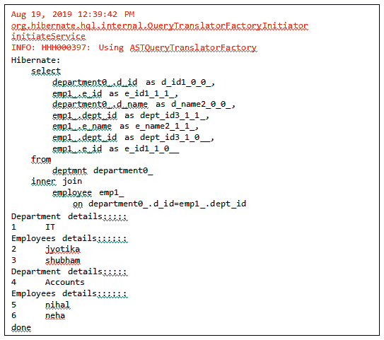
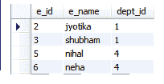
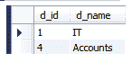

# 休眠 N+1 选择问题

> 原文：<https://www.tutorialandexample.com/hibernate-n-1-select-problem/>

## 休眠 N + 1 选择问题

**N + 1 选择**问题是 Hibernate 中的一个性能问题。在这个问题中，一个 Java 应用程序进行了 N + 1 次数据库调用(N =获取的对象数)。例如，如果 N= 2，应用程序进行 3 次(N+1= 3)数据库调用。

**例子**

让我们借助一个例子来理解这个问题。在这个例子中，我们选择了两个 POJO 类，**Employee.java**和**Department.java。**两个 POJO 类**之间存在**一对多**关联映射。**这样，一个*部门*(母)可以有多个*员工*(子)。

**部门**和**员工**类写在下面:

**Department.java**

```
import java.util.ArrayList;
import java.util.List;
import javax.persistence.CascadeType;
import javax.persistence.Column;
import javax.persistence.Entity;
import javax.persistence.GeneratedValue;
import javax.persistence.GenerationType;
import javax.persistence.Id;
import javax.persistence.OneToMany;
import javax.persistence.Table;
@Entity
@Table(name="deptmnt")
public class Department {
@Id
@GeneratedValue(strategy=GenerationType.AUTO)
@Column(name="d_id")
private int did;
@Column(name="d_name")
private String dname;
@OneToMany(mappedBy="dep", cascade=CascadeType.PERSIST)
private List emp = new ArrayList();
public int getDid() {
return did;
}
public void setDid(int did) {
this.did = did;
}
public String getDname() {
return dname;
}
public void setDname(String dname) {
this.dname = dname;
}
public List getEmp() {
return emp;
}
public void setEmp(List emp) {
this.emp = emp;
}
} 
```

在 Department 类中，存在部门 id (did)、部门名称(dname)和雇员列表。

**Employee.java**

```
import javax.persistence.Column;
import javax.persistence.Entity;
import javax.persistence.GeneratedValue;
import javax.persistence.GenerationType;
import javax.persistence.Id;
import javax.persistence.JoinColumn;
import javax.persistence.ManyToOne;
import javax.persistence.Table;
@Entity
@Table(name="employee")
public class Employee {
@Id
@GeneratedValue(strategy= GenerationType.AUTO)
@Column(name="e_id")
private int eid;
@Column(name="e_name")
private String ename;
@ManyToOne
@JoinColumn(name="dept_id")
private Department dep;
public int getEid() {
return eid;
}
public void setEid(int eid) {
this.eid = eid;
}
public String getEname() {
return ename;
}
public void setEname(String ename) {
this.ename = ename;
}
public Department getDep() {
return dep;
}
public void setDep(Department dep) {
this.dep = dep;
}
} 
```

在雇员类中，存在雇员 id (eid)、雇员姓名(e name)和部门类的对象。

下面的代码是配置文件的一部分，它包含关于数据库和映射类的信息。

**hibernate.cfg.xml**

```

org.hibernate.dialect.MySQL5Dialect
com.mysql.jdbc.Driver
jdbc:mysql://localhost:3306/test2
root
root
create
true 
true

```

现在，我们将创建主类，它存储 POJO 类的对象。下面的代码是 App.java 的。

**App.java**

```
import java.util.List;
import org.hibernate.Session;
import org.hibernate.SessionFactory;
import org.hibernate.cfg.Configuration;
public class App 
{
public static void main( String[] args )
{
Configuration cfg= new Configuration();
cfg.configure("hibernate.cfg.xml");
SessionFactory fact= cfg.buildSessionFactory();
Session sess= fact.openSession();
sess.beginTransaction();
Employee e1 = new Employee();
e1.setEname("jyotika");
Employee e2= new Employee();
e2.setEname("shubham");
Employee e3= new Employee();
e3.setEname("nihal");
Employee e4= new Employee();
e4.setEname("neha");
Department d1= new Department();
d1.setDname("IT");
d1.getEmp().add(e1);
d1.getEmp().add(e2);
e1.setDep(d1);
e2.setDep(d1);
Department d2= new Department();
d2.setDname("Accounts");
d2.getEmp().add(e3);
d2.getEmp().add(e4);
e3.setDep(d2);
e4.setDep(d2);
sess.persist(d1);
sess.persist(d2);
List depart= sess.createQuery("From Department", Department.class).getResultList();
//List depart= sess.createQuery("From Department d JOIN fetch d.emp", Department.class).getResultList();
for (Department dep: depart){
System.out.println("Department details:::::");
System.out.println(dep.getDid()+"\t"+dep.getDname());
List<Employee> emp = dep.getEmp();
System.out.println("Employees details::::::");
for (Employee employee : emp) {
System.out.println(employee.getEid() + "\t" + employee.getEname());
}
}
sess.getTransaction().commit();
sess.close();
System.out.println("done");
}
} 
```

**输出**



上面的输出遇到了 N+1 选择问题，因为对不同的对象执行不同的选择查询。第一个 SELECT 查询选择 Department (parent)的值，其余两个查询用于 Employee 类(child)。

由于以下代码，出现了 N+1 问题:

list Department = sess . create query(" From Department "，Department.class)。get result list()；

**为了解决 N+1 选择问题，我们可以使用以下方法:**

1.  **HQL 加入获取**

代替上面的代码，我们可以使用 *JOIN fetch* 来解决 N+1 问题。

```
 List depart=sess.createQuery("From Department d JOIN fetch d.emp",Department.class)
```

。get result list()；

*   **条件查询**

我们还可以使用条件查询来解决 N+1 选择问题。以下代码显示了条件查询的用法:

```
 CriteriaBuilder builder = sess.getCriteriaBuilder();
CriteriaQuery<Department> query = builder.createQuery(Department.class);
Root root = query.from(Department.class);
root.fetch("employees", JoinType.INNER); 
```

在解决 N+1 问题后，对于所有对象只执行一个选择查询。

**输出**



**数据库表**

**员工**



**部门**

