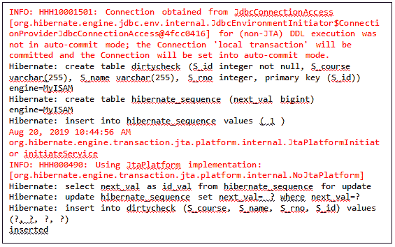
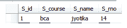
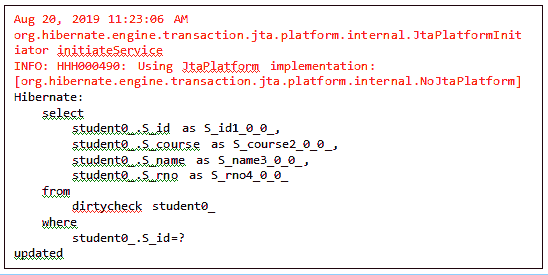
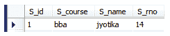

# 休眠中的脏检查

> 原文：<https://www.tutorialandexample.com/dirty-checking-in-hibernate/>

脏检查是 Hibernate 的一个基本概念。脏检查概念用于跟踪对象。它会自动检测对象是否被修改或需要更新。

它还允许开发人员避免耗时的数据库写操作。它只修改那些需要修改的字段，其余的字段保持不变。

### 脏检查的示例

让我们借助一个例子来理解脏检查的概念。在这个例子中，我们采用了一个实体类**学生。**学生类包含学生的学号(id)、姓名(Sname)、课程(Scourse)和 rollno (Srno)。它还提供了默认的和参数化的构造函数。

为了访问应用程序中的脏检查，我们对实体类**学生使用了注释 **@DynamicUpdate** 。**

**@DynamicUpdate-** 用于更新对象。该注释对必填字段进行了必要的修改和更改。**T3】**

下面的代码是学生类的。

**Student.java**

```
import javax.persistence.Column;
import javax.persistence.Entity;
import javax.persistence.GeneratedValue;
import javax.persistence.GenerationType;
import javax.persistence.Id;
import javax.persistence.Table;
import org.hibernate.annotations.DynamicUpdate;
@Entity
@Table(name="dirtycheck")
@DynamicUpdate
public class Student {
            @Id
             @GeneratedValue(strategy=GenerationType.AUTO)
             @Column(name="S_id")
             private int id;
             @Column(name="S_name")
             private String Sname;
             @Column(name="S_course")
             private String Scourse;
             @Column(name="S_rno")
             private int Srno;
             public int getId() {
                         return id;
             }
             public void setId(int id) {
                         this.id = id;
             }
             public String getSname() {
                         return Sname;
             }
             public void setSname(String sname) {
                         Sname = sname;
             }
             public String getScourse() {
                         return Scourse;
             }
             public void setScourse(String scourse) {
                         Scourse = scourse;
             }
             public int getSrno() {
                         return Srno;
             }
             public void setSrno(int srno) {
                         Srno = srno;
             }
             public Student(){
             }
             public Student(int id, String sname, String scourse, int srno) {
                         super();
                         this.id = id;
                         Sname = sname;
                         Scourse = scourse;
                         Srno = srno;
             }
    } 
```

现在，我们将创建配置文件。它包含有关数据库和映射类的信息。

**hibernate.cfg.xml**

```
org.hibernate.dialect.MySQL5Dialect
com.mysql.jdbc.Driverjdbc:mysql://localhost:3306/test3
root
root
update
truetrue

```

现在，我们将创建存储实体类对象的主类。

**App.java**

```
import org.hibernate.Session;
import org.hibernate.SessionFactory;
import org.hibernate.cfg.Configuration;
public class App 
 {
     public static void main( String[] args )
     {
        Configuration cfg=new Configuration();
        cfg.configure("hibernate.cfg.xml");
        SessionFactory fac= cfg.buildSessionFactory();
        Session ses= fac.openSession();
        ses.beginTransaction();
       //setting the values of Student class variables
       /* Student s= new Student();
        s.setScourse("bca");
        s.setSname("jyotika");
        s.setSrno(14);
        ses.save(s);
        ses.getTransaction().commit();
        ses.close();
        */
       //updating the existing record
        Student st= ses.get(Student.class, 1);
        st.setScourse("bba");
        ses.update(st);
        ses.getTransaction().commit();
        ses.close();
        System.out.println("updated");
     }
 } 
```

**输出–插入后**

当数据被插入到 **dirtycheck** 表中时，出现以下输出。



**数据库表–dirty check**



**输出-更新后**

当数据在 **dirtycheck** 表中更新时，出现以下输出。



**数据库表- dirtycheck**

我们已经更新了数据库表中的 **S_course** 。课程由 **bca** 更新为 **bba。**

