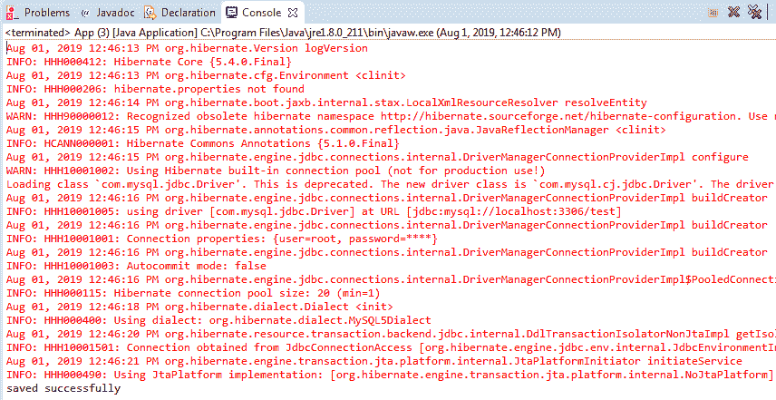
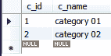
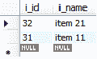
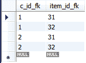

# Hibernate 中的延迟加载

> 原文：<https://www.tutorialandexample.com/lazy-loading-in-hibernate/>

惰性加载是一种抓取技术，用于 Hibernate 中的所有实体。它决定在加载父类对象时是否加载子类对象。当我们在 Hibernate 中使用关联映射时，需要定义获取技术。延迟加载的主要目的是从数据库中获取所需的对象。

例如，我们有一个父类，该父类有一个子类集合。现在，Hibernate 可以使用延迟加载，这意味着它将只加载所需的类，而不是所有的类。它防止了巨大的负载，因为实体只在必要时加载一次。延迟加载通过避免不必要的计算和减少内存需求来提高性能。

延迟加载可以用于所有类型的 Hibernate 映射，即一对一、一对多、多对一和多对多。

### **惰性加载的语法**

为了启用延迟加载，我们使用以下注释参数:

```
fetch= FetchType.LAZY
```

以下代码是延迟加载的语法:

```
@OneToOne(fetch= FetchType.LAZY)
```

### **延迟加载的例子**

1.  **创建所有 POJO 类**

在这一步，我们将开发持久类，即**Categories.java**和**Items.java。**

**Categories.java**

```
 import java.util.Set;
 import javax.persistence.CascadeType;
 import javax.persistence.Column;
 import javax.persistence.Entity;
 import javax.persistence.Id;
 import javax.persistence.JoinColumn;
 import javax.persistence.JoinTable;
 import javax.persistence.ManyToMany;
 import javax.persistence.Table;

 @Entity
 @Table(name="categories")
 public class Categories {
             @Id
             @Column(name="c_id")
             private int cate_id;
             @Column(name="c_name")
             private String cate_name;
             @ManyToMany(targetEntity=Items.class, cascade=CascadeType.ALL, fetch = FetchType.LAZY)
     @JoinTable(name="cate_items",[email protected](name="c_id_fk",referencedColumnName="c_id"),[email protected](name="item_id_fk",referencedColumnName="i_id"))
             private Set items;

             public int getCate_id() {
                         return cate_id;
             }
             public void setCate_id(int cate_id) {
                         this.cate_id = cate_id;
             }
             public String getCate_name() {
                         return cate_name;
             }
             public void setCate_name(String cate_name) {
                         this.cate_name = cate_name;
             }
             public Set getItems() {
                         return items;
             }
             public void setItems(Set items) {
                         this.items = items;
             }
   } 
```

**Items.java**

```
 import java.util.Set;
 import javax.persistence.Column;
 import javax.persistence.Entity;
 import javax.persistence.Id;
 import javax.persistence.ManyToMany;
 import javax.persistence.Table;

 @Entity
 @Table(name="items")
 public class Items {

             @Id
             @Column(name="i_id")
             private int item_id;
             @Column(name="i_name")
             private String item_name;
             @ManyToMany(targetEntity=Categories.class,mappedBy="items", fetch = FetchType.LAZY)
             private Set categories;

             public int getItem_id() {
                         return item_id;
             }
             public void setItem_id(int item_id) {
                         this.item_id = item_id;
             }
             public String getItem_name() {
                         return item_name;
             }
             public void setItem_name(String item_name) {
                         this.item_name = item_name;
             }
             public Set getCategories() {
                         return categories;
             }
             public void setCategories(Set categories) {
                         this.categories = categories;
             }
   } 
```

*   **创建配置文件**

在这一步中，我们将创建包含 POJO 类和数据库信息的配置类(hibernate.cfg.xml)。

**hibernate.cfg.xml**

<pre class="wp-block-preformatted"        update  org.hibernate.dialect.MySQL5Dialect com.mysql.jdbc.Driver jdbc:mysql://localhost:3306/test root</property>                        root</property>                           

*   **创建存储持久类对象的主类**

在这一步，我们将创建一个由 **main()** 方法组成的类，并存储 POJO 类的对象。

**App.java**

```
 import java.util.HashSet;
 import java.util.Set;
 import org.hibernate.Session;
 import org.hibernate.SessionFactory;
 import org.hibernate.Transaction;
 import org.hibernate.cfg.Configuration;
 public class App 
 {
     public static void main( String[] args )
     {
        Configuration cfg= new Configuration();
        cfg.configure("hibernate.cfg.xml");
        SessionFactory factory = cfg.buildSessionFactory();
        Session session= factory.openSession();
        Categories cate1 = new Categories();
        cate1.setCate_id(01);
        cate1.setCate_name("category 01");
        Categories cate2 = new Categories();
        cate2.setCate_id(02);
        cate2.setCate_name("category 02");
        Items i= new Items();
        i.setItem_id(31);
        i.setItem_name("item 11");
        Items i2 =new Items();
        i2.setItem_id(32);
        i2.setItem_name("item 21");
        Set set= new HashSet();
        set.add(i);
        set.add(i2);
        cate1.setItems(set);
        cate2.setItems(set);
        Transaction t= session.beginTransaction();
        session.save(cate1);
        session.save(cate2);
        t.commit();
        System.out.println("saved successfully!!!!");
        session.close();
     }
 } 
```

*   **输出**



*   **数据库表**

**类别表**



**物品表**



**美食 _ 项目表**

