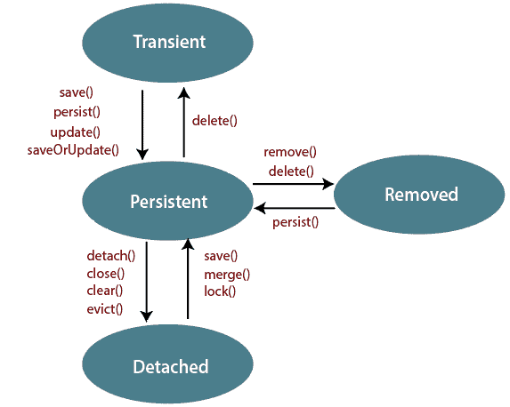

# 休眠生命周期

> 原文：<https://www.tutorialandexample.com/hibernate-lifecycle/>

**Hibernate 生命周期**

在 Hibernate 中，实体类的映射实例有一个生命周期。我们可以创建一个新对象，也可以从数据库中获取现有数据。值对象没有生命周期，只有实体对象有。Hibernate 希望它的对象处于特定的“状态”，对象主要有四种状态。

以下是对象生命周期的状态:

*   过渡状态
*   回归状态
*   分离状态
*   移除状态



### 过渡状态

如果一个对象使用 *new* 操作符初始化，并且不与任何 Hibernate 会话相关联，那么这个对象就被称为**瞬态**。因为它不与任何会话相关联，所以它在数据库表中没有任何表示。如果我们对 POJO 类的数据进行了更改，这不会影响数据库。

例如:

有一个 POJO 类叫做**Payment.java。**我们正在为付款类创建一个新对象。以下代码显示了付款对象的初始化:

```
Payment pay = new Payment();     //The object pay is in transient state
```

为了使对象持久，我们使用 Hibernate 会话。通过调用 **save()、persist()** 或**saveourupdate()**函数**，可以使瞬态对象持久化。**

### 回归状态

一个持久对象在数据库中有一个表示，一个标识符值，它还与一个 Hibernate 会话相关联。在这种状态下，Hibernate 将检测对对象所做的更改，并将其与数据库同步。如果我们更改了数据，也会影响数据库。它也存在于一个堆中。

我们可以通过调用 **session.save()** 、 **session.persist()、session.update()、session.saveOrUpdate()、session.lock()** 和 **session.merge()来创建一个持久对象。**

下面的代码显示了瞬态对象到持久对象的转换。

```
Payment pay = new Payment();     //The object pay is in transient state
Session s = sessionfactory.openSession();
pay.setId(01);
session.save(pay)                   //The object pay  is in persistent state. 
```

通过调用 **session.delete()** 函数，可以使持久对象成为瞬态对象。

### 分离状态

当一个持久对象的会话被关闭时，该对象将被称为一个**分离的**对象。由于分离的对象不再与会话相关联，因此对数据所做的更改不会影响数据库。需要时，可以将分离的对象重新附加到新会话。

我们可以通过调用 **session.close()、session.clear()、session.detach()** 和 **session.evict()来创建一个分离的对象。**

以下代码显示了分离对象的初始化:

```
Payment pay = new Payment();     //The object pay is in transient state
 Session s = sessionfactory.openSession();
 pay.setId(01);
 session.save(pay)                   //The object pay  is in persistent state.
 session.close(pay):               //The object pay is in detached state. 
```

+

### 移除状态

当一个对象从数据库中删除时，它被称为处于删除状态。在这种状态下，对象可能仍然存在，但是 Hibernate 会忽略它。对数据的任何更改都不会影响数据库。

我们可以通过调用 **session.delete()来创建一个移除的对象。**

以下代码显示了已删除对象的初始化:

```
Payment pay = new Payment();     //The object pay is in transient state
Session s = sessionfactory.openSession();
pay.setId(01);
session.save(pay)                   //The object pay  is in persistent state. 
session.delete(pay);             //The object pay is in removed state. 
```