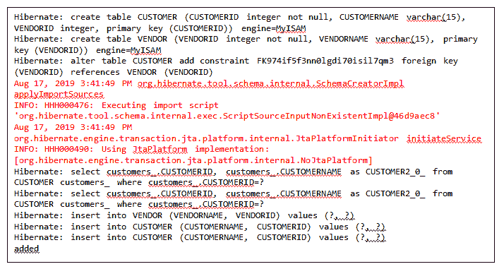
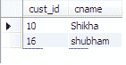
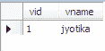
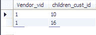

# 休眠反转

> 原文：<https://www.tutorialandexample.com/hibernate-inverse/>

**冬眠逆**

一个**逆**属性用于维护父类对象和子类对象之间的关系。**逆**属性仅用于双向映射，如**一对多**和**多对多**休眠映射。

在 Hibernate 中，关系仅由“关系所有者”维护关系所有者负责关系并处理所有任务。它还用于更新关系。因此，**逆**属性定义了哪一方是关系所有者。

反向属性在 POJO 类的 XML 映射文件中定义。

**句法逆**

一个**逆**属性的值可以是**真**或**假**:

1.  inverse = "true "
2.  inverse = "false "

1.  **inverse = "true"**

如果在 XML 映射文件中设置了 inverse= "true ",子类将成为关系所有者。这里，更新是由子类完成的。

**inverse = " true "**的语法

*   **inverse = "false"**

如果在 XML 映射文件中设置了 inverse= "false ",则父类将成为关系所有者。这里，更新是由父类完成的。如果映射文件中没有定义逆，则默认使用 inverse= "false"。

**inverse = " false "**的语法

**逆的例子**

让我们借助一个例子来理解逆的概念。在本例中，我们采用的是**一对多**关联映射。有两种 POJO 类，一种是**供应商、**，另一种是**客户。**一个供应商(父)可以有多个客户(子)；因此，我们在父类中添加了一个集合属性。

以下是创建反向示例的步骤:

1.  **创建所有 POJO 类**

 ****Vendor.java**

```
import java.util.Set;
 public class Vendor {
  private int vendid;
  private String name;
  private Set children;
  public int getVendid() {
  return vendid;
  } 
  public void setVendid(int vendid) {
  this.vendid = vendid;
  }
  public String getName() {
  return name; 
  }
  public void setName(String name) {
  this.name = name;
  }
  public Set getChildren() {
  return children; 
  }
  public void setChildren(Set children) {
  this.children = children;
  }
  public Vendor(){
  }
  public Vendor(int vendid, String name, Set children) { 
  super();
  this.vendid = vendid;
  this.name = name;
  this.children = children;
  }
  } 
```

**Customers.java**

```
public class Customers {
  private int cid;
  private String cname;
  public int getCid() {
  return cid;
  }
  public void setCid(int cid) { 
  this.cid = cid;
  }
  public String getCname() {
  return cname;
  }
  public void setCname(String cname) { 
  this.cname = cname;
  }
  public Customers(int cid, String cname) {
  super();
  this.cid = cid;
  this.cname = cname; 
  }
  public Customers() {
  }
  } 
```

*   **为所有 POJO 类创建映射文件**

 ****vendor.hbm.xml**

```

  <class name="com.app.Invers.Vendor" table="VENDOR">
  <id name="vendid" type="int"><column name="VENDORID" length="8"><generator class="assigned"></generator></column></id> 

  <set name="children" cascade="all" lazy="false" inverse="true"><key column="VENDORID"><one-to-many class="com.app.Invers.Customers"></one-to-many></key></set> 
  </class> 

```

**customers.hbm.xml**

```

  <class name="com.app.Invers.Customers" table="CUSTOMER"><id name="cid" type="int"><column name="CUSTOMERID" length="8"><generator class="assigned"></generator></column></id></class> 

```

*   **创建配置文件**

 ****hibernate.cfg.xml**

```

  <session-factory></session-factory>  
```

*   创建存储 POJO 类对象的主类。

 ****App.java**

```
import java.util.HashSet;
 import java.util.Set;
 import org.hibernate.Session;
 import org.hibernate.SessionFactory;
 import org.hibernate.cfg.Configuration;
 public class App 
 {
  public static void main( String[] args ) 
  {
  Configuration cfg= new Configuration();
  cfg.configure("hibernate.cfg.xml");
  SessionFactory fact= cfg.buildSessionFactory();
  Session session= fact.openSession();
  session.beginTransaction(); 
  Vendor vendor= new Vendor();
  vendor.setVendid(01);
  vendor.setName("jyotika");
  Customers customer= new Customers();
  customer.setCid(10);
  customer.setCname("Shikha"); 
  Customers c= new Customers();
  c.setCid(16);
  c.setCname("shubham");
  Set s= new HashSet();
  s.add(customer);
  s.add(c); 
  vendor.setChildren(s);
  session.save(vendor);
  session.getTransaction().commit();
  session.close();
  System.out.println("added");
  session.close();
  }
 } 
```

**输出**



**数据库表**

**客户**



**供应商**



**供应商 _ 客户**

********