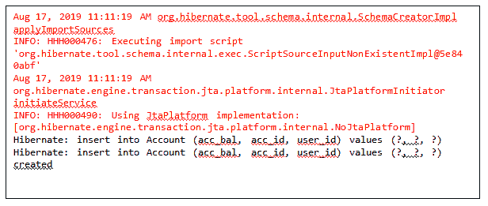
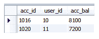

# Hibernate 复合主键

> 原文：<https://www.tutorialandexample.com/hibernate-composite-primary-key/>

**Hibernate 复合主键**

**复合主键**是构成主键的一列或多列的组合。当一个数据库表包含多个主键列时，它被称为**复合主键**或**复合键**。

组合键是数据库中的一组列，它们的值共同构成一个唯一的值。

我们可以用两种方法创建组合键:

*   使用 XML 文件
*   使用注释

**使用 XML 文件**

我们可以使用 XML 映射文件创建一个组合键。在那个映射文件中，我们使用一个 **<复合 id > … <复合 id/ >** 标签来声明一个组合键。POJO 类的所有主键对象都在组合键标记中定义。

**<复合标识>** 的语法

在 Hibernate 5(版本 5 及更高版本)中，使用注释的组合键比 XML 文件更受欢迎。因此，我们将使用注释创建一个组合键的例子。

### 使用注释

我们可以使用**@ embedded**注释创建一个组合键。它用在包含所有主键信息的 POJO 类中。

**@ embedded able-**它指定了一个类，其对象被存储为一个拥有实体的固有部分。此外，它还共享实体的身份。嵌入对象的每个字段都与数据库表映射。它可以在 **javax.persistence** 包中获得。

为了定义组合键，我们应该实现给定的规则:

1.  组合键类应该是 **public** 。
2.  组合键类必须实现**可序列化**接口。
3.  该类必须有一个**构造函数**。
4.  该类应该有 **equals()** 和 **hashCode()** 方法。

**@ embedded 的语法**

```
@Embeddable
 public class Ck_accId implements Serializable{
             private int user_id;
             private int acc_id;
    } 
```

**使用注释的组合键示例**

在这里，我们将创建一个组合键的例子。在这个例子中，我们取了两个类，**Account.java**和 **Ck_accId.java** 。Account.java 是一个纯 POJO 类，而 Ck_accId.java 是一个组合键类。

以下是创建组合键的步骤:

**Account.java**

```
import javax.persistence.Entity;
 import javax.persistence.Id;
 @Entity
 public class Account {
             Ck_accId ck_accid;
             private int acc_bal;
             @Id 
               public Ck_accId getCk_accid() {
                         return ck_accid;
             }
               public void setCk_accid(Ck_accId ck_accid) {
                         this.ck_accid = ck_accid;
             }
               public int getAcc_bal() { 
                         return acc_bal;
             }
               public void setAcc_bal(int acc_bal) {
                         this.acc_bal = acc_bal;
             }
     } 
```

**Account.java**包含一个 **Ck_accId** 类的对象。它还包含一个名为**的变量 acc_bal。**

**Ck_accId.java**

```
import java.io.Serializable;
 import javax.persistence.Embeddable;
 @Embeddable
 public class Ck_accId implements Serializable{
             private int user_id;
             private int acc_id;
             public Ck_accId(int user_id, int acc_id) {
                         super(); 
                         this.user_id = user_id;
                         this.acc_id = acc_id;
             }
             public int getUser_id() {
                         return user_id;
             }
             public void setUser_id(int user_id) { 
                         this.user_id = user_id;
             }
             public int getAcc_id() {
                         return acc_id;
             }
             public void setAcc_id(int acc_id) { 
                         this.acc_id = acc_id;
             }
             @Override
             public int hashCode() {
                         final int prime = 31;
                         int result = 1;
                         result = prime * result + acc_id; 
                         result = prime * result + user_id;
                         return result;
             }
             @Override
             public boolean equals(Object obj) {
                         if (this == obj)
                                     return true;
                         if (obj == null) 
                                     return false;
                         if (getClass() != obj.getClass())
                                     return false;
                         Ck_accId other = (Ck_accId) obj;
                         if (acc_id != other.acc_id)
                                     return false; 
                         if (user_id != other.user_id)
                                     return false;
                         return true;
             }
   } 
```

**Ck_accId.java** 是一个嵌入式类。它包含两个主要的关键变量，**用户标识，**和**用户标识。**

**hibernate.cfg.xml**

```

           "-//Hibernate/Hibernate Configuration DTD 5.3//EN"  
           "http://hibernate.sourceforge.net/hibernate-configuration-5.3.dtd">  
 <session-factory><property name="hibernate.hbm2ddl.auto">create</property>  
         <property name="hibernate.dialect">org.hibernate.dialect.MySQL5Dialect</property> 
         <property name="hibernate.connection.url">jdbc:mysql://localhost:3306/test2</property>
         <property name="hibernate.connection.driver_class">com.mysql.jdbc.Driver</property>
         <property name="connection.username">root</property>  
         <property name="connection.password">root</property>   
         <property name="show_sql"><mapping class="com.app.Composite_key.Account"></mapping></property></session-factory>    
```

**hibernate.cfg.xml** 包含数据库和映射类(com.app.Composite_key)的信息。账户)。

**App.java**

```
import org.hibernate.Session;
 import org.hibernate.SessionFactory;
 import org.hibernate.cfg.Configuration;
 public class App 
 {
     public static void main( String[] args )
     {
        Configuration cfg = new Configuration(); 
        cfg.configure("hibernate.cfg.xml");
        SessionFactory fact= cfg.buildSessionFactory();
        Session sess = fact.openSession();
        sess.beginTransaction();
        Ck_accId id1= new Ck_accId(10, 1016);
         Account acc= new Account();
         acc.setCk_accid(id1);
         acc.setAcc_bal(8100); 
        Ck_accId id2= new Ck_accId(11, 1020);
        Account acc2 = new Account();
        acc2.setCk_accid(id2);
        acc2.setAcc_bal(7200);
        sess.save(acc); 
        sess.save(acc2);
        sess.getTransaction().commit();
        System.out.println("created");
        sess.close();
     }
 } 
```

**App.java**是主类，包含了 **main()** 方法。

**输出**



**数据库表-账户**

