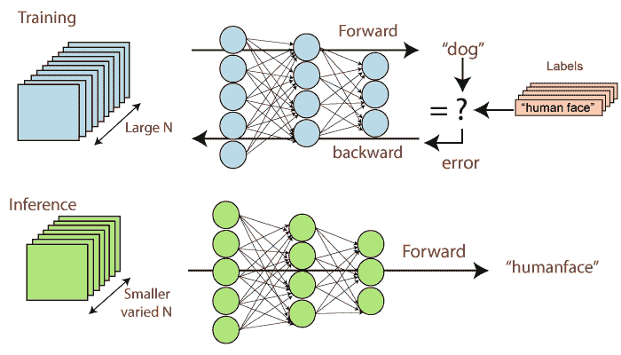
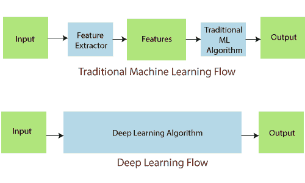
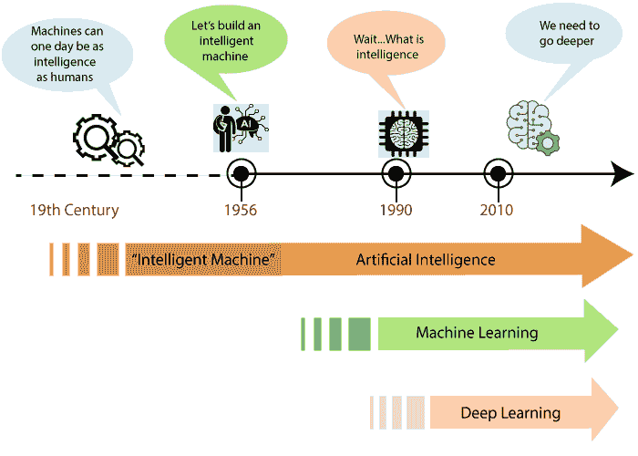
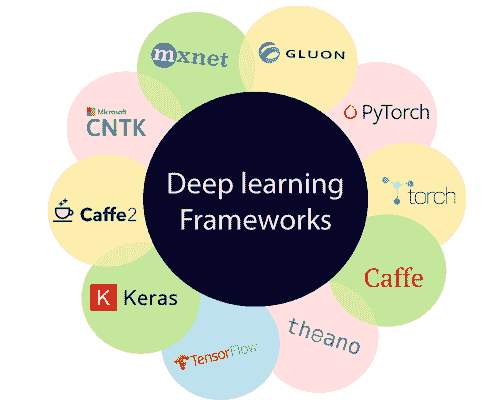
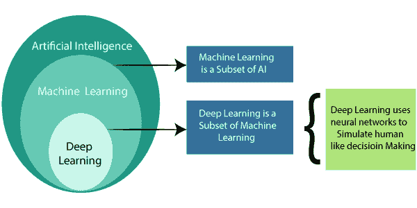
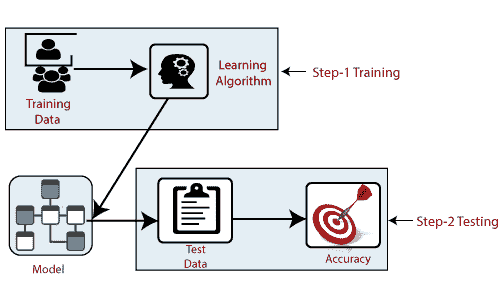
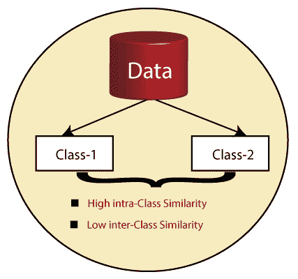

# 深度学习教程

> 原文：<https://www.tutorialandexample.com/deep-learning-tutorial>

**“深度学习是基于人工神经网络**的机器学习方法的一部分。”这是无人驾驶汽车背后的一项关键技术，使它们能够识别停车标志。深度学习正在实现以前不可能实现的结果。计算机模型在深度学习的帮助下，直接从图像、文本和声音中学习执行分类任务。

图:深度学习的示意图。

深度学习的模型可以达到最先进的精度，并超过人类水平的性能。这些深度学习的模型是通过使用最大的一组标记数据和包含许多层的神经网络架构来训练的。

深度学习中存在不同类型的算法。**这些算法通过神经网络算法的几个“层”运行数据。**深度学习需要大量的数据来学习。深度学习有各个领域，比如自动驾驶、航空航天，以及国防、医学研究、工业自动化、电子等。深度学习被称为深度神经学习或深度神经网络。

深度学习是机器学习的结构化或分层学习元素。这种学习可以是有监督的、无监督的或半监督的。深度学习是建立和训练神经网络的特殊方法。

特征提取也是深度学习的一个方面。它使用算法在数据的帮助下自动创建有意义的**“特征”**。模型的训练、学习和理解是特征提取的目的。数据科学家或程序员负责任何深度学习模型中的特征提取。

### 历史

**1943 年，** **【沃尔特·皮茨与沃伦·麦卡洛克】**在**神经网络的帮助下创造了基于计算机模型的**人脑**。他们在模型中使用了算法和数学的结合。根据开发者的说法，人工模型的思维过程被称为**“阈值逻辑”**。**

**图:深度学习的历史。**

**福岛 Kinihiko 使用的第一个“卷积神经网络”。**他设计了具有多个池和卷积层的神经网络。1979 年，他开发了一种被称为 Neocognitron 的人工神经网络。这些神经网络使用分级和多层设计。这种神经网络的设计允许计算机学习和识别视觉模式。

### 深度学习的框架

深度学习框架是允许用户构建深度学习模型的界面、库或工具。我们可以轻松快速地创建模型，而无需获得算法背后的细节或信息。它通过使用一组预先构建和优化的组件，为定义模型提供了一种清晰而简短的方式。最流行的深度学习框架有 Gmail、优步、Airbnb、Nvidia、TensorFlow 等

图:深度学习的框架。

我们可以借助合适的框架快速构建任何类型的模型，而不是写一百行代码。良好的深度学习框架有一些关键特征，如下所示:

1.  优化的性能。
2.  易于理解和无故障地编写代码。
3.  高质量的社区支持与深度学习框架一起工作。
4.  并行处理流程以减少计算量。
5.  自动计算梯度。

深度学习的框架通过高级编程接口为设计、训练和验证深度神经网络提供了构建块。深度学习中使用的框架有几种类型，如下所示:

### TensorFlow

TensorFlow 是一个开源软件集合，用于使用数据流图进行数值计算。它是由“谷歌大脑团队”的工程师和研究人员开发的【TheTensorFlow 之所以如此受欢迎，是因为它支持多种语言来创建深度学习模型。它有适当的文档，并逐步引导用户。

### PyTorch

PyTorch 是一个开源的机器学习库，用于多种应用，如计算机视觉和自然语言处理它是由**“Facebook 的人工智能研究小组”开发的**py torch 软件根据修改后的 BSD 许可证发布。它与 NumPy 的相似之处在于它可以管理计算，并具有强大的 GPU(图形处理单元)支持。

### Keras

Keras 是用 python 编写的深度学习框架和开源神经网络库。**2015 年 3 月 27 日**Keras 由 **Francois Chollet** 开发它是跨平台软件，支持多个后端神经网络计算引擎。Keras 专注于用户友好、模块化和可扩展，提供了一种干净便捷的方式来创建一系列深度学习模型。

### 咖啡

Caffe 是一个开源的深度学习框架。它是在**“加州大学伯克利分校”**开发的，用 C++编写，带有 python 接口。这个框架是按照表达、速度和模块化的思维模式构建的。它如此具有表现力的建筑；配置定义了模型和优化，但没有编码。速度使 Caffe 成为研究实验和工业部署的完美之选。

### 十四行诗

十四行诗是通过使用张量流实现神经网络的深度学习的框架。它是由世界著名的公司**【Deep Mind】**开发的，旨在创建具有复杂架构的神经网络。Sonnet 是一个高级面向对象的库，可以在开发神经网络或其他机器学习算法时带来抽象。它主要用于创建初级 python 对象，与神经网络的特定部分相关。这些对象分别链接到计算张量流图。

### MXNet

**MXNet** 是一个**开源**深度学习框架和高度可扩展的工具。用于训练和排列深度神经网络，由**“Apache 软件基金会”开发**mxnet 的库是可移植的**，**可扩展到多个 GPU 和不同的机器。它由公共云提供商支持，包括亚马逊网络服务和微软 Azure。

这是一个多语言机器学习库，用于简化机器学习算法的开发，特别是针对深度神经网络的设计。MXNet 是一个精简、灵活、高度可扩展的框架。它具有快速解决问题的能力和易于维护的代码。

### 胶子

Gluon 是一个开源的深度学习库，由亚马逊网络服务和微软开发。它用于在云技术中训练和部署机器学习模型。

胶子提供了**内置的**神经网络组件以及一个用户友好的编程接口。这使得深度学习项目对于那些不熟悉这项技术的程序员或开发人员来说更容易。

胶子可以减少训练过程的时间和复杂度，是神经网络模型与训练算法的紧密结合。它还支持编程循环和批处理，以便高效地执行任务。

葡萄糖可以用来创建简单和复杂的深度学习模型。它类似于 PyTorch，支持动态图形。

### 深度学习 4j

Eclipse Deeplearning4J 是一个深度学习编程库，是为 java 和 java 虚拟机编写的。它是由位于旧金山和东京的机器学习小组总部开发的，由 T2“亚当·吉布森”领导

DL4J 也是一个广泛支持深度学习算法的计算框架。在 deeplearning4J 中，神经网络的训练是通过迭代和聚类以并行方式进行的。是 java 深度学习框架的良好平台。

#### **优势**

深度学习不需要手动提取特征，它直接将图像作为输入。它需要高性能 GPU 和大量数据进行处理。特征去除和分类由深度学习算法执行，这个过程被称为卷积神经网络。

当数据量增加时，深度学习算法的性能会提高。深度学习有一些优势，如下所示:

1.  深度学习的架构是灵活的，可以被未来的新问题修改。
2.  对数据自然变化的鲁棒性是自动学习的。
3.  基于神经网络的方法应用于许多不同的应用程序和数据类型。

#### **缺点**

深度学习有以下几个缺点:

1.  我们在深度学习中需要非常大量的数据，才能比其他技术表现得更好。
2.  没有标准的理论来指导你选择正确的深度学习工具。这项技术需要拓扑知识、训练方法和其他参数。这样一来，由不太熟练的人来实现就不简单了。
3.  深度学习训练复杂的数据模型是极其昂贵的。
4.  它需要昂贵的 GPU 和数百台机器，这增加了用户的成本。

### **先决条件**

**1。人工智能**

人工智能是通过研究人脑如何思考，以及人类在试图解决问题时如何学习、决策和工作来完成的。这项研究的结果被用作开发智能软件和系统的基础。

简而言之，人工智能是机器复制智能人类行为的能力。

**人工智能的应用**

使用人工智能的应用有数百万种，但我们在此解释三种基本应用，如下所示:

1.  语音识别。
2.  理解自然语言。
3.  图像识别。

现在，我们应该学习如何实现人工智能，因此有各种各样的技术来实现人工智能，如下所示:

1.  机器学习
2.  深度学习

人工智能的概念并不是最新的。它在 1956 年首次被提出，但那时它只是一个理论概念。在 80 年代和 90 年代，我们开始谈论神经网络，但那时我们没有足够的计算能力，所以我们不能正确地利用它。

在 90 年代末和 21 世纪初，我们开始使用神经网络进行机器学习。2006 年，深度学习这个术语出现了。从 2010 年开始，它也被用于商业用途。

**2。机器学习**

机器学习只不过是一种人工智能。我们可以说它是人工智能的子集，它为计算机提供了无需显式编程就能学习的能力。

### 机器学习的类型

下面给出了几种类型的机器学习:

**A .监督学习**

在监督学习中，我们有一个输入变量(x)和一个输出变量(y)，我们可以使用一种算法来学习从输入到输出的映射函数。在监督学习中已经定义了数据集的分类。

因此，我们有数据集、训练数据以及测试数据。我们可以根据训练数据训练我们的机器，之后，我们应该创建一个模型。为了检查这个模型以获得准确性，我们有测试数据，这样我们将通过该测试数据并查看数据模型的准确性。我们可以说:

**准确度=实际输出-测试数据中存在的输出**

**B .无监督学习**

我们有无监督学习的数据，基于这些数据，我们试图创建我们的类。尽量确保我们创建的任何类都有很高的类内相似性。这个类具有较低的类间相似性，这意味着如果我创建了两个类，如类 1 和类 2。特定类别的元素应该具有高相似性，但是同时，它应该与类别 2 的元素具有低相似性。

无监督学习是使用既未分类也未标记的信息对模型进行训练。该模型用于根据输入数据的统计属性对其进行分类。

这种学习允许算法在没有指导的情况下对给定的信息或数据进行操作。在这里，机器或模型的任务是根据相似性、模式和差异对未分类的信息或数据进行分组，而无需任何事先的数据训练。

在无监督学习中不会提供任何教师，这意味着不会像有监督学习一样对机器或模型进行训练。无监督学习分为两类算法:

*   **聚类**

聚类是将相似的实体组合在一起的过程。这种无监督机器学习技术的目的是找到数据点中的相似性，并将相似的数据点分组在一起。

当我们处理多个变量时，聚类用于降低数据的维数。有许多算法被开发来实现这种技术。下面给出了两种主要算法:

1.  **K-均值聚类**
2.  **层次聚类**

*   **关联**

关联规则学习是基于规则的机器学习方法，用于发现大型数据库中变量之间的有趣关系。

**C .强化学习**

强化学习属于机器学习领域。它是三种基本的机器学习范式之一。它是关于顺序决策的，或者我们可以说输出依赖于当前输入的状态，下一个输入依赖于前一个输入的输出。

**3。机器学习的局限性**

机器学习有几种类型的限制，如下所示:

*   机器学习需要大量手工制作的结构化训练数据。
*   每一个狭义的应用都需要经过机器学习的专门训练。
*   学习通常必须被监督，训练数据必须被标记。
*   机器学习需要漫长的离线/批量训练。
*   在机器学习中，不要进行增量式或交互式的实时学习。

### 深度学习应用

深度学习被应用于数百个问题，从计算机视觉到自然语言处理。它在学术界被大量用于研究智能，在工业界被用于构建智能系统来帮助人类完成各种任务或工作。下面给出了深度学习的几个应用:

**1。虚拟助手**

虚拟助理或在线服务提供商在人类与他们互动时，使用深度学习来帮助理解我们的言语和语言。

**2。翻译**

同理，深度学习算法可以自动在语言之间进行翻译。对于旅行者、商人和政府官员来说，它可能是强大的。

**3。无人驾驶送货卡车、无人机和自动驾驶汽车的愿景**

自动驾驶汽车通过深度学习算法了解道路的现实情况以及如何对它们做出反应，无论是停车标志、街道上的球还是另一辆车。

**4。聊天机器人和服务机器人**

聊天机器人和服务机器人正在为许多公司提供客户服务，它们能够以智能和有益的方式做出响应。

**5。图像彩色化**

以前，将黑白图像转换成彩色图像是由人手完成的任务。如今，深度学习算法可以利用图像中的上下文和对象对其进行基本的着色，并重新创建彩色的黑白图像。通过使用深度学习算法，结果或输出令人印象深刻且准确。

**6。面部识别**

深度学习还用于人脸识别，不仅用于安全目的，还用于标记脸书帖子上的人。这是一个通过人脸识别和验证照片中的人的问题。人脸识别是由检测、对齐和特征提取组成的过程。

**结论**

深度学习是机器学习的子集，其中人工神经网络，受人脑启发的算法，从大量数据中学习。当机器可以完成通常需要人类智能的任务时，人工智能领域是必不可少的。深度学习算法会重复执行一项任务或工作。我们之所以称之为深度学习，是因为神经网络有几个支持学习的层。