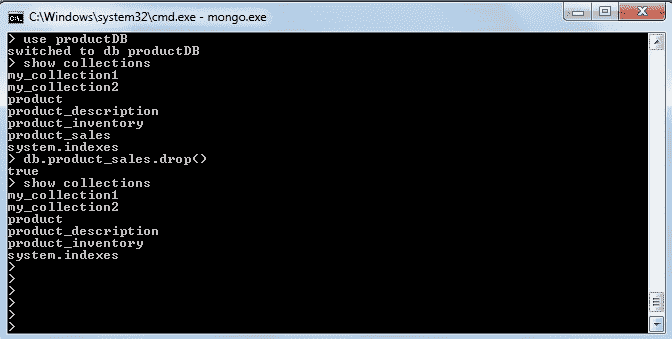

# MongoDB Drop 集合

> 原文：<https://www.tutorialandexample.com/mongodb-drop-collection/>

**MongoDB–Drop Collection**

如果您想要删除一个集合，那么首先您必须选择特定集合所在的数据库。然后，将使用以下命令删除集合:

**语法:**

```
db.collection.drop()
```

一旦一个集合被删除，与之相关的所有索引和文档也会随之删除。但是，如果您只想删除文档，而不想删除相关的集合和索引，那么使用 **remove()** 函数。

注意:方法 **db.collection.drop()** 不接受任何参数，如果用参数调用，那么它会产生一个错误。

### 示例:MongoDB: db.collection.drop()方法

1.连接到可以找到您的收藏的数据库。

```
>use productDB
 switched to productDB 
```

2.检查数据库中已经存在的集合。

```
>Show collections
 product
 product_description
 product_inventory
 product_sales
 system.indexes 
```

3.现在，您可以通过指定名称来删除任何特定的集合

```
>db.product_sales.drop()
 true
 >  
```

4.您可以通过以下命令检查数据库中的集合:

```
show collections
```

您将找不到丢弃的收藏。drop()方法仅在成功删除选定集合时返回 true，否则返回 false。

