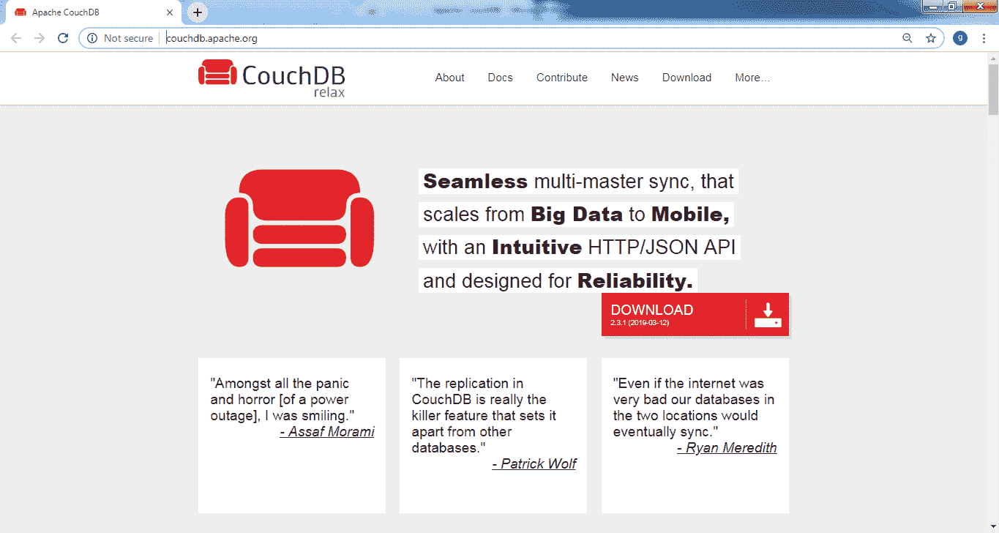

# Apache CouchDB 教程

> 原文：<https://www.tutorialandexample.com/apache-couchdb-tutorial>

### 什么是 CouchDB？

Apache CouchDB 是一个开源数据库软件，由 Apache 软件基金会开发，于 2005 年在 Apache 2.0 版许可下首次发布。CouchDB 最初是用 C++编写的，但是在 2008 年这个项目转移到了 Erlang，这是一种函数式编程语言。

CouchDB 是一个关注易用性的 NoSQL 数据库。它使用 JSON(基于 JavaScript 的对象表示法)文档来存储数据，并通过 MapReduce 使用 JavaScript 作为查询语言。

CouchDB 使用 HTTP 协议 API，这有助于轻松地与数据库通信，比如读取和更新数据库文档。

### SQL 和 CouchDB 的区别:

以下是 SQL 和 CouchDB 之间的一些重要差异:


| **SQL(RDBMS)** | **CouchDB** |
| 它是一个关系数据库模型。 | 它是非关系数据库模型。 |
| 它以表格的形式存储数据。 | 它以 JSON 文档文件的形式存储数据，即键值对。 |
| SQL 查询引擎。 | 映射/减少功能。 |
| 它支持连接，因为有一个外键和主键。 | CouchDB 不支持联接。它由一个概念‘视图’来加入文档。 |


### Apache CouchDB 的特性

*   CouchDB 数据库中的所有数据都存储在文档中，并且每个文档在数据库中都有唯一的名称。每个文档由任意数量的“键”和它们相应的“值”组成，这些值被称为字段，并且还包括元数据。在文档中，每个字段必须有一个唯一的名称，即没有两个字段具有相同的名称。文档字段包含不同类型的数据，如文本字符串、数字、布尔值(真或假)。文档中的文本或数字没有大小限制。
*   ACID 属性:CouchDB 文件遵循 ACID(即原子性、一致性、隔离性、持久性)属性。更新后的文档将遵循原子性，即更新要么完全保存，要么根本不保存。输入到 CouchDB 中的数据是一致的，也就是说，一旦 CouchDB 中的数据保存到数据库中，该文档就不会被覆盖和修改。

*   Apache CouchDB 复制到可以离线的设备(如 android 设备),并在设备恢复在线时为您备份数据。
*   基于 JSON 结构的 CouchDB 文档格式。

### 在 Windows 中安装 CouchDB:


1.  要下载 CouchDB 的安装文件，可以去官方网站:http://couchdb.apache.org/.



2.  现在，点击下载选项，然后它会引导到提供各种下载链接的页面。


3.  现在，点击窗口选项。2-3 分钟后，CouchDB 将以安装文件的形式下载到您的系统中。


现在，运行安装文件 **apache-Couchdb-2.3.1。**

4.  点击运行按钮后，继续安装。建议使用默认设置，单击“下一步”按钮。


5.  点击下一步按钮。


6.  在下图中选择 CouchDB 文件夹的目录。然后点击下一步按钮。


7.  最后点击安装按钮。之后，将会出现一个确认对话框，单击“是”按钮。您的安装将在几秒钟内完成。


8.  完成安装后，打开浏览器并键入以下 URL: http://127.0.0.1:5984/并打开链接。如果一切顺利，结果输出将会出现:

```
{"couchdb":"Welcome","version":"2.3.1","git_sha":"c298091a4","uuid":"2c468501cc403507843c0e8e1bf68f21",
"features":["pluggable-storage-engines","scheduler"],
"vendor":{"name":"The Apache Software Foundation"}}
```

9.  现在，通过键入这个 URL:http://127 . 0 . 0 . 1:5984/_ utils/，可以与 CouchDB web 接口进行交互，该接口显示了 Futon 的索引页面，如图所示:


10.  进入下图所示的验证选项卡，验证 CouchDB 的安装。现在点击验证安装。


11.  如果您的 CouchDB 安装成功，将会出现如下所示的窗口:


**与 CouchDB 通信有两种方式:**

1.  CouchDB 卷曲
2.  CouchDB 蒲团

**1。CouchDB Curl:**

CouchDB Curl 实用程序是一种与 CouchDB 及其数据库进行通信或交互的方式。

它是一个命令行工具，可以在 mac os x、windows 和 Linux 等操作系统上使用。Curl 提供了从命令行直接访问 HTTP 协议的便利。

*   在使用 curl 与 CouchDB 交互时，使用了 curl 实用程序的以下选项:

1.  ［加在以-u 结尾的法语词源的名词之后构成复数］
2.  - H
3.  -d
4.  表示“具有…性质的”

**安装卷曲:**

1.  如果您的系统中没有 Curl，那么首先从 https://curl.haxx.se/download.html.网站下载 Zip 文件
2.  打开给定的链接，然后转到网页的末尾，通过单击标记的蓝色文件下载文件。


3.  然后打开 Zip 文件下载的文件夹。然后通过右键单击来提取文件。
4.  **验证安装:**之后，打开命令提示符并键入以下命令:

```
C:\Users\user>cd Downloads
C:\Users\user\Downloads>cd curl-7.64.1                      
C:\Users\user\Downloads\curl-7.64.1>cd src
C:\Users\user\Downloads\curl-7.64.1\src>curl --version
```

5.  如果您看到如下图所示的 Curl 版本，那么 Curl 已经成功安装在您的系统中。


**使用 Curl，获取数据库信息:**

```
C:\Users\user\Downloads\curl-7.64.1\src>curl http://127.0.0.1:5984/
```

该命令将显示以下输出:


**所有数据库列表:**

```
            C:\Users\user\Downloads\curl-7.64.1\src>curl -X GET    http://127.0.0.1:5984/_all_dbs
```

上面的命令显示了所有数据库的列表。


2.  **CouchDB 蒲团:**

CouchDB Futon 是与 CouchDB 数据库交互的第二种方式。它为 CouchDB 提供了一个图形界面，提供了对所有 CouchDB 特性的完全访问，并使其易于工作。

通过使用蒲团，我们可以实现以下功能:

*   创建数据库
*   销毁数据库
*   创建文档
*   更新文档
*   编辑文档
*   删除文档

**出发蒲团:**

确保 CouchDB 正在您的系统中运行，然后打开浏览器并键入以下 URL:http://127 . 0 . 0 . 1:5984/_ utils/。

如果您打开 URL，它会显示如下所示的蒲团主页:


### 创建数据库:

通过使用 PUT 方法向服务器发送 HTTP 请求，可以使用 Curl 实用程序创建数据库:

```
curl -X PUT http://127.0.0.1:5984/school
```


现在，使用下面的命令来检查是否在 CouchDB 中成功创建了“school”数据库:

```
curl -X GET http://127.0.0.1:5984/_all_dbs
```

