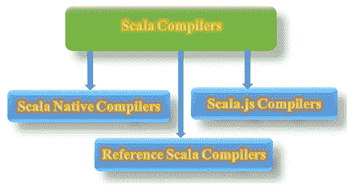
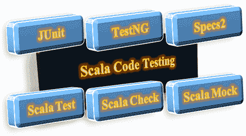
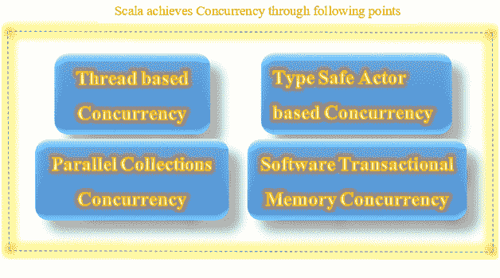
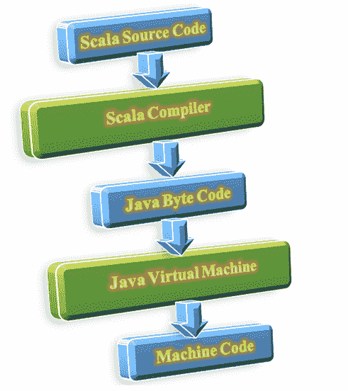
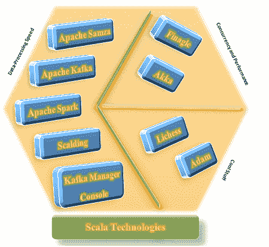

# Scala 初学者教程

> 原文：<https://www.tutorialandexample.com/scala-tutorial>

### Scala 简介

Scala programming language designed to express common programming patterns in an elegant, concise and type-safe way. Scala is a hybrid programming language. Scala has many features like currying, type-inference, lazy evaluation, immutability, pattern matching.

### 什么是 Scala？

*   Scala 是“可伸缩语言”的首字母缩写。
*   Scala 是一种通用编程语言。
*   Scala 是一种现代多范式并发、命令式、函数式和面向对象的编程语言。
*   此外，Scala 有一个高级类型系统，支持代数高阶类型协方差和逆方差以及匿名类型。
*   有一些特性，Scala 有，Java 没有:操作符重载、命名参数、可选参数和原始字符串。
*   同样，特性 Checked Exceptions 在 Java 中存在，但在 Scala 中不存在。
*   Scala 的文件扩展名是。scala，' ' . sc '

### Scala 语言的历史

[Scala software](https://docs.scala-lang.org/learn.html) was released under Apache License. Martin Odersky started designing Scala in 2001\. He combined the features of functional programming language and Petri nets to build the idea in the development of Scala whereas Petri nets are known as PT net or Place/Transition net. Petri nets are mathematical modeling language. Petri nets are used for the description of Distributed Systems.

*   Scala 于 2004 年 1 月在 Java 平台上公开发布。
*   Scala 的第二个版本发布于 2006 年。
*   Scala 的最新稳定版本是 2018 年 12 月发布的‘Scala 2 . 12 . 8’。

### Scala 编译器

**The Scala.js Compiler:** The Scala.js is the Scala Compiler. The Scala.js compiler is used to compile the JavaScript. Hence, the Scala.js compiler makes it possible to write programs in Scala and run them in web browsers. **The Scala Native Compiler: **The Scala Native is a Scala Compiler. The Scala Native compiler targets the LLVM compiler infrastructure to produce executable code. The development of Scala native project starts in 2015, with the goal ‘to be faster than just-in-time compilation’ for the Java Virtual Machine. This project eliminates the initial runtime and provides the ability ‘to call the native routines directly.’ The Scala native project released first time in 14th March 2017. **The Reference Scala Compiler:** The reference Scala compiler is used for [.NET framework](https://dotnet.microsoft.com/download/dotnet-framework). The Reference Scala Compiler released in June 2004, but this reference compiler was dropped officially in 2012.

### 测试 Scala 代码

Testing of the Scala Code/ Scala Programs can be possible in several ways such as Junit, TestNG, Specs2, ScalaTest, ScalaCheck, and ScalaMock. Let us see them one by one.  **Junit and TestNG:** Junit and TestNGis the most popular testing framework and both are written in Java. **Specs2:** Specs2 is a library. This library is used to write executable software specification. **ScalaTest:** It supports multiple testing styles. ScalaTest can integrate with java based testing frameworks. **ScalaCheck:** ScalaCheck is a library for testing. ScalaCheck is similar to Haskell's QuickCheck. QuickCheck is a library designed to assist in software testing. QuickCheck generates test cases for test suites.

### Scala 中的并发性

Scala supports two important strategies for concurrency: Thread-based concurrency and type-safe Actor-based concurrency. Thread-based concurrency derived from Java and Type-safe Actor-based Concurrency inspired by Erlang. Software Transactional Memory and Parallel Collections are two significant additions to the Scala's Concurrency. Parallel Collections allow for parallelizing necessary collection transformers across multiple threads like a map, for each. 

### Scala 的特性

Following is the list of features of Scala programming language:

1.  类型推理
2.  不变
3.  懒惰评估
4.  简明的
5.  高层
6.  静态类型化
7.  可扩张的
8.  面向对象
9.  功能的
10.  Scala 运行在 JVM 上
11.  Scala 可以执行 Java 代码

Let us see all the Scala features in details:

1.  **类型推断**

Scala programming language detects the type of expressions automatically. In Scala programming language, no need to declare the type. That will reduce the complexity of the programming language, for example, the difficulty occurs in case of typecasting.

2.  **不变性**

In Scala programming language, each variable is immutable by default. Scala achieves the concurrency with the help of immutable data, and Immutability plays a vital role to manage the concurrency control.

3.  **懒不严谨的评价**

Scala performs a lazy evaluation. As the name says '**Lazy Evaluation'**, it is clear that 'it delays the evaluation of an expression.' Lazy Evaluation also is known as '**Call-by-needis' or ‘Non-Strict Evaluation**.' Lazy evaluation is an evaluation strategy, which delays the evaluation/ computation/ calculation of expression until the result/ value needed. Lazy evaluation avoids repetitive calculations.

4.  **简洁**

Scala programming language is concise. The meaning of concise is to give abundant information clearly in minimum words. Scala programming language uses the less number of lines of code in comparison with Java programming language for building the same logic.

5.  **高层**

Scala is a high-level programming language. The high-level programming language has strong abstraction from the inner details of the computer. A high-level language is friendlier with the user than low-level language.

6.  Scala 是可扩展的

Scala allows adding new language in the form of libraries. Result to this, and Scala can add extensions to domain-specific languages as extensions to develop the Domain Specific Projects.

7.  **静态类型化**

Statically typed language is a language in which type checking is done at compile time. Scala is a statically typed language. 'Type-Checking' is a process ‘to verify’ and ‘to enforce’ the constraints or rules of 'Types.' C, Pascal, and Rust are examples of statically typed language. Unlike those languages, Scala does not expect ‘to provide the redundant type information.'

8.  **面向对象**

Scala programming language is an object-oriented language. Everything present in the Scala is in the form of the object. Classes and traits describe objects type and behavior. Scala provides a concurrent ready environment to object-oriented on a Java Virtual Machine JVM platform.

9.  **功能性**

Scala programming language is a functional language. It provides multiple features of functional programming like literal function, singleton objects, nested functions, curried functions, and higher-order functions.

*   **函数文字:** Scala 支持函数文字。函数文字是定义匿名函数的轻量级语法。匿名的含义不明。匿名函数没有名字，即没有名字的函数。
*   **单例对象:** Scala 支持单例对象。单例对象提供了一种对类的非成员函数进行分组的方法。
*   **嵌套函数:** Scala 编程语言允许嵌套函数。
*   **Curried 函数:** Scala 编程支持 Curried 函数。curried 函数是一个接受多个参数的函数，一次一个。让我们用一个例子来理解。假设函数有三个参数。该函数的简化版本接受单个参数并返回一个函数，该函数接受第二个参数，第二个函数接受第三个参数，如级联并返回最终结果。
*   **高阶函数:** Scala 编程语言支持高阶函数。高阶函数是这样一种函数，其中任一函数将一个函数作为输入，或者函数已经作为返回类型。

*Function Return Type: Function* *Function Parameter: Function*

10.  Scala 运行在 JVM 上

When Scala compiler compiles the scala source code, then Scala source code is converted into ‘java byte code.' Generated java byte code executes on Java virtual machine, i.e. JVM.  **11\. Scala can execute Java code** Scala runs Java code. Scala programming language allows using java classes from the Java software development kit SDK. Scala allows for creating custom Java classes.

### Scala 内置的技术

Following is the list of technologies built in Scala programming language.

1.  阿帕奇火花
2.  滚烫的
3.  阿帕奇卡夫卡
4.  Apache Samza
5.  Kafka 管理器控制台
6.  欺骗
7.  阿卡
8.  圣经》和《古兰经》传统中）亚当（人类第一人的名字
9.  利切斯

Technologies built in Scala categorized based on "data processing speed", "Concurrency", 'Performance' and other cool stuff. As the first category 'data processing speed' **Apache Spark, Apache Kafka, Scalding and Apache Samza** are examples of technology, which can process event stream in real-time. **Finagle, and Akka** is the example of technologies having high concurrency and high performance. **Adam and Lichess** come under the category of cool stuff. Following diagram clears how the technologies categorized into groups based on their features.  **Apache Spark** Hadoop community realized the need for the replacement of MapReduce from last few years. Apache Spark is the replacement for the MapReduce. This replacement was done in late 2013\. Apache spark becomes the fastest and ‘General Purpose Engine' for largescale data processing. Apache Spark developed at UC Berkeley. **Scalding** Twitter built Scalding using Scala programming language. Functional programming is ideal for Big Data. Scalding provides the functional operations and provides all benefits of Scala syntax. **Apache Kafka** Apache Kafka is a publish-subscribe messaging system. Apache Kafka has written in Scala programming language and highlights the power of Scala programming language. LinkedIn built the ‘Apache Kafka,' and it is the center of LinkedIn infrastructure. Apache Kafka handles hundreds of megabytes of read-write traffic per second from thousands of clients. **Kafka Manager Console** Kafka manager console is built by Yahoo. Kafka manager console is an open source console. Most of Yahoo teams and media analytics team uses Kafka manager console. **Apache Samza** Apache Samza has written in Scala programming language. Apache Samza is a distributed framework, and it is a stream processing framework. Apache Samza uses 'Kafka' for messaging purpose. Besides, Apache Samza uses "Apache Hadoop Yarn" for multiple tasks such as fault tolerance, security, resource management, and processor isolation. **Akka** Akka is a high concurrency tool. Akka is written in Scala programming language. Akka is a very fast and concurrent framework and this framework used for building the distributed applications. Akka handles all low-level IO operations. **Finagle** Finagle is one of the best use cases of Scala programming language. Finagle used for constructing high scalability services through concurrency and optimal use of system resources. Finagle is an extensible Remote procedure call RPC system for the Java virtual system JVM. This Finagle RPC system used to construct high concurrency servers. Finagle implements uniform server APIs and client APIs for several protocols.