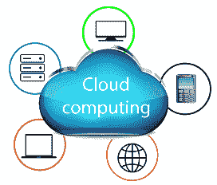

# 云计算教程

> 原文：<https://www.tutorialandexample.com/cloud-computing-tutorial/>

我们的教程为您详细提供了云计算的基本和高级概念。

我们的云计算教程主要是为初学者和专业人士设计的

### 什么是云计算？

云计算是一个通用术语，用来描述发生在互联网上的一种新的基于网络的计算。**举例: [AWS](https://www.tutorialandexample.com/aws-interview-questions) ， [Azure](https://www.tutorialandexample.com/microsoft-azure-tutorial) ，Google cloud。**

> *云计算是计算机系统资源，特别是数据存储和计算能力的按需设施，无需用户的任何直接主动管理。*

换句话说，云计算被定义为通过互联网按需提供计算机能力、数据库存储、应用程序和其他 [IT](https://tutorialandexample.com/top-10-it-companies-in-india) 资源。 ***它以低廉的价格为 It 基础设施提供解决方案。***

### 为什么选择云计算？

为了提供小型且广泛的 IT 基础设施，IT 公司遵循传统的方法。这意味着对于任何类型的 IT 公司，我们都需要一个服务器机房，这是任何 IT 公司的基本需求。

在那个服务器机房里，我们需要这么多东西，比如邮件服务器、数据库服务器、网络、[防火墙、](https://www.tutorialandexample.com/firewall)、[路由器、](https://www.tutorialandexample.com/what-is-a-router)、[交换机、](https://www.tutorialandexample.com/switching)、调制解调器、QPS(每秒查询)、配置系统、高需求速度以及维护工程师。

为了建立这种类型的 IT 基础设施，我们需要大量的资金和资源。因此，为了克服所有这些问题并降低 IT 基础设施成本，云计算的概念应运而生。

### 为什么取名云？

术语“**云”**背后的原因来自网络工程师用来表达或表示不同网络设备的位置及其相互连接的网络设计。这种网络设计的结构类似于云。

### 云计算的特点

云计算的特点是:

1.  **按需自助服务:-** 云计算允许用户按需使用网络服务和资源。任何人都可以在任何时候登录网站并使用它。
2.  **广网接入:**-云计算是基于 web 的，随时随地都可以接入。
3.  **资源池:-** 在云计算中，资源池意味着允许多个客户共享一个资源池。
4.  **快速弹性:**-在云计算中，资源的扩展非常容易，无论是横向还是纵向。资源的规模意味着资源处理增加或减少的需求的能力。
5.  **多共享:-** 在云计算中，多用户和应用程序可以通过共享一个公共基础设施，以更低的成本、更好的方式工作。
6.  **维护:**-由于不需要在每个用户的电脑上安装，云计算应用的维护很简单，可以从各个地方访问。

### 云计算的架构

**云计算的架构大致分为两部分。**

1.  前端
2.  后端

两端通过网络连接，通常是互联网连接。下图展示了云计算架构的可视化视图:

让我们详细讨论云计算架构的两个部分。

1.  **前端:-** 前端是对客户端或用户可见的视图。它是云计算系统的客户端部分。前端包含用于访问云系统的用户界面、应用程序和网络。 ***例如:一个网页浏览器。***
2.  ****后端:**-后端就是云本身。它包含提供云计算服务所需的所有资源。这一端由庞大的数据存储、虚拟机、安全机制、服务、开发模型等组成。**

 ****.

### 云计算教程

*   [云计算简介](https://www.tutorialandexample.com/cloud-computing-tutorial/)
*   [云计算的历史](https://www.tutorialandexample.com/history-of-cloud-computing/)
*   [云计算的优缺点](https://www.tutorialandexample.com/advantages-and-disadvantages-of-cloud-computing/)
*   [云计算应用](https://www.tutorialandexample.com/cloud-computing-application/)
*   [云计算基础设施](https://www.tutorialandexample.com/cloud-computing-infrastructure/)
*   [云计算技术](https://www.tutorialandexample.com/cloud-computing-technologies/)
*   [云的种类](https://www.tutorialandexample.com/types-of-cloud/)

### 云服务模式

*   [云服务模式](https://www.tutorialandexample.com/cloud-service-models/)
*   [软件即服务](https://www.tutorialandexample.com/software-as-a-service-saas-model/)
*   [基础设施即服务](https://www.tutorialandexample.com/infrastructure-as-service/)
*   [平台即服务](https://www.tutorialandexample.com/platform-as-a-service/)
*   [身份即服务](https://www.tutorialandexample.com/identity-as-a-service/)
*   [网络即服务](https://www.tutorialandexample.com/network-as-a-service/)

### 虚拟化

*   [什么是虚拟化](https://www.tutorialandexample.com/what-is-virtualization/)
*   [硬件和软件虚拟化](https://www.tutorialandexample.com/hardware-and-software-virtualization/)
*   [服务器虚拟化](https://www.tutorialandexample.com/server-virtualization/)
*   [存储虚拟化](https://www.tutorialandexample.com/storage-virtualization/)
*   [操作系统虚拟化](https://www.tutorialandexample.com/operating-system-virtualization/)

### 云计算高级概念

*   [云计算管理及其运营](https://www.tutorialandexample.com/cloud-computing-management/)
*   [云计算提供商](https://www.tutorialandexample.com/cloud-computing-providers/)
*   [云计算安全](https://www.tutorialandexample.com/cloud-computing-security/)
*   [云计算存储](https://www.tutorialandexample.com/cloud-computing-storage/)
*   [云计算战略](https://www.tutorialandexample.com/cloud-computing-strategy/)
*   [移动云计算](https://www.tutorialandexample.com/mobile-cloud-computing/)
*   [云立方模型](https://www.tutorialandexample.com/cloud-cube-model/)
*   [大数据 Vs 云计算](https://www.tutorialandexample.com/big-data-vs-cloud-computing/)
*   [网格计算 Vs 云计算](https://www.tutorialandexample.com/grid-computing-vs-cloud-computing/)
*   [云计算的未来](https://www.tutorialandexample.com/future-of-cloud-computing/)
*   [商业云计算](https://www.tutorialandexample.com/cloud-computing-for-business/)****