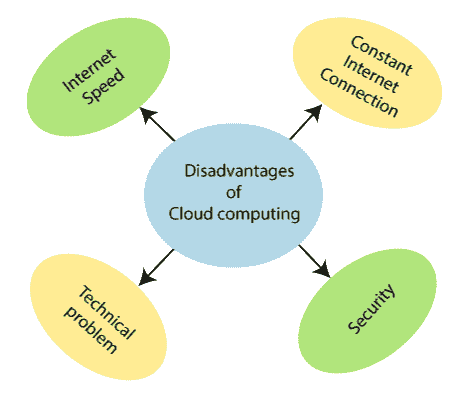

# 云计算的优势和劣势

> 原文：<https://www.tutorialandexample.com/advantages-and-disadvantages-of-cloud-computing/>

### 云计算的优势

1.  **低成本** **: -** 云计算最显著的优势就是低成本。在云计算中运行云技术，不需要高功率的计算机和技术，因为应用程序将在云上运行，而不是在用户的 PC 上。
2.  ****存储容量:-****云提供了海量的存储容量。云存储的大小是无限的，一般来说，它提供 2000-3000 GBs 或更大的存储容量，这取决于需求。****
3.  ********提高计算能力:-** 云计算的另一个优势是它在运行和处理任务以及处理应用程序方面提供了非常高的能力。******
4.  ********降低软件成本:** -云降低了软件成本，因为不需要为组织中的每台计算机购买软件。******
5.  ********更新:-** 更新是云计算的另一个优势。在云计算中，软件的即时更新是可能的，用户在绝对升级和高度升级软件之间的选择不会有问题。******
6.  ********云支持按使用付费模式:** -云的主要优势之一是按使用付费，允许用户只为他们使用的资源和工作负载付费。******
7.  ********提高可访问性:** -您可以随时随地访问，让您的生活更加轻松。******
8.  ********简化流程:-** 用更少的人、更少的时间完成更多的工作。******

 ******

### 云计算的缺点

1.  **互联网速度:-** 云技术需要高速互联网连接，因为基于网络的应用程序通常需要很大的带宽。
2.  ****持续的互联网连接:-** 没有互联网，云基础设施的使用是不可能的。访问云存储上的任何应用程序都需要持续的互联网连接。**
3.  ******安全性:** -云最显著的缺点就是安全性。云上的数据不安全。因为未经授权的用户可以访问用户的数据，所以可能会有数据丢失的机会。****
4.  ********技术问题:-** 除了使用云计算之外，当出现问题时，您无法自己管理它，您可能需要联系客户支持，而他们并不准备好全天候服务。这是一个大问题，因为对于这种类型的支持，你也必须支付一些钱。******

 ******************