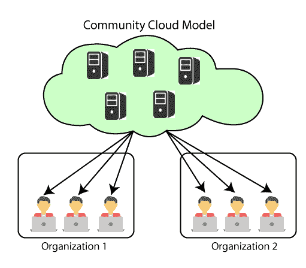

# 云的类型

> 原文：<https://www.tutorialandexample.com/types-of-cloud/>

*   公共
*   私人的
*   杂交鸟
*   社区

1.  **公共云:-** 公共云允许公众高效地访问系统和服务。公共云是通过互联网异地提供服务和基础设施的云。 ***例子:亚马逊、IBM、微软、谷歌、Rackspace 等。***

### 公共云的优势

*   **低成本:-** 与私有云相比，公共云的成本较低，因为公共云与大量消费者共享相同的资源。
*   ****可靠:-** 公共云的最大优势在于，它提供来自不同位置的大量资源。如果任何资源停止工作，公共云可以雇佣另一个资源。**
*   ******灵活:-****公有云可以轻松集成或与私有云结合；这就是它如此灵活的原因。******
*   ********位置无关:-** 公有云保证了位置的独立性，因为公有云服务是通过互联网交付的。******
*   ********高可扩展性:-** 云上的资源是根据资源池中的需求提供的，这意味着资源可以根据用户的需求扩大或缩小。******

 ******### 公共云的缺点

*   **安全性低:-** 安全性是公有云的主要缺点。在公共云中，数据呈现在异地，资源公开共享。因此，通过这种方式，公共云无法保证高水平的安全性。
*   ****更少的定制:-** 在公共云中无法定制服务。**
*   ******性能:-** 网络的性能主要取决于网速。****
*   ********缺乏适当的控制:-** 在公共云中，没有对数据和基础架构的控制。******

 ********2)** **私有云:-“*私有云是在私有网络*** 上维护服务和基础设施的云它允许访问组织内的系统和服务。私有云仅在特定组织内专门运营。它由第三方管理。

### 私有云的优势

*   **高安全性和保密性:-** 私有云的主要优势是安全性。私有云中的数据是安全的，因为在私有云中，资源是从不同的资源池中共享的。
*   ****更多控制:-** 私有云比公共云对其资源拥有更多控制，因为它只能在组织的边界内访问。**
*   ******定制:-** 定制是私有云的另一个优势。私有云的一个重要特征是它们提供的定制级别。****

 ******### 私有云的缺点

*   **限制:-** 本地可以访问私有云。全球扩张非常困难。
*   ****成本多:-** 私有云的成本比公共代码多。**
*   ******可扩展性较差:-** 私有云的可扩展性较差。它只能在内部托管资源的有限容量内扩展。****

 ********3)** **混合云:-** 混合云定义为“ ***公有云和私有云的混合。”*** 混合云是一种组合云服务，利用私有云和公共云在同一组织内执行不同类型的功能。

### 混合云的优势

*   **可扩展:-** 混合云是可扩展的，因为它同时提供了公共云和私有云的可扩展性
*   ****灵活安全:** -混合云因私有云而提供安全资源，因公有云而提供可扩展资源。**
*   ******经济实惠:-** 与私有云相比，混合云的成本更低。****

 ******### 混合云的缺点

*   **网络问题:-** 由于私有云和公共云的存在，混合云中的网络变得非常复杂。
*   基础设施依赖性
*   通过公共云违反安全的可能性。

**4)** **社区云:-** 在社区云中，系统和服务被允许由一组组织访问。云计算在特定社区的不同组织之间共享基础设施。云计算由组织或第三方在内部管理。

### 社区云的优势

*   **经济高效:-** 社区云以低成本提供与私有云相同的优势。
*   **组织间共享:**-社区云提供了一个基础设施，用于在多个组织间共享云资源和能力。
*   **安全性:**-社区云比公有云更安全。

### 社区云的缺点

*   不是每个组织的正确选择。
*   **缓慢的收养日期。********************************