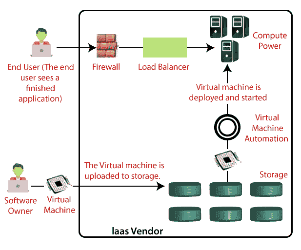

# 基础设施即服务

> 原文：<https://www.tutorialandexample.com/infrastructure-as-service/>

### 基础设施即服务(IaaS)

基础架构即服务(IaaS)提供物理机、虚拟机、虚拟存储等基本资源的设施。

基础设施即服务(IaaS)是云计算的一种形式，它提供虚拟化的计算资源。

例子:*亚马逊网络服务*

它还提供其他资源，例如:

*   虚拟机磁盘存储
*   虚拟局域网
*   负载平衡
*   IP 地址
*   软件包

它完全是关于虚拟服务器、扩展网络和远程存储的。为此，不再需要大量的硬件投资、维护或基础设施。

### IaaS 的优势

1.  我们可以根据您的需求动态选择 CPU、内存和存储配置。
2.  我们可以轻松获得 IaaS 云计算平台上的广泛计算能力。
3.  我们可以轻松消除对很少使用的 IT 硬件的投资需求。
4.  IT 基础设施由 IaaS 云计算平台供应商处理。

### IaaS 的缺点

1.  IaaS 云计算平台模式完全依赖于互联网。
2.  IaaS 还依赖于虚拟化服务的可用性。
3.  需要培训来学习如何管理新的基础架构。
4.  由于多租户架构，存在数据安全性问题。