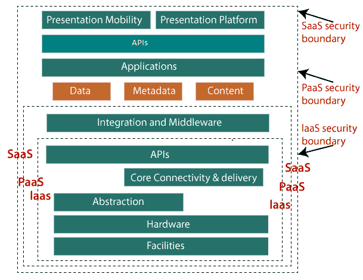
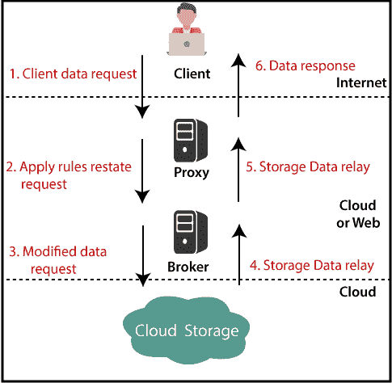

# 云计算安全

> 原文：<https://www.tutorialandexample.com/cloud-computing-security/>

云计算的安全性是主要问题。数据应该以加密的形式保存在云中。应该使用代理和经纪工具来限制客户对共享数据的直接访问。

### 安全规划

在将特定资源用于云之前，应该需要评估资源的各种条件，例如:

*   选择需要迁移到云的资源，并评估其对风险的敏感度。
*   了解云服务提供商的数据存储流程及其向云和从云的过渡。
*   考虑一下云服务模式，如 IaaS、PaaS 和 SaaS。此类模型要求客户应负责不同服务级别的保护。
*   考虑要使用的云类型，如公共云、私有云、社区云或混合云。

### 了解云的安全性

特定的服务模型描述了客户和服务提供商之间的界限。云安全联盟(CSA)堆栈模型有助于解释每个服务模型之间的限制，并显示各种功能单元之间的关系。

下图显示了 CSA 堆栈模型:

### 了解数据安全性

因为所有的数据都是通过互联网传输的；数据安全性是云中的主要问题。有各种保护数据的关键机制。

*   访问控制
*   审计
*   证明
*   批准

### 对数据的隔离访问

因为存储在云中的信息可以从任何地方访问，所以我们需要一种机制来隔离和屏蔽用户对数据的直接访问。

*   代理云存储访问是一种云存储隔离策略。用这种方法正在开发两个程序。
*   拥有完全处理权限但没有客户权限的代理。
*   代理没有存储访问权，但可以访问代理和客户端

### 代理云存储访问系统的工作原理

当客户端发送访问数据的请求时:

*   客户端的请求发送到代理的外部服务接口。
*   代理将请求发送给代理。
*   代理请求云存储数据。
*   代理最终必须将信息提供给服务器。

 ****下图显示了整个上述步骤**

**