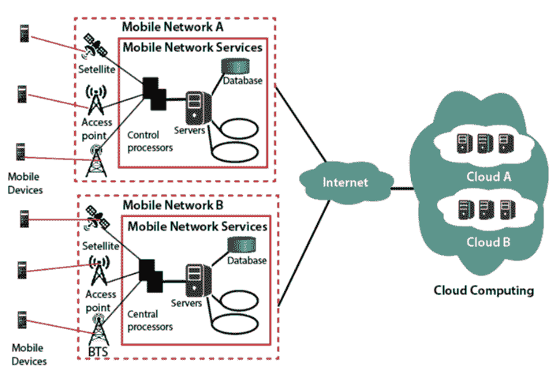

# 移动云计算

> 原文：<https://www.tutorialandexample.com/mobile-cloud-computing/>

移动云计算是一个你可以用手机远程访问云的系统。手机和互联网连接都需要。在移动云计算中，客户可以随时随地轻松访问数据。它为移动网络运营商和云提供商提供了许多商机。移动云计算的目标是通过向客户提供出色的体验来允许从移动电话访问云，并推广它。移动云计算性价比高，也节省时间。这很经济，因为从理论上讲，这些网站关注的是薪酬。

### 移动云计算的架构

移动云计算基于计算增强方法，这种方法是远程执行的，而不是在设备上执行的。在计算增强的帮助下，移动设备可以使用各种基于云的资源的计算资源。移动云计算包括四种类型的远程移动云网络资源、就近移动计算、本地移动计算和混合云。像亚马逊这样的大公司在远处的移动社区，而小规模的组织是本地固定计算机构的一部分。

下图显示了移动云计算的架构:

### 为什么选择移动云计算

我们选择移动云计算的原因是:

*   **快速发展:-** 云公司正在开发帮助消费者日常生活的移动应用。该应用程序不断改进，不断提高应用程序的性能。随着公司定期改进或开发他们的应用程序，这导致了移动云计算的快速发展。
*   ****灵活性:-** 灵活性是选择移动云计算的另一个问题。内置技术更加全面和通用。有不同类型的方法和设备有助于移动计算。在 MCC 中，客户可以选择他们业务所需的服务，这使得它更加灵活。**
*   ******安全:-** 移动云计算是强大的，可以保证云中所有数据的安全。备份后可以随时安全取回。这些应用程序受密码保护，因此如果手机丢失，云不会面临任何风险。该方法从一个设备到另一个设备非常简单，并且没有信息丢失。****

 ******### 如何支持移动云计算

*   **功能外包:-** 将视频索引和离岸语音识别等任务外包给要求较低的云角色，由设备本身完成。
*   Web analytics : -在 Web analytics 中，公司收集信息并进行分析，以用于产品改进和应用升级。为了使产品更好，并使移动应用程序捕获、保存和呈现有关用户界面的信息，该公司不断投入大量精力。
*   **托管服务:-** 移动云计算客户可以利用操作系统中一定程度的控制来保证更少的配置问题。这是利用云的最佳方式之一。
*   **硬件扩充:** **-** 移动软件的克隆被开发以进一步扩展高级应用支持，这在以前由于其处理能力是不可能的。

### 云计算的优势

*   **灵活:-** 移动云计算之所以灵活，是因为它允许随时随地访问数据。客户只需要一个互联网连接和一个设备，就可以轻松获取云数据。
*   ****多平台可用性:-** 该公司推出的云计算应用程序，可在 Android、IOS 等多种平台上使用。无论系统如何，云都可以轻松访问和更改。**
*   ******经济:-** 移动云计算消除了硬件成本，是最具成本效益的使用和维护方法之一。移动云计算的成本用户只需为他们使用的东西付费。****
*   ******备份与恢复** **:-** 在移动云计算中，数据备份很容易，需要时数据检索也很容易。**********