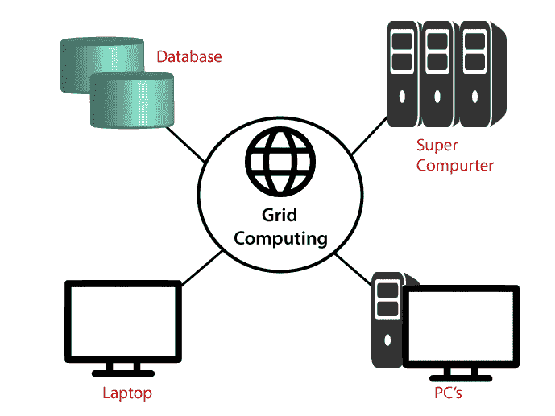

# 网格计算与云计算

> 原文：<https://www.tutorialandexample.com/grid-computing-vs-cloud-computing/>

### 什么是网格计算？

网格计算是一种分布式结构，将大量计算机连接起来解决一个复杂的问题。在网格计算中，服务器和计算机独立运行，通过互联网松散连接。计算机可以直接连接或通过调度系统连接。

换句话说，网格计算涉及大量并行连接的计算机，并形成一个计算机集群。

网格计算通过各种计算资源用于各种类型的应用，例如数学、科学和教育任务。

网格计算是一种处理器体系结构，它集成了来自不同领域的计算机资源以实现一个主要目标。网络上的计算机将在一个项目的网格计算中一起工作，从而充当一台超级计算机。

网格系统主要是为大规模分布式和集群计算的资源共享而设计的。它将复杂的任务分成较小的部分，分配给 CPU 并保存在网格中。

### 什么是云计算？

云计算被定义为通过互联网按需提供计算机能力、数据库存储、应用程序和其他 IT 资源。 ***以低廉的价格为 It 基础设施提供解决方案。*T3】**

简单地说，云计算意味着通过互联网而不是计算机的硬盘来存储和访问数据。

云计算是一种按使用付费的模式。

### 网格计算与云计算

1.  **主要目标:-** 云计算的主要目标是以较低的价格提供服务。它还提供了可扩展性和灵活性，以便客户高效地使用云计算，同时提高安全性和可用性。

然而，网格计算的目标是着眼于网络来解决复杂的问题；它还提供了一台计算机作为实用工具。

**2。类型与划分:-** 云计算的类型有公有云、私有云、社区云、混合云。

 **然而，网格计算是一个分布式计算系统，因此它的类型是分布式信息系统和分布式普适系统。

 ***   **使用与安全:-****大量数据存储在云端。所以它提供了安全保障。存储在云上的数据是安全的，只有在凭证的帮助下才能访问。**

 **网格计算与计算机中的偶像能量有关，主要用于一些明智的事情。

*   **依赖基础:-** 云计算完全依赖内部。云提供了高安全性和高性能。

 **即使一台计算机停止运行或出现故障，网格计算也能持续工作。另一台计算机将选择工作，使系统更加有效和可靠。

*   **差异和相似:-** 云计算和网格计算在架构、业务模型和互操作性等方面互不相同。

 **云计算和网格计算的相似之处在于它们都是基于网络的技术

. **6。空间和存储:-** 在云计算中，由于其快速的数据处理器，备份和恢复数据很容易。云计算中的更新是自动且高效的。

然而，在网格计算中，节省了空间，并且可以访问额外的资源。

**7。远程使用:-** 在云计算中，计算资源的管理是在一个单独的位置进行的，这个位置位于不同的地方。

然而，在网格计算中，有一个分布式系统，其中资源被分配在不同的位置，并且可以位于不同的站点。

**8。资源需求:-** 网格计算需要更多的资源，云计算不直接访问资源；它通过互联网获取资源。

**9。问题解决技术:-** 对于作业调度，网格计算使用各种计算资源。在网格计算中，大任务被分成多个任务，当工作分配给特定的计算机时，这些任务由不同的计算机来解决。

云计算拥有通过资源分组汇集在一起的资源，并且需要一个来自服务器集群的基础。

10。服务和功能:- 学术研究人员主要使用网格计算，并有能力处理大量复杂的工作，包括大量的数据收集。

云计算完全是基于互联网的计算。云提供各种类型的服务，如数据管理、作业查询、数据安全等。它消除了购买构建应用程序所需的新硬件和软件的成本。

**11。互操作:-** 在网格计算中，可以快速处理互操作，但是云计算不支持互操作。

### 网格计算与云计算:对比图

| **网格计算** | **云计算** |
| 网格计算是面向应用的。 | 云计算是面向服务的。 |
| 在网格计算中，资源在多个计算单元之间共享，用于处理单个任务。 | 在云计算中，所有的资源都是集中管理的，并且分布在集群中的不同服务器上。 |
| 网格计算是互连的计算机和网络的集合，可以称为大规模处理工具。 | 在云计算中，多台计算机协同解决问题。 |
| 网格计算在公司网络中运行 | 云计算可以通过互联网访问。 |
| 在这种情况下，网格主要由组织在其场所内拥有和管理。 | 云服务器归基础设施提供商所有，放置在不同的物理位置。 |
| 它根据需要提供一个共享的计算资源池。 | 云计算包括使用不同数量的计算资源来处理一个常见问题。 |**********