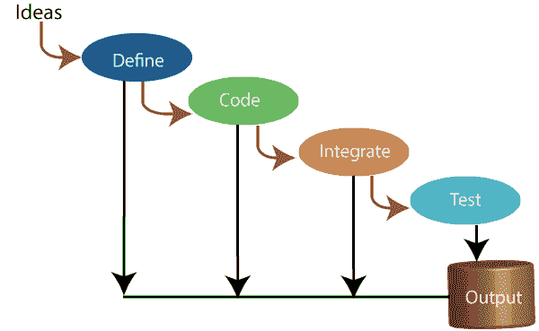
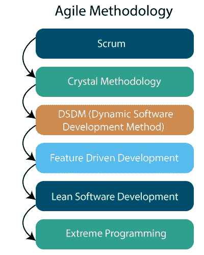
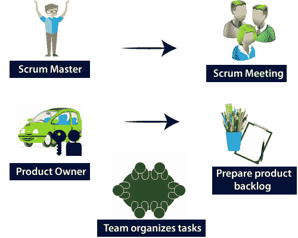
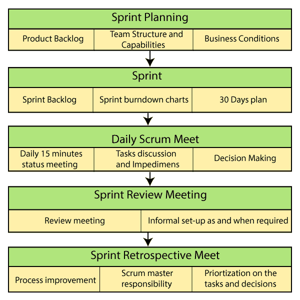
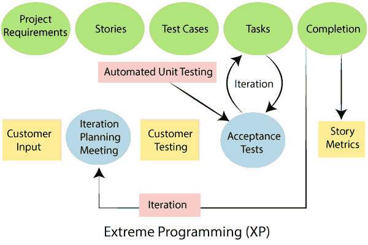

# 敏捷方法教程

> 原文：<https://tutorialandexample.com/agile-methodology-tutorial>

**索引**

1.  [敏捷方法简介](#iam)
2.  什么是敏捷方法论？
3.  [敏捷元素](#ae)
4.  [敏捷原则](#ap)
5.  [敏捷方法的阶段](#pam)
6.  [敏捷方法的历史](#ham)
7.  [敏捷方法的特点](#fam)
8.  [优缺点](#adda)
9.  [敏捷方法](#am)
10.  [Scrum](#s)
11.  [晶体方法论](#cm)
12.  [DSDM(动态软件开发方法)](#dsdm)
13.  [功能驱动开发](#fdd)
14.  [精益软件开发](#lsd)
15.  [XP(极限编程)](#xp)
16.  [中的“T1”](#k)
17.  [结论](#c)

### 敏捷方法简介

敏捷方法是软件开发方法的一种形式。其主要关注点是持续提供客户满意度。敏捷的重点更多的是控制项目范围。敏捷计划设定了最低要求，并将它们转化为可以实现的服务。

### 什么是敏捷方法论？

敏捷方法是一种在软件开发的整个项目生命周期中支持持续开发迭代和验证的技术。与瀑布设计不同，开发和测试活动是同时进行的。

敏捷方法是一种项目管理方法，它跨越**四个** **元素**和 **12 个原则**来安排项目。这里是一个方法的敏捷概述，以及你需要知道的关于这个方法的一切。

### 敏捷元素

敏捷宣言文章的四个主要元素旨在评估，这些元素如下所示:

**1。** **个人的流程沟通和技术:-** 敏捷方法中的第一个价值是**“个人的流程沟通和技术。”**人们比流程或资源更受重视，这很容易理解，因为响应业务需求和推动发展流程的是人。

**2。** **处理准确文档的应用:-** 历史上，大量的时间花费在记录创作和最终发行材料上。技术规范、技术要求、与接口设计相关的文件、测试计划、文档计划以及每项所需的批准。

**3。** **新合同的客户沟通:-** 谈判是客户和产品经理敲定交付细节的过程，包括要点以及如何重新协商细节。合作是完全不同的生物。在任何工作开始之前，客户通常会非常详细地讨论使用概念模型(如瀑布模型)的服务规范。这意味着消费者在开发之前和开发开始之后表现出兴趣，但不是在开发过程中。

**4。** **按照计划对修改的响应:-** 传统的技术设计认为改变是一种开销，所以现在应该避免。目标是创建详细的、精心制作的计划，具有给定的一组特性和所有内容，通常具有与其他内容一样高的优先级，并且以特定的顺序具有大量的交付依赖关系，以便团队可以专注于下一个难题。

### 敏捷原则

敏捷宣言文章的 12 个主要原则旨在评估:

1.**我们最优先考虑的是通过尽早并持续地提供有用的软件来支持客户:**敏捷方法的第一个原则是，客户应该在项目生命周期中频繁地收到项目可交付物或原型，而不仅仅是在项目结束时收到一个产品交付物。

2.**欢迎客户的需求，即使在开发的早期，敏捷流程的变化也会为客户的竞争优势而激活**:宣言作者发现传统项目管理的困难之一是很难满足客户对最后时刻变化的申请。但是现在，敏捷项目将会以最小的延迟适应任何变化，不管在过程中有多晚。

**3。频繁地产生工作代码，从几个星期到几个月，偏好较短的时间框架:**敏捷项目计划频繁的、短的项目时间框架，允许可工作产品的良好结果。有时，敏捷项目被分成 1 到 4 周的冲刺或任务周期，每一个周期都导致一个服务的交付。

4.**在整个项目中，业务、人员和设计师每天都会一起工作:**敏捷原则指出，与所有利益相关者的频繁互动对于项目的成功至关重要。它通常包括与项目团队以及任何其他关键涉众的简短例会。

**5。** **在被驱使的人群中创造项目。为他们提供所需的环境和支持，并相信他们能完成工作**:动态软件开发技术的一个重要概念是，合适的人应该被安排在合适的位置，并给予他们做好工作所需的灵活性。基于技能而不是职位或公司名称来发展项目团队是至关重要的。项目经理必须专注于激励和帮助项目团队，而不是微观管理他们。

**6。**如果你不能和你的小组共处一地，视频会议是一个替代方案，它仍然可以捕捉到一些相同的质量，比如非语言信号。

**7。** **进展的主要度量是工作代码:**敏捷方法的焦点是实现完整的、功能性的结果。这也应优先于任何附加要求，如设计文件。像花费的时间或经过的时间这样的度量标准，也不像工作材料的可用性那样被认为是必要的。

**8。** **敏捷系统正在支持可持续发展。发起人、开发人员和用户应该无限期地保持恒定的速度:**根据这一理论，敏捷项目应该在每个迭代过程或冲刺的设计中保持一致的速度。这种失败将消除加班或计划崩溃的需要，同时鼓励正常生产可行的商品。它还应该创建一个可重复的循环，只要有必要，该组就可以持续地遵循这个循环。

**9。持续强调技术优势和良好的设计增加了敏捷性:**一个敏捷项目将主要关注于改进最终产品并随着时间的推移取得进展。换句话说，每次迭代都应该是对前一次迭代的改进，团队应该总是寻求新的想法。

10。简单至关重要——最小化未完成工作量的艺术:敏捷项目的目标是做足够多的工作来成功完成要求的项目，并符合要求的规范。任何额外的文档、步骤、流程或工作，如果不能为客户增加价值或提高项目的产出，都应该避免或删除。

**11。** **写下你想转述的任何东西，按下右边的 Quill It 按钮:**敏捷基于这样一种信念，即交付最好的结果和商品，需要有灵感、自主和熟练的团队。应该鼓励各单位在适当的时候组织起来。他们应该能够在他们认为合适的时候进行合作和创新，而不会受到太多的控制。

**12。该团队专注于如何定期变得更加成功，然后相应地调整和适应其行为:**一个成功的、自我激励的团队需要非常重视如何继续成长&改进他们的技能和流程。小组必须定期审查他们的进展和成果，包括探索他们在前进过程中如何发展。

### 敏捷方法的阶段

敏捷方法有六个阶段:

1.  概念
2.  开始
3.  循环
4.  放
5.  生产
6.  退休

**概念:-** 基于价值、计划和可行性，表示为设想，并按优先顺序排列。

**Inception:** -建立一个团队，单独确定团队成员，建立一个基金，并讨论和决定任何初始需求。

**迭代:** -项目团队开始使用基于精化和输入需求的敏捷方法应用的代码进行项目开发。

**发布:** -质量监控、内部和外部培训、信息开发和报告。

**生产:** -敏捷方法有助于跟踪您的计划，并确保它不断优化，能够从任何突然的变化或困难中恢复过来。

**退休:** -生命末期的活动。

### 敏捷方法的历史

*   敏捷技术的历史可以追溯到二十世纪九十年代、七十年代和六十年代。然而，每个人都承认，随着 2001 年出版的《敏捷软件开发宣言》的发展，敏捷已经扎根。
*   最初它创建于 2001 年 2 月，敏捷报告创造了一种管理软件开发的新方法。这份报告是在犹他州召开的一次会议的成果，在这次会议上，一群领先的软件开发人员聚集在一起讨论问题和行业的潜在解决方案。
*   这组人承认，软件行业需要一种更好的方法来更快地将产品推向市场。他们的目标是在不显著影响项目成本或减缓开发速度的情况下，开发修改产品和计划的新策略。
*   通过将迭代划分为更短的迭代，可以轻松快速地开发和测试设计。

### 敏捷方法的特点

敏捷方法有多种特征

*   重复的
*   模块性
*   时间拳击
*   吝啬
*   增加的
*   适应的
*   收敛的
*   合作的
*   以人为本

**迭代**

敏捷应用系统的主要目标是客户满意，因此通过多次迭代，它关注于单一的需求。

**模块化**

敏捷周期将整个系统分解成可管理的组件。模块化在软件开发过程中起着重要的作用。

**时间拳击**

由于敏捷方法是迭代的，每个模块及其各自的持续时间都需要时间限制。

**吝啬**

在敏捷系统中，通过最小数量的模块来减少风险和实现目标。

**增量**

 **由于敏捷方法本质上是迭代的，它涉及到系统的逐步创建，其中，每个增量都是独立于其他的，最终，所有的增量都合并到整个系统中。

**自适应**

由于敏捷方法是迭代的，它涉及到程序的增量创建。每一个增量都是独立于其他的，最终，所有的增量。由于敏捷过程的迭代性质，新的风险可能会出现。敏捷系统的灵活特性使得系统能够被修改以满足最新的威胁，并且允许实时需求的改变。

**收敛**

通过使用迭代和渐进策略，与每次增长相关的所有风险在活动阶段都是并发的。

**协同**

因为敏捷方法是通用的，所以软件开发团队需要良好的沟通。在软件开发过程的最后，必须将独立的模块组合起来。

**以人为本**

在敏捷系统中，客户满意度是软件和过程的第一关注点。一个好的软件开发团队可以提高软件的质量和收益。

### 敏捷方法的优势

*   在敏捷方法中，技术的交付是坚定不移的。
*   客户很高兴，因为应用程序的每个 sprint 功能都提供了敏捷方法。
*   客户可以查看满足他们标准的功能。
*   如果客户有任何建议或设计改进，可以在产品的当前版本中考虑。
*   敏捷方法需要业务人员和程序员之间的定期交流。
*   这种方法注重产品的声音设计。
*   即使在开发的后期，规范的改进也是公认的。

### 敏捷方法的缺点

*   需求有时在敏捷技术中并不完全明显，因此很难预测预期的结果。
*   在软件开发生命周期的开始，很难估计一些项目所涉及的实际工作。
*   实施敏捷技术的项目可能会面临可能影响项目的未知风险。

### 敏捷方法

敏捷中有各种各样的方法，如下所示。

### 混乱

SCRUM 是一种敏捷的设计模型，主要关注如何在基于团队的软件平台中管理任务。Scrum 通常来源于橄榄球比赛中的一项活动。Scrum 致力于授权给开发团队，并支持小团队工作(比如 7-9 个成员)。它由三项任务组成，它们的职责描述如下:

*   **Scrum Master**

领导者负责设计团队、冲刺和消除进步的挑战。

*   **产品负责人**

产品负责人维护一个软件 backlog，确定延迟的优先级，并负责每次迭代的功能交付。

*   **Scrum 会议**

团队管理其工作，并组织冲刺和循环工作。

*   **准备产品积压:**

它是一个数据库，在这个数据库中，对每个发布的需求进行监控，并提供关于要完成的需求(用户故事)的信息。产品负责人必须管理和组织它，并将它分发给 scrum 团队。组织还可能要求更改或删除新的条件。

### Scrum 如何工作

**步骤 1:** 对于每个 Sprint，产品负责人创建一组在**产品待办事项中识别的新特性。**

**步骤 2:** 然后，团队从 sprint 开始时交付的服务积压中选择顶级属性。

**第三步:**该功能被分割成一个更小的项目，由品牌所有者在决定做一个特定的功能后在 **sprint backlog** 中创建。

**步骤 4:** 然后冲刺开始，在冲刺阶段有一个所谓的**例会**，团队成员在会上分享他们的任务状态并解决与任务相关的问题。

**第五步:**Sprint 完成后，该功能将提交给品牌所有者审批，并将反馈给与某个元素相关的 **sprint 反馈**团队。

**步骤 6:** 最后，scrum 主管和品牌负责人在**回顾会议中与团队一起讨论整个过程的进展**。这个项目被分割成一个更小的任务，由品牌所有者在决定做一个特定的功能后在 **sprint backlog** 中创建。

### Scrum 方法论的流程

scrum 的流程如下:

*   scrum 的每次迭代都被命名为 Sprint
*   项目积压是一个列表，它包含了获得最终产品的所有信息。
*   在每个 Sprint 期间，挑选出服务待办事项中的顶级消费者故事，并将其转化为 Sprint Backlog
*   团队在已建立的 sprint backlog 上工作
*   日常工作的团队评审
*   团队在冲刺的最后交付产品特性

### 动态软件开发的方法有

*   **时间拳击**
*   **莫斯科规则**
*   **原型制作**

**Scrum 实践**

 **

### 水晶方法论

尽管这一过程是必不可少的，但它应被视为仅次于上述内容的次要焦点。水晶方法背后的概念是，参与软件开发的团队通常具有不同的技能和才能，所以过程方面不是一个重要的因素。

水晶方法中有三个概念:

*   **特许:-** 该流程中的不同活动包括组建开发团队、进行概念性可行性分析、设计初始计划以及最终确定设计方法。
*   **循环交付:-** 开发的主要阶段由两个或多个生产阶段组成，在此期间进行输出。
*   团队改进和细化发布计划。
*   通过组合一个或多个软件测试的迭代来实现需求的子集。
*   它为真实用户提供综合服务。
*   讨论项目计划和发展战略。
*   **总结:-** 此流程中执行的操作是用户实现、子部署评估，并进行反思。

## DSDM(动态软件开发方法)

动态软件开发方法是一种 RAD(快速应用开发)软件开发方法，它为生产创建了一个敏捷的项目框架。DSDM(动态软件开发方法)重要的元素是客户需要积极参与，并且团队拥有决策权。对 DSDM 来说，消费者交付是当前的优先事项。DSDM 有 7 个阶段，如下所示:

*   最小项目
*   可行性研究
*   商业分析
*   逻辑框架的迭代
*   模型和构建变化
*   执行
*   最大项目

### 特征驱动开发

这种方法侧重于“设计和创建”的特性与其他敏捷方法相比，FDD 为每个功能定义了非常具体和快速的工作阶段。这需要领域预览、软件分析、构建推广、代码分析和设计。

FDD(特性驱动开发)创建了一个服务来保持事物的目标。

*   领域对象的建模
*   按功能实现
*   组件/类的所有权
*   功能概念
*   检查
*   配置的操作
*   普通建筑
*   成功和结果的可见性

精益软件开发:-精益软件开发方法是基于“准时生产”的概念。这旨在提高软件开发速度和降低成本。

### 精益开发可以概括为七个阶段

*   废物的清除
*   加强培训
*   推迟沟通(尽早决定)
*   首先发送
*   启用系统
*   创造质量
*   优化整个包

### 极限编程(XP)

当客户的需求或期望不断变化，或者如果他们不确定系统的功能时，极限编程方法是有益的。这支持在较短的开发周期内定期发布产品，最终增加了系统的竞争力，并且提供了一个检查点，任何消费者的需求都可以很容易地实现。

XP 创建了用户友好的应用程序。

在故事方面，公司标准被收集。所有这些故事都存放在一个停车场。

基于这种技术形式的更短时间间隔的发布被称为 14 天周期的迭代。-迭代涉及诸如**编码、单元测试、**和**系统测试、**等阶段，其中一些次要或重要的特性在每个阶段都被集成到软件中。

### 极限编程阶段

敏捷极限编程有 6 个阶段，如下所示:

1.**策划**

*   确定支持者和投资者
*   服务指南
*   与安全相关的数据和编译
*   关于服务水平及其条款和条件的协议

2.**分析**

*   故事在停车场被发现
*   优先考虑停车场的故事
*   项目账户的清理
*   定义跨度(时间)迭代
*   开发团队和质量保证团队的资源准备

3.**设计**

*   拆除活动
*   为每个项目准备评估方案
*   回归自动化框架

3.**执行**

*   编程；编排
*   单元测试
*   执行手动研究条件
*   缺陷记录的生成
*   测试回归手册到自动化的转换
*   中期迭代研究
*   迭代开始的讨论

4.**包装**

*   有限的出版物
*   回归分析
*   演示和反馈
*   开发新的基于需求的故事
*   基于从迭代分析开始的注释的系统变更

5.**关闭**

*   释放飞行员
*   教育
*   生产开始
*   SLA 的保证
*   研究 SOA 的方法
*   输出帮助

有两个故事板可以用来跟踪每天的工作，下面列出了用于比较的故事板。

*   **故事的纸箱**

这是一种典型的方式，将所有的故事以便笺的形式收集在一块板上，以记录每天的 XP 事件。最好切换到在线表单，因为这种手动任务需要更多的精力和时间。

*   **故事板上线**

故事板在线工具可以用来存储故事。

### 看板法

最初，看板起源于日语，意思是一张卡片，上面有物品完成过程中每一点需要完成的所有细节。在软件测试方法中，这种系统或方法被广泛采用，尤其是在敏捷测试中。

### 结论

敏捷模型基于迭代代码的创建。迭代完成后，安装一个独立的工作单元。超过两周不需要重复完成代码。敏捷方法允许开发人员参与培训，而不是一个单独的质量保证小组。

由于新的方法和概念允许团队在短时间内开发产品，敏捷方法非常适合不断变化的环境。****