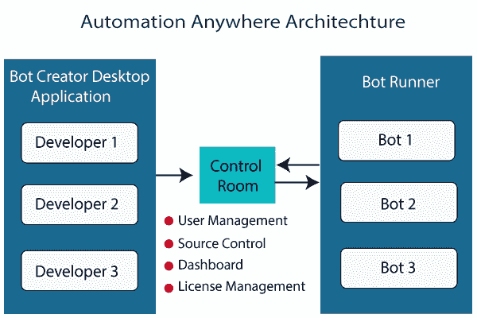

# 面向初学者的自动化随处教程

> 原文：<https://www.tutorialandexample.com/automation-anywhere-tutorial>

### 什么是自动化？

自动化是一种在最少人工协助下执行流程的技术。自动化用于计算机控制和电子设备，以支持流程。自动化的目的是提高可靠性和效率。

它是一种使设备、系统或过程自动运行的技术。它是信息技术不可分割的一部分。

自动化工具分为许多种类。一些流行的自动化类型如下。

*   流程编排
*   舞蹈编排
*   机器自动化
*   机器人学
*   判定算法
*   人工智能

### RPA 自动化随处可见

自动化自 20 世纪 20 年代就已存在，但直到 20 世纪 90 年代初才开始流行。这个软件可以帮助完成各种日常任务。为了执行日常任务，我们需要机器人流程自动化 **RPA** 。

RPA 代表**机器人流程自动化**。这是一种可以模仿人类用户行为的软件。它在 PC 上自动执行严格重复且基于规则的过程。

RPA 是一种帮助我们轻松执行复杂任务的新技术。Automation Anywhere 是 RPA 市场的领导者之一。

### 自动化随处架构

下图显示了任何地方的自动化架构。

Automation Anywhere 架构有**三个主要组件**

*   控制室
*   机器人创建者
*   机器人赛跑者

**控制室**控制室是一个基于网络的平台，可以在任何地方控制自动化。它就像一个服务器，控制着任何地方的自动化机器人。

它还处理

*   **用户管理**
*   **源控制**

控制室管理机器人的代码。所以跨不同系统共享代码很容易。

*   **仪表板**

它给出了完整的分析报告和自动化结果。您可以看到和控制有多少机器人正在运行，以及一个机器人如何失败/通过。

*   **许可证管理**

要在任何地方使用自动化，必须购买许可证。购买的许可证在控制室进行配置。

Automation Anywhere 提供两种类型的许可证。

1) **开发许可**

您可以使用此许可证创建、编辑和运行 bot。

2) **运行许可**

此许可证只允许您运行 bot，并且您不能对 bot 进行任何更改。

**机器人创建者**

开发人员在基于桌面的应用程序的帮助下创建机器人。他们的开发许可证在控制室检查。认证后，它会创建机器人的代码，并将其存储在控制室中。不同的开发人员创建不同的机器人或任务。这些机器人可以被立即执行或合并。

机器人赛跑者

机器人运行程序用于执行机器人；他们可以并行执行多个机器人。它们是运行时客户端，可以向控制室报告执行日志状态。

如果我们将所有组件总结在一起，那么首先，开发人员创建一个机器人(任务)并在控制室进行更新。现在，控制室中更新的任务会根据需求或优先级安排并执行给机器人运行者。

### 随处自动化的一些附加组件

除了上述组件，Automation Anywhere 还包含一些附加组件。这些如下。

*   智商机器人
*   机器人洞察力
*   Bot 农场

**智商机器人**

智商机器人或认知机器人具有自学能力、专业知识、基于算法的决策等特征。这些机器人可以像人一样思考。为了执行其功能，这些机器人从半结构化和非结构化数据中提取数据，并使用语义模型。

**机器人洞察**

这是一个分析每个机器人性能的工具。有了这个自动化工具，你可以在任何地方看到业务的统计数据和图表。

**机器人农场**

它可以让你创建多个机器人按需数字劳动力。它还通过 Automation Anywhere Enterprise 提供 RPA(机器人流程自动化)服务。

### 自动化随处机器人的类型

自动化领域有三种类型的机器人:

*   任务机器人
*   元机器人
*   智商测验

**任务机器人**

任务机器人是一种自动化的基于规则的重复性任务，适用于文档管理、索赔管理、人力资源、IT 服务等领域。这直接提高了生产率，减少了错误，节约了成本。

**元机器人**

元机器人是自动化的基本构件。所以，它是以这样一种方式设计的，你可以在更改应用程序更新时对 bot 进行最小的更改。

**IQBot**

智商机器人或认知机器人具有自学能力、专业知识、基于算法的决策等特征。这些机器人可以像人一样思考。为了执行其功能，这些机器人从半结构化和非结构化数据中提取数据，并使用语义模型。

### 随处自动化的特点

以下是自动化最重要的特性列表:

*   它是业务和 It 任务的智能自动化。
*   它使用智能自动化技术。
*   它能快速自动化复杂的任务。
*   它执行自动化任务，如记录键盘敲击和鼠标点击。
*   它将任务分配给多台计算机。
*   它提供了无脚本自动化
*   它有助于自动登录运行计划的任务在任何时候，甚至当计算机被锁定。

### 在任何地方使用自动化的行业

一些使用自动化的顶级行业如下:

**业务流程外包**

BPO 中使用自动化来降低运营成本、提高绩效和增加劳动力的能力。

**电信**

自动化在电信中用于向连接的用户提供支持。这提高了效率，实现了快速增长。

**医疗保健**

自动化在医疗保健中用于有效地与患者互动，降低风险，并分析关键的医疗保健数据。

**金融服务**

自动化被用于金融行业，以提高效率、减少欺诈和减少合规性。

**制造**

自动化在制造业中被用来简化供应链管理。这降低了成本，加快了生产。

### 在任何地方使用自动化的好处

在任何地方使用自动化都是有益的，因为

 ***   要在任何地方使用自动化，不需要任何编程知识。我们可以记录我们的操作，或者指向并单击操作向导。
*   任何地方的自动化都消除了人为错误的因素。
*   随处自动化提高了交易速度，节省了时间和成本。
*   Automation Anywhere 可帮助您在文件或应用程序之间自动进行数据传输以及导入或导出数据。
*   Automation Anywhere 可从桌面扩展到数据中心。**